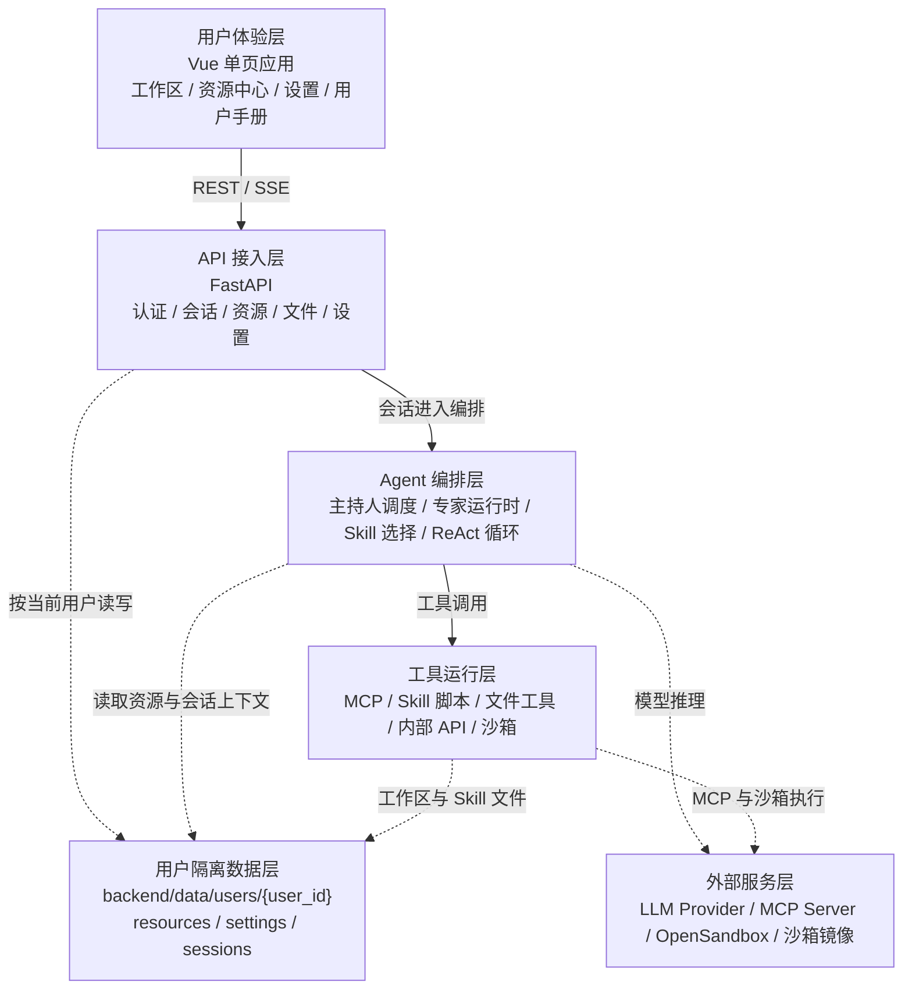
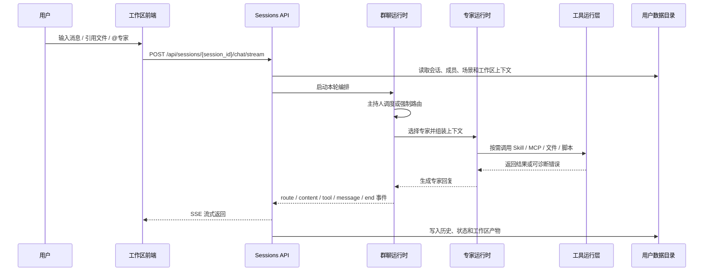

# 书童四九架构设计文档

版本：v1.1 项目验收版
日期：2026-07-05
适用范围：书童四九 Web 应用、FastAPI 后端、Agent 编排、资源中心、Skill、MCP、沙箱、用户隔离数据、资源导入导出以及 Docker/1Panel 私有化部署形态。

## 1. 文档目的

本文承接 [用户需求说明书](../requirements/user-requirements.md) 和 [需求说明与验收测试](../requirements/acceptance-and-tests.md)，从架构角度说明书童四九如何支撑“AI Agent 应用搭建与运行平台”的交付目标。

本文重点回答：

- 平台由哪些架构层组成，各层承担什么职责。
- 一次会话从前端输入到主持人调度、专家执行、工具调用和结果沉淀如何流转。
- 场景、专家、Skill、MCP、模型、密钥、文件和沙箱如何作为平台资源被管理和复用。
- 多用户数据、密钥、文件路径和工具权限如何隔离。
- 架构设计如何映射到 UR-01 到 UR-11 的项目验收需求。

本文不设计具体上层业务应用。教学、科研、办公等应用只作为平台能力验证样例，不构成平台本体架构边界。

## 2. 架构目标与设计原则

### 2.1 架构目标

书童四九的架构目标是提供一套可私有化部署、可配置、可复用、可诊断的 AI Agent 应用运行底座。平台应允许用户在不改动代码的情况下，通过资源中心组合主持人、专家、Skill、MCP、模型、密钥和文件，形成可运行、可沉淀、可迁移的 Agent 应用。

架构交付重点如下：

| 目标 | 说明 | 对应需求 |
|------|------|----------|
| 平台底座稳定 | 提供账号、鉴权、用户目录、部署、健康检查和持久化能力 | UR-01、UR-11 |
| 工作区统一 | 单人问答、多专家协作、文件引用和工具状态共用统一会话入口 | UR-02、UR-08 |
| 协作可编排 | 主持人负责调度专家，专家按配置使用 Skill、MCP、模型和文件上下文 | UR-03 |
| 资源可配置 | 场景、专家、Skill、MCP、模型、密钥和文件集中维护 | UR-04、UR-10 |
| 工具可执行 | Skill、MCP、脚本、内置文件工具和沙箱通过统一工具层接入 | UR-05、UR-06、UR-07 |
| 配置可迁移 | 应用相关资源可通过 ZIP 包导入导出并处理依赖和冲突 | UR-09 |

### 2.2 设计原则

| 原则 | 约束 |
|------|------|
| 平台本体优先 | 架构只承诺应用搭建、运行、资源复用和部署能力，不承诺具体应用效果 |
| 用户隔离默认开启 | 所有资源读写都必须能追溯到当前用户上下文和用户数据根 |
| 会话入口统一 | 普通会话、场景会话和多专家协作共用 `/api/sessions/*` 主链路 |
| 主持人组织协作 | 场景不是固定模板，而是主持人按场景资源组织专家协作 |
| 工具权限最小化 | 专家只能获得其配置和当前 Skill 声明允许的 MCP、脚本和文件工具 |
| 文件路径受控 | 工作区文件、Skill 文件和沙箱挂载必须经过路径白名单和用户边界校验 |
| 状态用户可见 | 等待补充、工具失败、沙箱超时、MCP 断连等状态必须回到前端 |
| 测试跟随架构 | 新增架构能力必须同步需求、验收矩阵、测试用例和用户说明 |

## 3. 总体架构

### 3.1 分层结构



上图表达的是平台运行边界：前端不直接调用模型、MCP 或沙箱；后端 API 先确认当前用户，再进入会话、资源或设置模块；Agent 编排层负责主持人和专家协作；工具运行层统一处理 MCP、脚本、文件和沙箱；所有用户资源落在当前用户隔离数据目录中。

### 3.2 架构层职责

| 架构层 | 主要职责 | 主要代码入口 |
|--------|----------|--------------|
| 用户体验层 | 登录、工作区、资源中心、设置、用户手册、SSE 消息展示 | `frontend/src/router/index.ts`、`frontend/src/views/MainView.vue`、`frontend/src/features/*` |
| API 接入层 | 鉴权、用户上下文、会话 API、资源 API、设置 API、文件 API | `backend/app/api/routes.py`、`backend/app/api/auth.py`、`backend/app/api/sessions.py`、`backend/app/api/files.py` |
| Agent 编排层 | 主持人调度、专家解析、Skill 选择、ReAct 执行、会话状态持久化 | `backend/app/agent/group_chat_runtime.py`、`group_chat_host_runtime.py`、`expert_runtime.py`、`simple_agent.py` |
| 工具运行层 | 组装并执行 MCP、Skill 脚本、文件工具、内部 API 工具、沙箱任务 | `backend/app/agent/tool_gateway.py`、`tools_for_skill.py`、`backend/app/tools/*`、`backend/app/mcp/manager.py` |
| 用户隔离数据层 | 按用户保存资源、会话、工作区、配置、密钥引用和沙箱 requirements | `backend/app/core/user_context.py`、`user_settings_paths.py`、`resource_store.py`、`backend/app/session_state/*` |
| 外部服务层 | 提供 LLM 推理、MCP 远端工具、OpenSandbox 控制面和沙箱镜像 | `backend/app/agent/llm_client.py`、`backend/app/mcp/manager.py`、`backend/app/agent/sandbox_*` |

### 3.3 用户需求到架构映射

| 用户需求 | 主要架构层 | 设计关注点 |
|----------|------------|------------|
| UR-01 账号与用户隔离 | 用户体验层、API 接入层、用户隔离数据层 | 登录态、受保护路由、Token 校验、用户资源根隔离 |
| UR-02 工作区与统一会话 | 用户体验层、API 接入层、Agent 编排层、用户隔离数据层 | 会话生命周期、SSE 事件、消息历史、成员和工作区状态恢复 |
| UR-03 主持人与专家协作 | 用户体验层、API 接入层、Agent 编排层 | 主持人调度、专家选择、`@专家` 路由、等待用户状态 |
| UR-04 资源中心 | 用户体验层、API 接入层、用户隔离数据层 | 场景、专家、Skill、MCP、模型、文件配置的 CRUD 和引用关系 |
| UR-05 Skill 与脚本执行 | Agent 编排层、工具运行层、用户隔离数据层 | Skill 选择、脚本契约、工作区挂载、执行结果回传 |
| UR-06 MCP 工具能力 | Agent 编排层、工具运行层、外部服务层 | 工具授权、MCP 生命周期、断连重试、鉴权错误诊断 |
| UR-07 沙箱运行环境 | 工具运行层、外部服务层、用户隔离数据层 | OpenSandbox、镜像选择、requirements、超时和网络策略 |
| UR-08 工作区文件管理 | 用户体验层、API 接入层、工具运行层、用户隔离数据层 | 文件预览、编辑、下载、路径白名单、工具读写边界 |
| UR-09 导出与导入 | 用户体验层、API 接入层、用户隔离数据层 | ZIP 资源包、依赖预览、冲突处理、跨账号迁移 |
| UR-10 模型、密钥与个人设置 | 用户体验层、API 接入层、Agent 编排层、用户隔离数据层、外部服务层 | LLM Provider、密钥脱敏、默认主持人、主题和账号安全 |
| UR-11 部署与运维 | API 接入层、工具运行层、外部服务层 | 健康检查、Docker/1Panel、数据卷、OpenSandbox 和日志诊断 |

## 4. 核心运行链路

### 4.1 登录与用户上下文

1. 前端通过 `frontend/src/features/auth/LoginView.vue` 完成登录或注册。
2. 路由层通过 `frontend/src/router/index.ts` 控制受保护页面访问。
3. 后端认证入口由 `backend/app/api/auth.py` 提供，受保护 API 依赖 `backend/app/core/security.py` 中的用户上下文依赖。
4. 当前用户解析后形成稳定 `user_id` 和用户资源根。
5. 资源、会话、工作区、配置、密钥和沙箱偏好都从当前用户数据根派生。

设计约束：

- 受保护 API 不能绕过 `user_context_dependency`。
- 业务失败不能滥用 401，避免前端全局鉴权逻辑误登出。
- 用户目录路径只能通过 `user_context.py`、`user_settings_paths.py`、session state 和资源存储工具获取。
- 账号凭据与平台运行数据分离，密码不得明文存储。

测试入口：

- `backend/tests/test_auth_sqlite.py`
- `backend/tests/test_user_resource_paths.py`
- `frontend/e2e/auth.spec.ts`
- `frontend/e2e/settings.spec.ts`

### 4.2 会话发送与 SSE 返回



这条链路是平台运行的主链路。普通会话、场景会话和多专家协作都从 `/api/sessions/{session_id}/chat/stream` 进入；非流式 `/api/sessions/{session_id}/chat` 只作为 SSE 中断后的容错入口，应复用同一条路由和编排结果。

设计约束：

- 前端消息发送由 `GroupChatComposer.vue` 发起，流式读取由 `useGroupChatStreamRunner.ts` 和相关 composable 处理。
- 后端入口为 `backend/app/api/sessions.py`，群聊运行核心在 `backend/app/agent/group_chat_runtime.py` 及相关模块。
- SSE 事件必须能表达路由、内容增量、工具调用、完整消息、等待用户和结束状态。
- 会话历史、成员列表、工作区文件和运行状态刷新后必须可恢复。
- 工具失败、轮次上限、等待补充和异常结束都必须有用户可见状态。

测试入口：

- `backend/tests/test_sessions_api.py`
- `backend/tests/test_group_chat_stream_protocol.py`
- `backend/tests/test_group_orchestration_fsm.py`
- `backend/tests/test_group_chat_state.py`
- `frontend/e2e/workspace.spec.ts`

### 4.3 主持人与专家协作

主持人负责组织专家协作，不是普通专家的同义词。场景的核心语义是“主持人把各个专家组织起来”，而不是只加载一组固定模板。

| 组件 | 职责 | 关键文件 |
|------|------|----------|
| 会话状态服务 | 读取和写入会话 meta、历史、成员和工作区状态 | `backend/app/agent/group_session_service.py`、`backend/app/session_state/*` |
| 编排状态机 | 控制发言、等待用户、结束、错误和软停止状态 | `backend/app/agent/group_orchestration_fsm.py`、`group_chat_soft_stop.py` |
| 主持人运行时 | 根据当前任务、场景、成员和历史生成调度决策 | `backend/app/agent/group_chat_host_runtime.py`、`group_host_decision.py` |
| 专家解析 | 根据专家名称、场景成员和用户点名解析本轮专家 | `backend/app/agent/group_chat_expert_resolution.py`、`leader_scheduler.py` |
| 专家运行时 | 组装专家提示词、Skill、模型、工具和文件上下文 | `backend/app/agent/expert_runtime.py`、`skill_agent_runtime.py` |
| ReAct 执行 | 调用模型、处理 tool calls、汇总最终回复 | `backend/app/agent/simple_agent.py`、`simple_agent_finalization.py` |

设计约束：

- 普通会话可以由主持人推荐专家；场景会话优先使用场景内专家。
- 用户显式 `@专家` 或点名专家时，强制路由优先于主持人自动选择。
- 主持人调度说明是用户可见消息，不应只存在于日志。
- 专家需要用户补充信息时，运行时必须进入等待用户状态。
- 主持人 Skill 是主持人的调度能力配置，不应与普通专家 Skill 混用。

测试入口：

- `backend/tests/test_group_host_decision.py`
- `backend/tests/test_host_takeover.py`
- `backend/tests/test_scene_scheduler.py`
- `backend/tests/test_scene_runtime.py`
- `backend/tests/test_expert_runtime.py`
- `backend/tests/test_orchestration_contracts.py`

### 4.4 资源中心与应用配置

资源中心是平台搭建 Agent 应用的配置入口。用户通过资源中心维护场景、专家、Skill、MCP、模型和文件，再由工作区会话运行这些资源。

| 资源 | 前端入口 | 后端入口 | 设计重点 |
|------|----------|----------|----------|
| 场景 | `frontend/src/features/resources/useScenarioEditor.ts`、`MainView.vue` | `backend/app/api/settings_presets.py`、`backend/app/core/scenario_bundle.py` | 主持人配置、协作专家、依赖导入导出 |
| 专家 | `frontend/src/features/resources/AgentView.vue` | `backend/app/api/agents.py`、`backend/app/core/expert_bundle.py` | 模型、提示词、头像、Skill、MCP 权限 |
| Skill | `frontend/src/features/resources/SkillDetailView.vue` | `backend/app/api/settings_skills.py`、`settings_skill_parts.py` | `SKILL.md`、脚本、references、assets、依赖 |
| MCP | `MCPAddView.vue`、`MCPDetailView.vue` | `backend/app/api/settings_mcp.py`、`backend/app/mcp/manager.py` | transport、密钥引用、工具 schema、连接测试 |
| 模型 | `LLMSettingsView.vue`、设置页 | `backend/app/api/settings_app.py`、`settings_skills.py` | Base URL、模型名、参数、密钥引用 |
| 密钥 | `ApiSecretsSettingsView.vue` | `backend/app/api/settings_secrets.py` | 脱敏展示、按用户保存、运行时引用 |
| 文件 | 工作区文件页、资源文件页 | `backend/app/api/files.py` | 上传、预览、编辑、下载、路径安全 |

设计约束：

- 所有资源列表默认只展示当前用户资源。
- 资源保存后，新会话和新专家运行应读取最新配置。
- 导入资源包必须先预览对象、依赖、同名覆盖和本地引用重映射。
- 密钥类字段前端只展示脱敏值或状态，不能展示完整 Key。
- 资源中心提供平台能力配置，不负责具体上层应用的内容运营。

测试入口：

- `backend/tests/test_agents_api.py`
- `backend/tests/test_bundle_import_api.py`
- `backend/tests/test_scenario_bundle.py`
- `backend/tests/test_expert_bundle.py`
- `backend/tests/test_llm_config.py`
- `frontend/e2e/resources-scenario-expert.spec.ts`
- `frontend/e2e/resources-skill-mcp-llm.spec.ts`

### 4.5 Skill、MCP、脚本与沙箱执行

Skill 是策略层，描述专家什么时候触发、按什么步骤做、使用哪些脚本或工具、输出如何判断。MCP 是外部工具层，提供搜索、抓取、转写、生成或服务调用能力。沙箱是受控执行层，用于运行 Skill 脚本和浏览器自动化。

执行链路：

1. `expert_runtime.py` 根据专家配置、用户消息、会话历史和候选 Skill 选择本轮 Skill。
2. `tools_for_skill.py` 和 `skill_agent_runtime.py` 根据专家权限与 Skill 声明组装工具集合。
3. `tool_gateway.py` 统一调度 MCP 工具、Skill 脚本、文件工具和内部 API 工具。
4. MCP 工具由 `backend/app/mcp/manager.py` 管理连接、schema 和调用。
5. Skill 脚本通过 `backend/app/tools/run_skill_script.py` 进入沙箱执行。
6. 沙箱策略由 `sandbox_service.py`、`sandbox_policy_runtime.py`、`sandbox_workspace_*` 和 requirements 相关模块控制。
7. 工具结果、错误、超时和诊断信息回传会话。

设计约束：

- 专家不能默认获得全部 MCP 工具；工具集合必须由专家配置和当前 Skill 声明共同收敛。
- Skill 脚本必须在当前用户工作区和用户沙箱中执行。
- 沙箱挂载当前会话工作区和 Skill 资源，不能越权访问其他用户目录。
- requirements、沙箱镜像、网络策略、超时和冷启动失败要形成可诊断错误。
- `done`、`final`、Skill 会话 keep/release 等控制信号必须与会话状态明确区分。

测试入口：

- `backend/tests/test_skill_agent_tool_resolution.py`
- `backend/tests/test_skill_mcp_and_script_requirements.py`
- `backend/tests/test_group_chat_skill_script_cli_flow.py`
- `backend/tests/test_file_ref_and_gateway.py`
- `backend/tests/test_sandbox_service.py`
- `backend/tests/test_sandbox_policy_runtime.py`
- `backend/tests/test_sandbox_requirements_runtime.py`
- `backend/tests/test_sandbox_workspace_fs.py`

### 4.6 工作区文件与成果沉淀

工作区文件是用户、专家、Skill 脚本和工具之间共享成果的边界。平台需要允许用户在会话中上传、引用、编辑、预览和下载文件，也要允许专家和工具在授权范围内读取或写入当前工作区文件。

设计约束：

- 工作区文件 API 由 `backend/app/api/files.py` 提供，所有路径解析必须带当前用户上下文。
- 前端文件面板由 `WorkspaceFilesView.vue`、`FileDetailView.vue`、`GroupWorkspacePanel.vue` 等组件承载。
- 图片、PDF 等预览不能依赖无鉴权裸 URL，应通过鉴权请求转换为 Blob URL。
- 专家只能读取当前会话或授权范围内的文件引用。
- 路径穿越、内部运行日志误读和跨用户路径访问必须被拒绝。
- 专家或工具生成的新文件应出现在对应工作区中。

测试入口：

- `backend/tests/test_workspace_files.py`
- `backend/tests/test_file_ref_and_gateway.py`
- `backend/tests/test_sandbox_workspace_fs.py`
- `frontend/e2e/workspace.spec.ts`

### 4.7 部署与运维

平台部署形态以本地开发、Docker 和 1Panel 为主。后端启动由 `backend/app/core/lifespan.py` 管理生命周期，静态前端由 `backend/app/core/static_spa.py` 挂载，健康检查由 `backend/app/main.py` 暴露。

设计约束：

- `/health` 是基础健康检查入口。
- `STATIC_DIR` 存在时，根路径返回前端应用，非 API 路由走 SPA fallback。
- 用户数据、账号配置、资源、会话和工作区必须落在持久化数据卷中。
- OpenSandbox、镜像 tag、沙箱 endpoint、资源配额和预热策略由部署环境控制。
- 生产日志需要包含 OpenSandbox、MCP、模型、路径权限和用户上下文相关关键词，便于排障。

测试入口：

- `backend/tests/test_lifespan.py`
- `backend/tests/test_static_spa.py`
- `backend/tests/test_sandbox_service.py`
- `backend/tests/test_pack_1panel_backup.py`

## 5. 数据与权限架构

### 5.1 用户数据布局

平台运行数据按用户隔离保存：

```text
backend/data/users/{user_id}/
  profile.json
  resources/
    scenarios/
      {scenario_id}/
        scenario.json
    agents/
      {agent_name}/
        agent.json
    skills/
      {directory_name}/
        SKILL.md
        scripts/
        assets/
        references/
        templates/
        other/
    tools/
      {tool_id}/
        tool.json
    models/
      {model_provider_id}/
        model.json
  settings/
    app.json
    secrets.enc.json
    sandbox/
      requirements.txt
      settings.json
  sessions/
    index.json
    {session_id}/
      session.json
      history.json
      runtime.json
      chat.md
      workspace/
      checkpoints/
        HEAD.json
        chain.json
        commits/
          {commit_id}.json
        objects/
          blobs/
            {sha256}
          trees/
            {sha256}.json
```

以上布局来自当前 `backend/app/session_state/paths.py`、`docs/architecture/user-resource-store/README.md` 和用户资源路径代码。`meta.json` 不再作为新会话协议文件名使用；会话定义写入 `session.json`，运行时恢复镜像写入 `runtime.json`，消息事实写入 `history.json`，面向 Agent / 检查点的 Markdown 快照写入 `chat.md`。

架构约束是：业务代码不直接拼接其他用户目录，不把账号凭据、密钥明文和会话工作区混放。

### 5.2 数据归属规则

| 数据类型 | 归属 | 访问规则 |
|----------|------|----------|
| 账号凭证 | 用户账号系统 | 与平台运行数据分离，密码不得明文存储 |
| 会话历史 | 当前用户 + 当前会话 | 仅当前用户可读取和修改 |
| 工作区文件 | 当前用户 + 当前会话 | 通过文件 API、文件引用解析或沙箱挂载访问 |
| 场景配置 | 当前用户资源中心 | 可引用当前用户的主持人配置、专家、Skill、模型和工具 |
| 专家配置 | 当前用户资源中心 | 可被当前用户会话或场景引用 |
| Skill 文件 | 当前用户资源中心 | 脚本执行时只读挂载 Skill 资源，工作产物写入工作区 |
| MCP 配置 | 当前用户资源中心 | 工具权限按专家和 Skill 收敛 |
| 模型配置 | 当前用户资源中心或设置 | 引用密钥时不得泄露完整 Key |
| 密钥 | 当前用户设置 | 仅后端运行时解析，前端脱敏展示 |
| 沙箱依赖 | 当前用户设置 | requirements 和沙箱版本按用户维护 |

### 5.3 权限控制规则

- API 层先确认用户，再进入资源、会话、文件或设置逻辑。
- Agent 编排层只能读取当前会话和当前用户资源。
- 工具运行层不能绕过会话工作区和 Skill 资源挂载。
- MCP 工具授权由专家配置和 Skill 声明共同决定。
- 文件工具必须使用路径白名单、工作区根和用户上下文校验。
- 导入导出只迁移资源包内容，不迁移账号凭据或密钥明文。

## 6. 接口与事件边界

| 边界 | 主要入口 | 说明 |
|------|----------|------|
| 认证与账号 | `/api/auth/*` | 登录、注册、改密、账号修改、当前用户 |
| 统一会话 | `/api/sessions/*` | 会话 CRUD、流式对话、会话状态和历史 |
| 专家资源 | `/api/agents/*`、`/api/dha/instances/*` | 专家 CRUD 与专家资源包导入导出 |
| 场景与设置 | `/api/settings/*` | 场景、Skill、MCP、模型、密钥、沙箱和应用设置 |
| 工作区文件 | `/api/workspaces/*` | 文件上传、预览、编辑、保存、下载和删除 |
| 健康检查 | `/health` | 部署和运维基础探活 |

SSE 事件是工作区体验的关键边界，至少需要表达：

- 路由和主持人调度结果。
- 专家内容增量。
- 工具开始、工具结果和工具错误。
- 完整消息落盘。
- 等待用户补充。
- 会话结束或异常结束。

新增事件时必须同步前端解析、后端测试、用户提示和文档说明。

## 7. 资源导入导出架构

资源导入导出用于支持平台配置迁移，而不是导出用户账号或私密运行数据。

设计规则：

- 场景包应包含场景本体、必要专家、Skill、MCP 引用和依赖说明。
- 专家包应包含专家配置及其需要的 Skill、MCP 引用。
- Skill 包应包含 `SKILL.md`、`scripts/`、`references/`、`assets/` 等必要文件。
- MCP 包应包含 transport、命令或 URL、环境变量引用和密钥引用占位，不包含密钥明文。
- 导入前必须展示对象列表、依赖、同名覆盖和本地引用重映射。
- 导入后以资源名称和本地引用关系为准，不要求保留来源账号的内部 id。

相关入口：

- `backend/app/core/scenario_bundle.py`
- `backend/app/core/expert_bundle.py`
- `backend/app/core/settings_bundle_import.py`
- `frontend/src/features/resources/useBundleImports.ts`
- `frontend/src/features/resources/useZipResourceImports.ts`

## 8. 横向设计规则

| 规则 | 说明 | 需要同步的文档或测试 |
|------|------|----------------------|
| 需求先行 | 新功能先分配或新增 UR 编号，再写接口和测试 | `../requirements/user-requirements.md`、`../requirements/acceptance-and-tests.md` |
| 用户隔离默认开启 | 任何资源读写都要能回答“当前用户是谁” | `user-resource-store/README.md`、`backend/tests/test_user_resource_paths.py` |
| 工具权限最小化 | Skill、MCP、脚本工具按专家和任务授权 | `../skills/skill-standard.md`、`../skills/sandbox-tool-interface.md` |
| 状态必须可见 | 等待、失败、超时、补充信息都要回到前端 | `../testing/test-case-catalog.md`、`frontend/e2e/workspace.spec.ts` |
| 配置不能复制成第二事实源 | 会话只保存引用和运行事实，资源详情从资源中心解析 | `session-logic-current.md`、`runtime-interface-contract.md` |
| 导入导出不带密钥明文 | 资源包迁移配置和引用，不迁移用户私密凭据 | `scenario-bundle-export.md`、`backend/tests/test_bundle_import_api.py` |
| 测试跟随变更 | API、编排、沙箱、文件和前端路由变更必须更新测试入口 | `../testing/layer1-regression.md`、`../testing/test-case-catalog.md` |

## 9. 架构变更检查清单

每次修改架构或模块边界前，按以下顺序检查：

1. 需求编号是否已有，若没有先更新 `docs/requirements/user-requirements.md`。
2. 验收矩阵是否包含自动化测试和手工验收入口。
3. 本文对应模块是否需要补充代码入口、约束或失败模式。
4. 变更是否属于平台本体能力，还是上层应用设计与运营问题。
5. 是否影响当前用户隔离、密钥脱敏、路径白名单或工具权限。
6. `docs/testing/test-case-catalog.md` 是否有覆盖正向、异常和权限边界的测试用例。
7. 代码变更后运行 `rtk ./scripts/test-layer1.sh` 或更窄的等价测试命令。

## 10. 验收关系

| 验收对象 | 架构关注点 | 推荐验证入口 |
|----------|------------|--------------|
| 登录和用户隔离 | Token、受保护路由、用户目录边界 | `backend/tests/test_auth_sqlite.py`、`frontend/e2e/auth.spec.ts` |
| 工作区会话 | 会话 CRUD、SSE、刷新恢复、状态提示 | `backend/tests/test_sessions_api.py`、`frontend/e2e/workspace.spec.ts` |
| 主持人和专家协作 | 场景内调度、点名专家、等待用户 | `backend/tests/test_group_host_decision.py`、`test_host_takeover.py` |
| 资源中心 | 场景、专家、Skill、MCP、模型、文件配置 | `frontend/e2e/resources-scenario-expert.spec.ts`、`resources-skill-mcp-llm.spec.ts` |
| Skill 与 MCP | Skill 选择、MCP 授权、脚本执行、错误诊断 | `backend/tests/test_skill_agent_tool_resolution.py`、`test_group_chat_skill_script_cli_flow.py` |
| 沙箱 | 镜像、requirements、网络、超时、工作区挂载 | `backend/tests/test_sandbox_service.py`、`test_sandbox_policy_runtime.py` |
| 文件管理 | 上传、预览、编辑、路径安全、工具写入 | `backend/tests/test_workspace_files.py`、`test_file_ref_and_gateway.py` |
| 导入导出 | 资源包预览、依赖、冲突和引用重映射 | `backend/tests/test_bundle_import_api.py`、`test_scenario_bundle.py` |
| 部署运维 | 健康检查、静态资源、1Panel 打包、持久化 | `backend/tests/test_lifespan.py`、`test_static_spa.py`、`test_pack_1panel_backup.py` |
