# 项目流程图

本文档详细描述了 DHA 项目中 React、Skills、MCP 的具体行为和完整流程，包含系统启动、请求处理、Agent 工作流、工具调用、技能使用和前端交互等各个环节的流程图。

## 目录

- [系统启动流程](#系统启动流程)
- [用户请求完整流程](#用户请求完整流程)
- [ReAct Agent 工作流程](#react-agent-工作流程)
- [MCP 工具调用流程](#mcp-工具调用流程)
- [Skills 加载和使用流程](#skills-加载和使用流程)
- [前端 React 组件交互流程](#前端-react-组件交互流程)
- [流式输出流程](#流式输出流程)
- [完整端到端流程示例](#完整端到端流程示例)

---

## 系统启动流程

### 后端启动流程

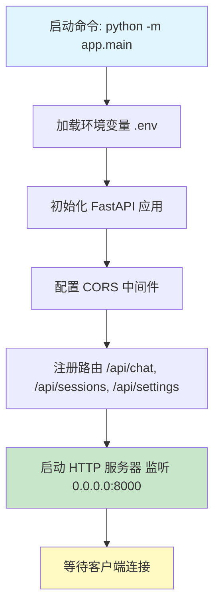

### 延迟初始化流程

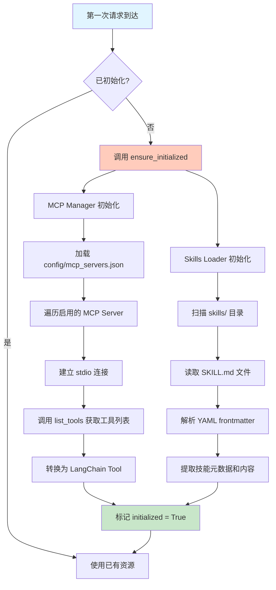

---

## 用户请求完整流程

### 请求处理流程图

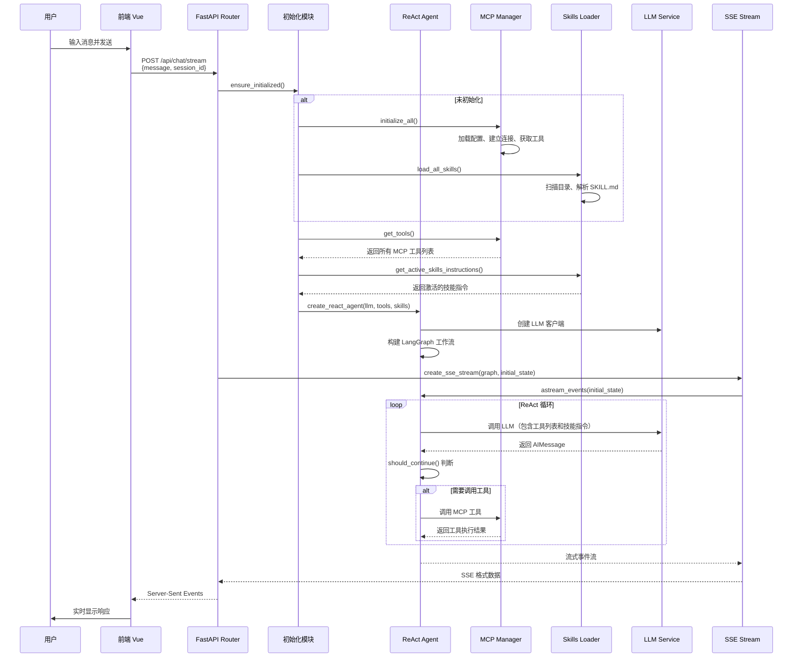

---

## ReAct Agent 工作流程

### ReAct 循环详细流程

```mermaid
flowchart TD
    Start([开始: 用户消息]) --> AgentNode[Agent 节点<br/>call_model]
    
    AgentNode --> BuildPrompt[构建系统提示词]
    BuildPrompt --> AddTools[添加工具列表<br/>- time_get_time<br/>- calculator_calculate<br/>...]
    AddTools --> AddSkills[添加技能指令<br/>## skill-name<br/>description<br/>content]
    AddSkills --> CallLLM[调用 LLM<br/>llm.ainvoke messages]
    CallLLM --> GetResponse[获取 AIMessage 响应]
    
    GetResponse --> CheckContent{检查响应内容}
    CheckContent -->|包含 tool_call JSON| ParseJSON[解析工具调用 JSON<br/>{action: tool_call,<br/>tool: tool_name,<br/>arguments: {...}}]
    CheckContent -->|纯文本回复| EndNode[END 节点]
    
    ParseJSON --> ShouldContinue[should_continue 判断]
    ShouldContinue -->|返回 call_tool| ToolNode[Tool 节点<br/>call_tool]
    ShouldContinue -->|返回 end| EndNode
    
    ToolNode --> ExtractTool[提取工具名称和参数]
    ExtractTool --> FindTool[查找 LangChain Tool]
    FindTool --> ExecuteTool[执行工具<br/>tool.arun arguments]
    ExecuteTool --> GetResult[获取工具执行结果]
    GetResult --> FormatResult[格式化为 HumanMessage<br/>工具执行结果: ...]
    FormatResult --> UpdateState[更新状态<br/>messages += [result]]
    
    UpdateState --> AgentNode
    
    EndNode --> StreamOutput[流式输出最终回复]
    StreamOutput --> Finish([结束])
    
    style Start fill:#e1f5ff
    style AgentNode fill:#fff9c4
    style ToolNode fill:#ffccbc
    style EndNode fill:#c8e6c9
    style Finish fill:#c8e6c9
```

### ReAct 状态转换图

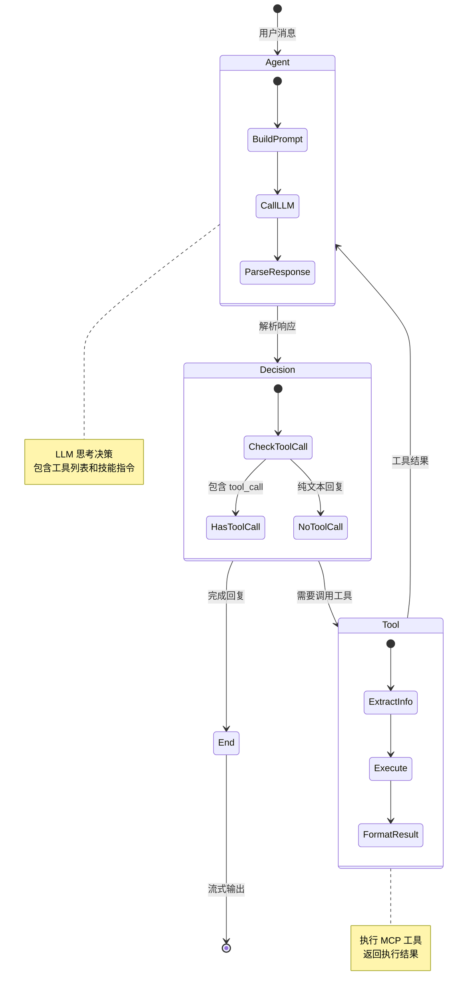

---

## MCP 工具调用流程

### MCP Server 初始化流程

```mermaid
flowchart TD
    A[读取 config/mcp_servers.json] --> B[遍历所有 Server 配置]
    B --> C{enabled: true?}
    C -->|否| B
    C -->|是| D[创建 StdioServerParameters]
    
    D --> E[建立 stdio 连接<br/>stdio_client server_params]
    E --> F[创建 ClientSession<br/>read, write]
    F --> G[初始化 Session<br/>await session.initialize]
    
    G --> H[获取工具列表<br/>await session.list_tools]
    H --> I[遍历工具]
    I --> J[转换为 LangChain Tool]
    J --> K[注册工具名称<br/>server_id + _ + tool_name]
    K --> L{还有工具?}
    L -->|是| I
    L -->|否| M[保存 Session 到字典<br/>sessions[server_id] = session]
    
    M --> N{还有 Server?}
    N -->|是| B
    N -->|否| O[初始化完成]
    
    style A fill:#e1f5ff
    style O fill:#c8e6c9
```

### MCP 工具调用详细流程

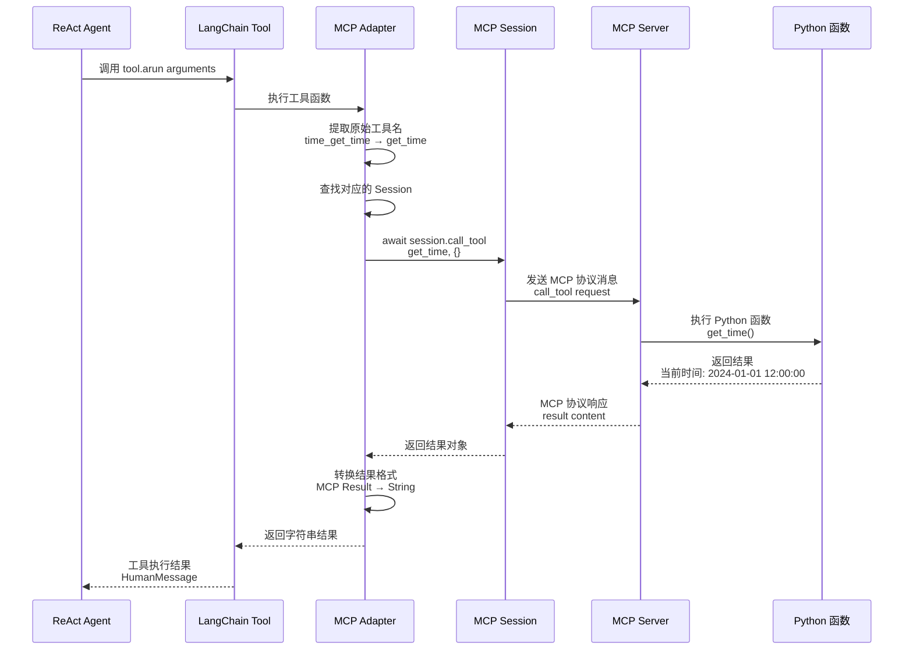

### MCP 工具名称映射

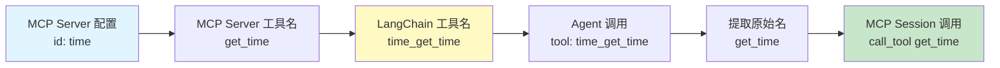

---

## Skills 加载和使用流程

### Skills 加载流程

```mermaid
flowchart TD
    A[扫描 skills/ 目录] --> B[遍历子目录]
    B --> C[读取 SKILL.md 文件]
    C --> D[解析 YAML Frontmatter]
    
    D --> E[提取元数据<br/>name, description,<br/>license, compatibility]
    E --> F[提取 Body 内容<br/>Markdown 指令]
    
    F --> G[创建 Skill 对象<br/>name, description,<br/>content, metadata]
    G --> H[存储到字典<br/>skills[name] = Skill]
    
    H --> I{还有目录?}
    I -->|是| B
    I -->|否| J[加载完成]
    
    style A fill:#e1f5ff
    style J fill:#c8e6c9
```

### Skills 使用流程

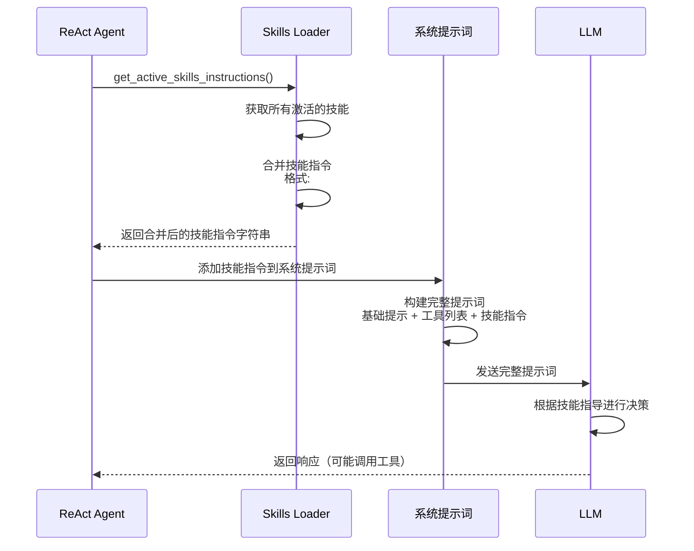

### Skills 渐进式披露流程

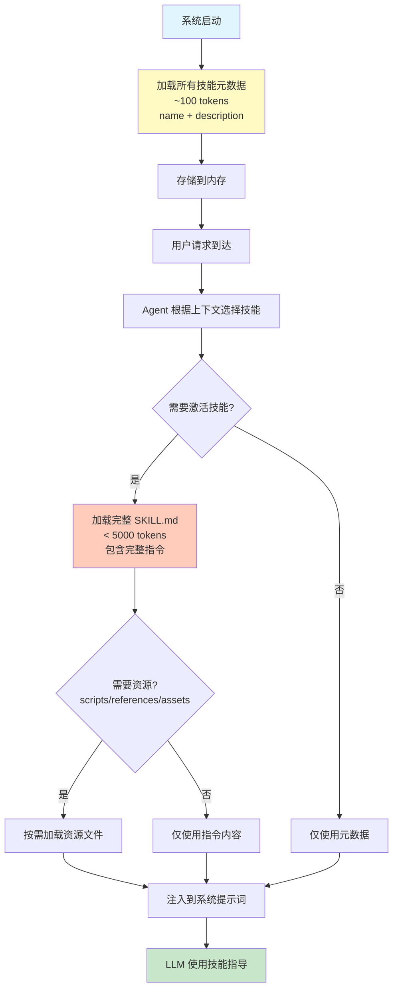

---

## 前端 React 组件交互流程

### Vue 组件数据流

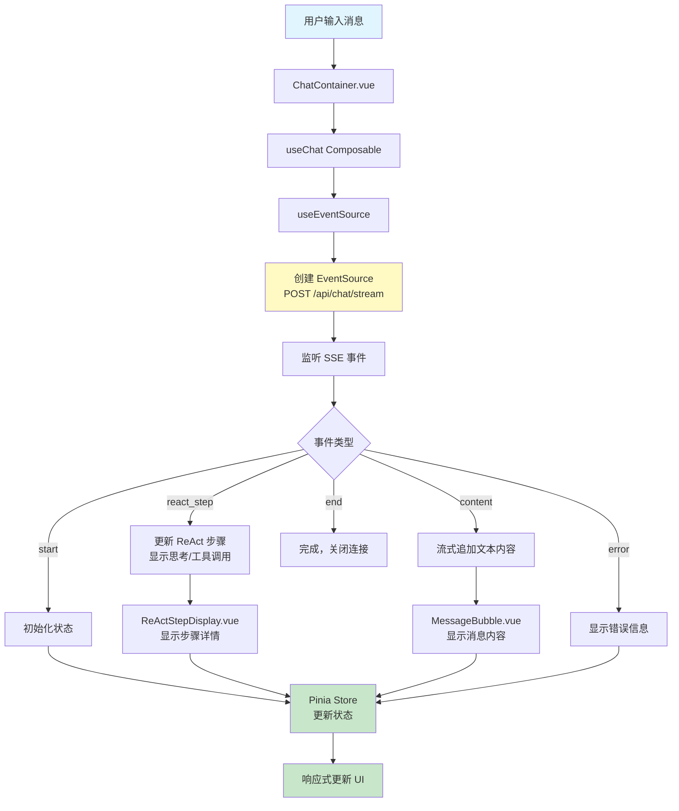

### 前端 SSE 事件处理流程

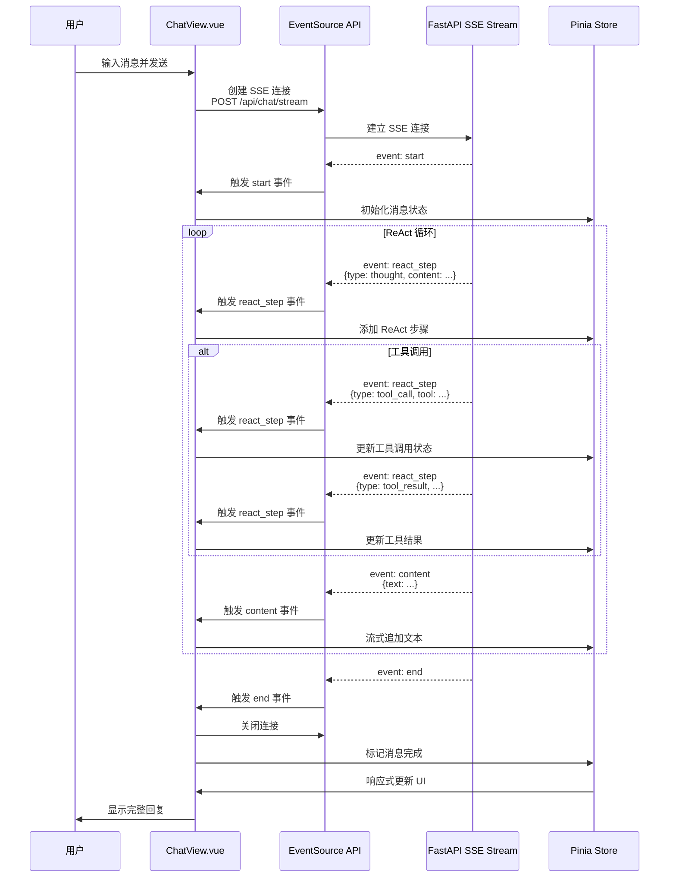

---

## 流式输出流程

### SSE 事件格式和流程

```mermaid
flowchart TD
    A[LangGraph astream_events] --> B[LangGraphEventProcessor]
    B --> C[处理事件类型]
    
    C --> D{事件类型}
    D -->|on_chain_start| E[处理节点开始]
    D -->|on_chain_end| F[处理节点结束]
    D -->|on_llm_stream| G[处理 LLM 流式内容]
    D -->|on_tool_start| H[处理工具开始]
    D -->|on_tool_end| I[处理工具结束]
    
    E --> J[转换为 ReActStep]
    F --> J
    G --> K[转换为 content 事件]
    H --> J
    I --> J
    
    J --> L[格式化 SSE 事件<br/>event: react_step<br/>data: {...}]
    K --> M[格式化 SSE 事件<br/>event: content<br/>data: {text: ...}]
    
    L --> N[StreamingResponse]
    M --> N
    
    N --> O[发送到前端]
    
    style A fill:#e1f5ff
    style B fill:#fff9c4
    style N fill:#c8e6c9
    style O fill:#c8e6c9
```

### SSE 事件序列示例

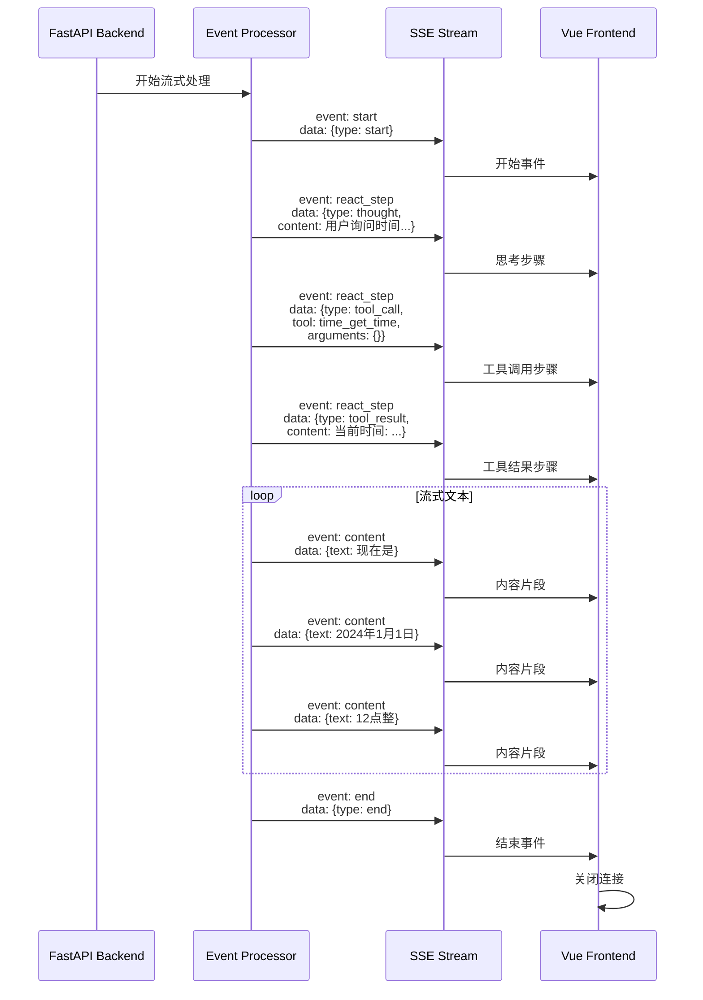

---

## 完整端到端流程示例

### 示例：用户询问时间

```mermaid
flowchart TD
    Start([用户: 现在几点了?]) --> A[前端发送请求<br/>POST /api/chat/stream]
    
    A --> B[后端接收请求]
    B --> C{已初始化?}
    C -->|否| D[初始化 MCP 和 Skills]
    C -->|是| E[获取工具和技能]
    
    D --> E
    E --> F[创建 ReAct Agent]
    
    F --> G[Agent 节点: 调用 LLM]
    G --> H[系统提示词包含:<br/>- 工具列表: time_get_time<br/>- 技能指令: 时间查询技能]
    
    H --> I[LLM 思考:<br/>用户询问时间，<br/>需要调用 time_get_time]
    I --> J[LLM 生成工具调用 JSON:<br/>{action: tool_call,<br/>tool: time_get_time}]
    
    J --> K[should_continue 判断]
    K --> L[路由到 Tool 节点]
    
    L --> M[提取工具名: time_get_time]
    M --> N[查找 LangChain Tool]
    N --> O[执行工具: tool.arun]
    
    O --> P[MCP Adapter 提取原始名: get_time]
    P --> Q[MCP Session 调用<br/>call_tool get_time]
    Q --> R[MCP Server 执行<br/>Python 函数 get_time]
    R --> S[返回结果:<br/>当前时间: 2024-01-01 12:00:00]
    
    S --> T[格式化为 HumanMessage]
    T --> U[更新状态，返回 Agent 节点]
    
    U --> V[Agent 节点: 再次调用 LLM]
    V --> W[LLM 基于工具结果生成回复:<br/>现在是 2024年1月1日 12点整]
    
    W --> X[should_continue 判断]
    X --> Y[无工具调用，结束]
    
    Y --> Z[流式输出到前端]
    Z --> AA[前端显示:<br/>1. 思考步骤<br/>2. 工具调用<br/>3. 工具结果<br/>4. 最终回复]
    
    AA --> End([完成])
    
    style Start fill:#e1f5ff
    style G fill:#fff9c4
    style O fill:#ffccbc
    style Z fill:#c8e6c9
    style End fill:#c8e6c9
```

### 示例：使用 Skills 指导的复杂任务

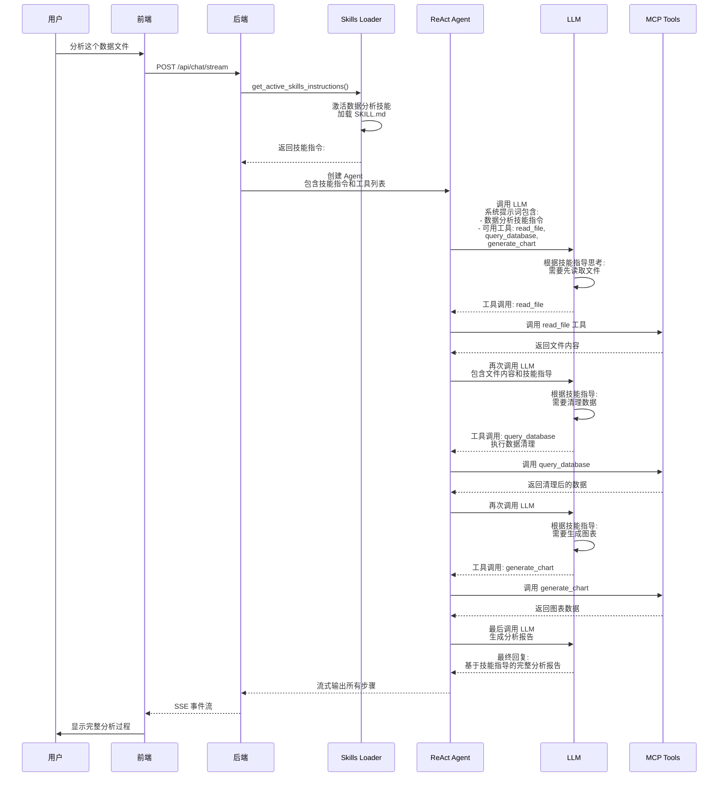

---

## 关键流程说明

### 1. ReAct 循环的核心机制

ReAct (Reasoning + Acting) 循环是 Agent 的核心工作模式：

1. **Thought（思考）**: Agent 分析当前情况，决定下一步行动
2. **Action（行动）**: 如果需要，调用工具执行操作
3. **Observation（观察）**: 获取工具执行结果
4. **Thought（再思考）**: 基于结果继续思考，决定是否需要更多工具调用
5. **循环**: 重复上述过程直到得出最终答案

### 2. MCP 工具的作用

- **提供执行能力**: MCP Server 提供具体的工具函数
- **标准化接口**: 通过 MCP 协议统一工具接口
- **多 Server 支持**: 可以同时连接多个 MCP Server
- **工具命名空间**: 通过 `server_id_tool_name` 避免冲突

### 3. Skills 的作用

- **提供策略指导**: Skills 告诉 Agent "做什么"和"怎么做"
- **任务分解**: 将复杂任务分解为步骤
- **最佳实践**: 提供执行任务的最佳方式
- **可组合性**: 多个 Skills 可以组合使用

### 4. 三者协作关系

```
┌─────────────────────────────────────┐
│      ReAct Agent (决策中心)          │
│  - 思考和分析                        │
│  - 决定调用哪些工具                  │
│  - 生成最终回复                      │
└──────────────┬──────────────────────┘
               │
       ┌───────┴────────┐
       │                │
       ▼                ▼
┌──────────────┐  ┌──────────────┐
│   Skills     │  │  MCP Tools   │
│  (策略层)     │  │  (执行层)     │
│              │  │              │
│ • 任务分解    │  │ • 工具调用    │
│ • 执行步骤    │  │ • 资源访问    │
│ • 最佳实践    │  │ • 数据操作    │
└──────────────┘  └──────────────┘
```

### 5. 流式输出的优势

- **实时反馈**: 用户可以实时看到 Agent 的思考过程
- **透明化**: 显示工具调用和结果，增强可解释性
- **更好的体验**: 不需要等待完整回复，提升用户体验

---

## 总结

本文档详细描述了 DHA 项目中 React、Skills、MCP 的完整流程：

1. **系统启动**: 延迟初始化，按需加载 MCP 和 Skills
2. **请求处理**: 接收请求 → 初始化 → 创建 Agent → 执行工作流
3. **ReAct 循环**: Agent 思考 → 工具调用 → 结果处理 → 生成回复
4. **MCP 工具**: Server 连接 → 工具发现 → 工具注册 → 工具调用
5. **Skills 使用**: 技能加载 → 技能激活 → 指令注入 → 策略指导
6. **前端交互**: SSE 连接 → 事件监听 → 状态更新 → UI 渲染
7. **流式输出**: 事件处理 → SSE 格式化 → 实时推送 → 前端显示

整个系统通过 ReAct Agent 模式，结合 MCP 工具的执行能力和 Skills 的策略指导，实现了强大的 AI 助手功能。
