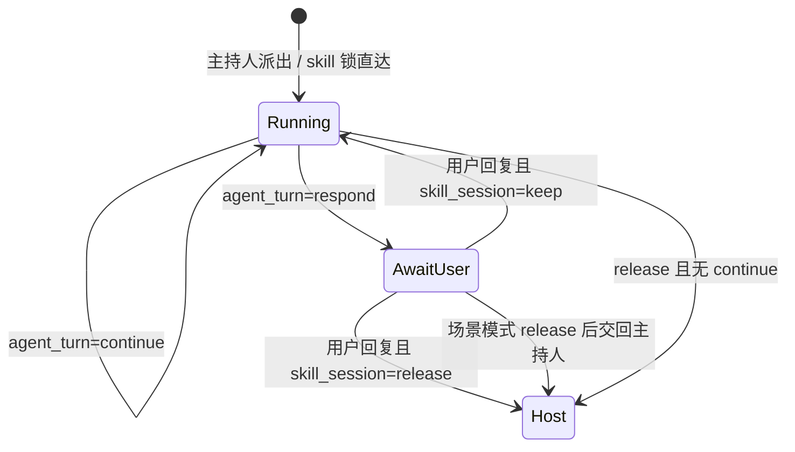

# 群聊编排有限状态机

本文把「主持人调度」「Skill 会话锁」「专家回合内流程控制」合成一张状态机视图，便于实现与测试对齐。

字段级协议细节见 [Skill 流程控制协议](../skills/skill-session-flow.md)；主持人 Skill 边界见 [主持人 Skill 规范](../skills/host-skill.md)。

---

## 1. 三层控制，不要混为一谈

| 层级 | 状态载体 | 谁决定 | 作用 |
| --- | --- | --- | --- |
| **L0 入口路由** | `meta.skill_session_owner_id` / `scheduler_state.next_speaker` | 平台规则 | 本轮消息是否绕过主持人、是否已结束 |
| **L1 主持人 FSM** | `scheduler_state.next_speaker`（主持人 JSON） | 主持人 LLM / 平台固定话术 | 宏观编排：派专家、等用户、组队、收束 |
| **L2 专家回合 FSM** | 脚本 stdout / 隐藏状态块 `next_action` | 专家 Skill / 脚本 | 单专家回合内继续行动，以及是否保留 Skill 锁 |

**关键区分：**

- `next_speaker=user`（L1）：主持人判断「先让用户说」，**下一轮用户消息仍会走主持人**。
- `next_action.skill_session=keep`（L2）：专家声明「我和用户还要连续讨论」，**下一条用户消息直达该专家，主持人 bypass**。

二者正交，不能互相替代。

---

## 2. 总览流程图

```mermaid
flowchart TD
    START([用户消息进入]) --> P0{@专家 强制点名?}
    P0 -->|是| EXPERT
    P0 -->|否| P1{显式点名场内专家?}
    P1 -->|是| CLEAR_LOCK[清理 skill 锁] --> EXPERT
    P1 -->|否| P2{skill_session 锁有效?}
    P2 -->|是| EXPERT[专家回合 L2]
    P2 -->|否| P3{scheduler_state.end?}
    P3 -->|是| HOST_END[固定: 任务结束，请打开新对话]
    P3 -->|否| P4{场内 0 专家?}
    P4 -->|是| HOST_INVITE[固定: 推荐专家话术]
    P4 -->|否| HOST[主持人调度 L1]

    HOST --> H1{next_speaker}
    H1 -->|agent-xxx| HOST_DELEGATE[固定: 下面由 X 发言] --> EXPERT
    H1 -->|user| HOST_SILENT[静默，等用户] --> WAIT_USER([AWAITING_USER])
    H1 -->|invite| HOST_INVITE --> WAIT_USER
    H1 -->|end| HOST_END --> COMPLETED([COMPLETED])

    EXPERT --> E_DONE{专家回合结束}
    E_DONE -->|agent_turn=continue| EXPERT
    E_DONE -->|skill_session=keep| LOCK[写入 skill 锁] --> WAIT_USER
    E_DONE -->|skill_session=release| UNLOCK[释放 skill 锁] --> HOST
    E_DONE -->|场景模式且 release| HOST

    WAIT_USER --> START
    HOST_END --> COMPLETED
```

实现入口：`group_chat_runtime.group_chat_stream`、`group_orchestration_fsm.resolve_group_entry_route`、`group_chat_skill_session._should_handoff_to_host_after_expert`。

---

## 3. L0 入口路由（平台硬规则）

优先级从高到低（与 [session-modes.md](./session-modes.md) 一致）：

1. `@专家` 开头 → 强制该专家，清理常规调度。
2. 用户显式点名场内专家 → 直达该专家，**清理旧 skill 锁**。
3. `skill_session_owner_id` 有效且专家仍在场内，且用户未要求主持人接管 → **`skip_host_dispatch`**，直达锁定专家。
4. `scheduler_state.next_speaker == end`（或 `current_phase == end`）→ 吸收态，固定结束话术，不再调主持人 / 专家。
5. 否则 → 进入 L1 主持人调度。

用户可说「结束 skill / 交给主持人」等语义主动 **`clear_skill_session_lock`**，从 L2 环回到 L1。

---

## 4. L1 主持人 FSM（`next_speaker`）

主持人**只输出 JSON**（`current_phase`、`next_speaker`、`speaker_task`），平台按状态生成**固定可见话术**：

| `next_speaker` | 平台阶段 | 用户可见主持话术 | 后续 |
| --- | --- | --- | --- |
| `agent-xxx` | `EXECUTING` | `下面由 {名} 发言。` | 进入 L2 专家回合；`speaker_task` 交给专家 |
| `user` | `AWAITING_USER` | **无气泡（静默）** | 用户补充后**重新走 L1** |
| `invite` | `RECRUITING` / `AWAITING_USER` | 固定「我推荐以下专家加入讨论：…」 | 解析 `suggested_add_agent_ids`，等用户确认邀请 |
| `end` | `COMPLETED` | `任务结束，请打开新对话。` | **吸收态**：后续任意输入仍结束 |

**不应出现：** 主持人复述用户需求、代答、自由发挥 announcement（如「好的，我理解了…」）。

`invite` 与 0 专家分支在实现上可合并：都是「需组队」态，话术固定。

---

## 5. L2 专家回合 FSM（`execution_status` + `next_action`）

专家通过**脚本 stdout JSON** 或正文末尾 **隐藏状态块** 输出同一套字段。详见 [skill-session-flow.md](../skills/skill-session-flow.md)。

### 5.1 `execution_status`（当前步骤结果）

| 值 | 含义 | 专家对用户怎么说 |
| --- | --- | --- |
| `succeeded` | 当前步骤成功（≠ 整个工作流结束） | 交付 `artifacts` 中的业务结果 |
| `blocked` | 未达目标，但用户补参/补文件/确认后可继续 | 说明缺什么，请用户补充 |
| `failed` | 当前参数下无法继续 | 说明原因与可修正方式 |

### 5.2 `next_action.agent_turn`（**同一 HTTP 连接内**的专家回合）

| 值 | 平台动作 | 典型场景 |
| --- | --- | --- |
| `continue` | 同一轮内继续让专家读结果、改文件、调下一工具 | 初始化后还要写 `SKILL.md`；manifest 后还要选脚本 |
| `respond` | 基于脚本结果生成面向用户的最终答复 | 脚本已产出结果，专家只做总结 |

缺省：`respond`。

### 5.3 `next_action.skill_session`（**跨请求**的 Skill 锁）

| 值 | 平台动作 | 典型场景 |
| --- | --- | --- |
| `keep` | 写入 `skill_session_owner_id` + `skill_session_skill_id`；下条用户消息 **L0 bypass 主持人** | 需用户补充/确认/上传；多轮工作流未完成 |
| `release` | 清除 skill 锁；下条用户消息交回 **L1 主持人** | 本 Skill 流程完成；后续应由主持人重选专家 |

缺省：`release`。

### 5.4 专家回合状态转移



**与 L1 的衔接：**

- `skill_session=keep` → `_should_handoff_to_host_after_expert` 为 **false** → 专家说完**不**调主持人，只等用户；下轮走 L0 第 3 条。
- `skill_session=release` → 交回 L1；场景模式（`orchestration_profile=scene`）专家完成后**默认**交回主持人。

**冲突规则：** 任一信号明确要求 `keep` 则保留锁；仅当无 `keep` 且有 `release` 时释放。

---

## 6. 推荐组合速查

| 意图 | execution_status | agent_turn | skill_session |
| --- | --- | --- | --- |
| 中间步骤，专家继续干活 | `succeeded` | `continue` | `keep` |
| 等用户补输入 | `blocked` | `respond` | `keep` |
| 本 Skill 交付完成 | `succeeded` | `respond` | `release` |
| 失败且无法在当前参数下继续 | `failed` | `respond` | `release` |

---

## 7. 与两种会话模式的对照

| 环节 | 新建会话（recruitment） | 场景协作（scene） |
| --- | --- | --- |
| 组队 | L1 `invite` + 固定推荐话术 | 名单固定，一般不 `invite` |
| 专家多轮 | L2 `keep` → 四九 bypass | 同左 |
| 专家完成后 | `release` → 四九调度 | `release` → **必回四九**（除非 `keep`） |
| 场景结束 | L1 `end` 吸收态 | 同左 |

---

## 8. 测试与实现索引

| 行为 | 主要代码 | 测试 |
| --- | --- | --- |
| 入口 skill 锁 bypass | `group_orchestration_fsm.resolve_group_entry_route` | `test_group_orchestration_fsm.py` |
| 专家后是否交回主持人 | `group_chat_skill_session._should_handoff_to_host_after_expert` | `test_host_takeover.py`、`test_group_chat_stream_protocol.py` |
| 解析 `next_action` | `skill_session_contract.resolve_skill_session_state` | `test_group_orchestration_fsm.py` |
| 主持固定话术 | `group_chat_host_messages.py` | `test_host_fixed_messages.py` |
| 主持 JSON 决策 | `group_host_decision.py`、`group_chat_host_runtime.py` | `test_group_host_decision.py` |
