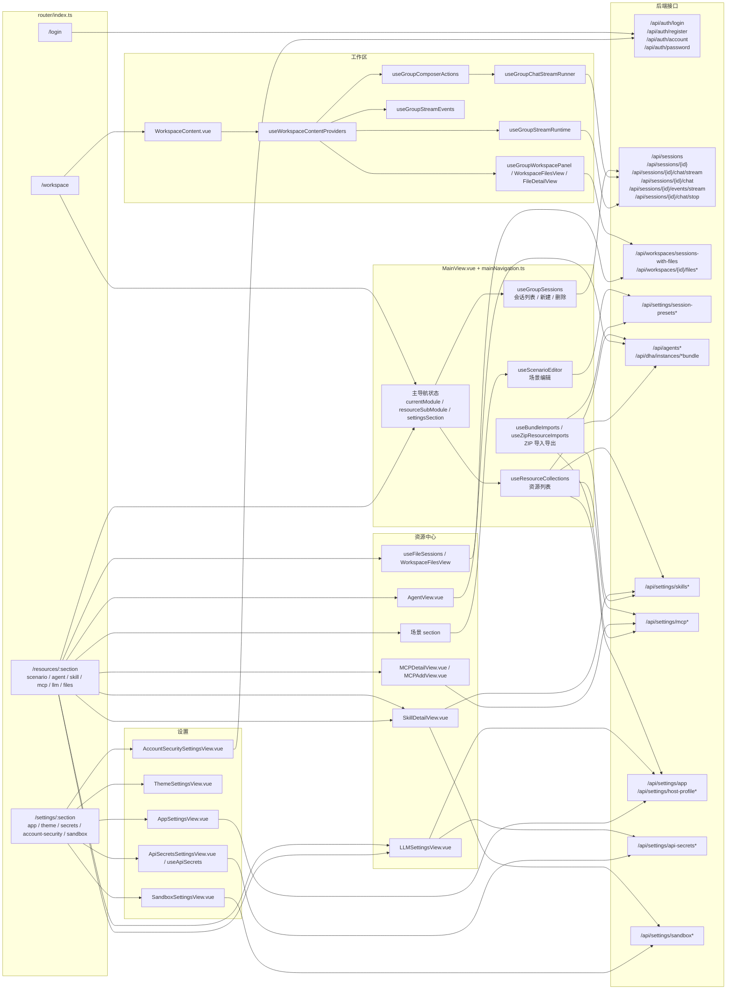
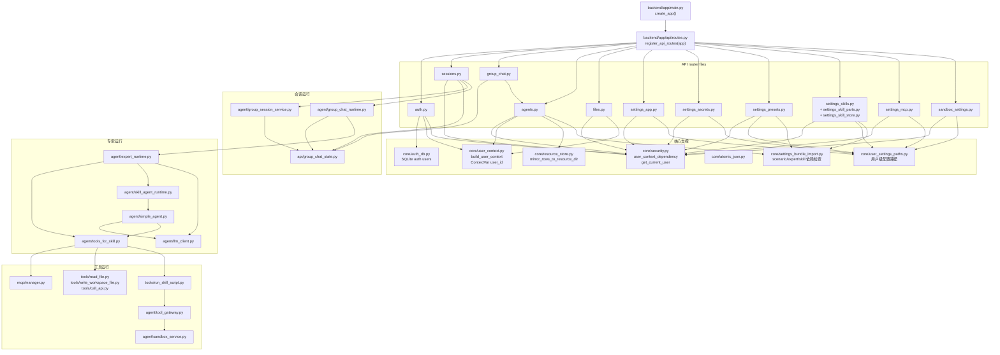
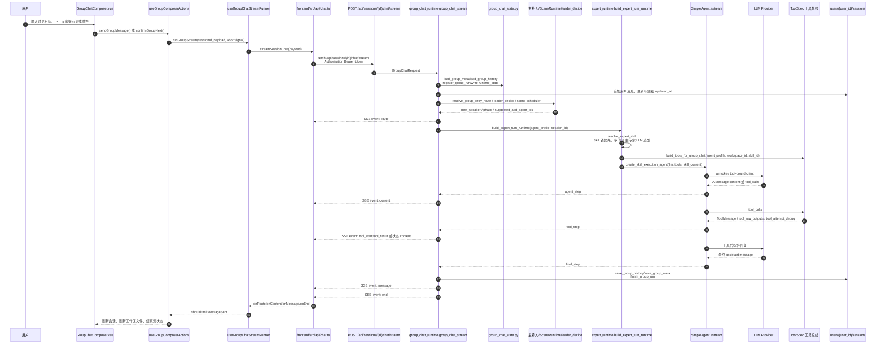
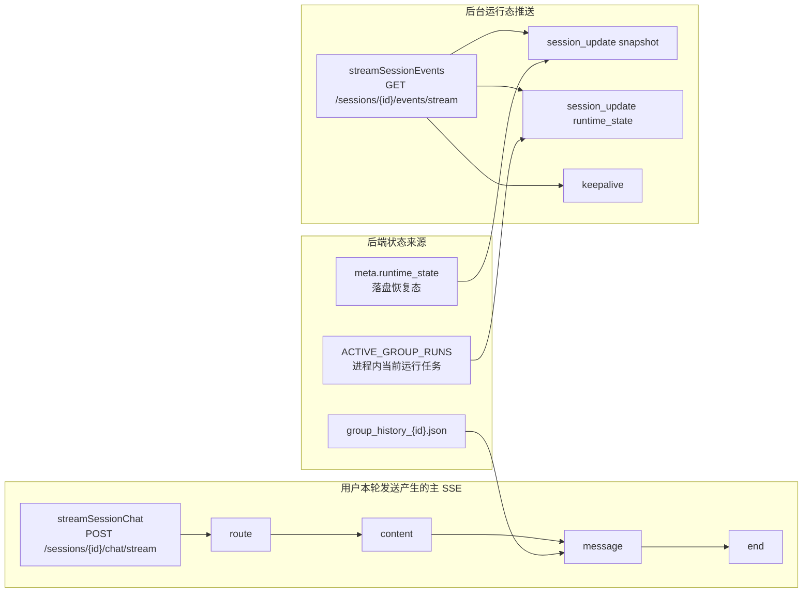
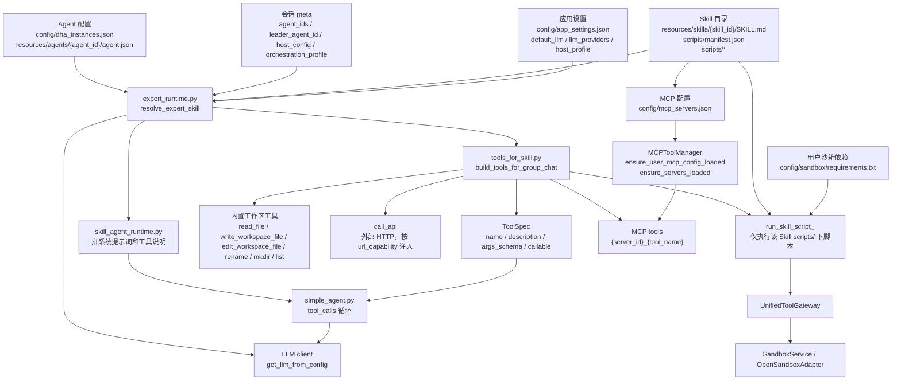
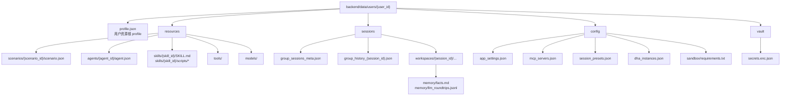
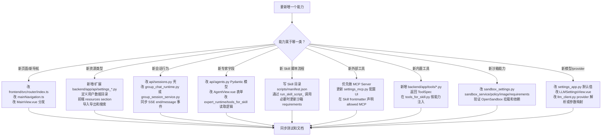

# 书童四九接口定位架构图

本文是排查问题和新增功能时使用的接口定位图。它不替代详细设计，而是回答四个问题：

1. 一个页面按钮或输入框最终会打到哪个接口。
2. 一个后端接口进入后会落到哪个服务、运行时或数据目录。
3. 一次专家回复如何从前端输入走到 LLM、工具、沙箱，再回到 SSE。
4. 新增功能时应改哪些边界，哪些地方必须同步。

源码事实以以下入口为准：

- 前端路由：`frontend/src/router/index.ts`
- 前端 API 基址与鉴权：`frontend/src/api/base.ts`、`frontend/src/main.ts`
- 会话流式 API：`frontend/src/api/chat.ts`
- 后端应用入口：`backend/app/main.py`
- 后端 API 注册：`backend/app/api/routes.py`
- 用户隔离路径：`backend/app/core/user_context.py`

## 1. 总览定位图

```mermaid
flowchart TB
  User["用户浏览器"]

  subgraph FE["前端 Vue 3 / Vite"]
    Router["router/index.ts<br/>/workspace<br/>/resources/:section<br/>/settings/:section<br/>/login"]
    Main["views/MainView.vue<br/>主导航 / 中栏列表 / 右侧内容分发"]
    AuthUI["features/auth/LoginView.vue"]
    WorkspaceUI["features/workspace<br/>WorkspaceContent.vue<br/>GroupChat* 组件<br/>workspace composables"]
    ResourceUI["features/resources<br/>场景 / 专家 / Skill / MCP / LLM / 文件"]
    SettingsUI["features/settings<br/>主持人 / 主题 / 密钥 / 账号 / 沙箱"]
    ApiBase["api/base.ts<br/>apiUrl / apiRequest / apiFetch"]
    ChatApi["api/chat.ts<br/>streamSessionChat<br/>streamSessionEvents<br/>chatOnceRequest"]
    FetchWrap["main.ts<br/>全局 fetch 包装<br/>Authorization Bearer dha_token<br/>401 统一跳转登录"]
  end

  subgraph API["后端 FastAPI /api"]
    MainPy["app/main.py<br/>create_app / CORS / lifespan / static SPA / health"]
    Routes["api/routes.py<br/>register_api_routes"]
    AuthAPI["api/auth.py<br/>/api/auth/*"]
    SessionsAPI["api/sessions.py<br/>/api/sessions/*"]
    GroupArchiveAPI["api/group_chat.py<br/>/api/sessions/{id}/archive"]
    AgentsAPI["api/agents.py<br/>/api/agents/*<br/>/api/dha/instances/*bundle"]
    FilesAPI["api/files.py<br/>/api/workspaces/*"]
    SettingsAppAPI["api/settings_app.py<br/>/api/settings/app<br/>/api/settings/host-profile"]
    SettingsSecretAPI["api/settings_secrets.py<br/>/api/settings/api-secrets"]
    SettingsPresetAPI["api/settings_presets.py<br/>/api/settings/session-presets"]
    SettingsSkillAPI["api/settings_skills.py<br/>/api/settings/skills/*"]
    SettingsMcpAPI["api/settings_mcp.py<br/>/api/settings/mcp/*"]
    SandboxAPI["api/sandbox_settings.py<br/>/api/settings/sandbox*"]
  end

  subgraph Runtime["Agent 编排与运行时"]
    SessionState["api/group_chat_state.py<br/>meta/history/runtime_state<br/>ACTIVE_GROUP_RUNS<br/>session_update SSE"]
    SessionService["agent/group_session_service.py<br/>会话 CRUD / 事件流 / 停止 / 导出"]
    GroupRuntime["agent/group_chat_runtime.py<br/>group_chat_stream<br/>主持人调度 / 专家回合 / SSE"]
    SceneRuntime["agent/scene_runtime.py<br/>场景主持人和 orchestration_profile"]
    FSM["agent/group_orchestration_fsm.py<br/>Skill 锁 / 入口路由 / 状态恢复"]
    Orchestrator["agent/orchestrator_state.py<br/>phase / interrupt_reason / end payload"]
    ExpertRuntime["agent/expert_runtime.py<br/>resolve_expert_skill<br/>build_expert_turn_runtime"]
    ToolsForSkill["agent/tools_for_skill.py<br/>build_tools_for_group_chat"]
    SkillAgentRuntime["agent/skill_agent_runtime.py<br/>create_skill_execution_agent"]
    SimpleAgent["agent/simple_agent.py<br/>tool_calls ReAct loop<br/>agent_step / tool_step / final_step"]
    LLMClient["agent/llm_client.py<br/>get_llm_from_config<br/>OpenAI-compatible ChatOpenAI"]
  end

  subgraph ToolLayer["工具与沙箱层"]
    ToolSpec["agent/tool_spec.py<br/>ToolSpec<br/>OpenAI tool schema"]
    ToolGateway["agent/tool_gateway.py<br/>UnifiedToolGateway<br/>timeout / retry / idempotency / user semaphore"]
    BuiltinTools["tools/read_file.py<br/>tools/write_workspace_file.py<br/>tools/call_api.py<br/>工作区与 HTTP 内置工具"]
    RunSkillScript["tools/run_skill_script.py<br/>run_skill_script_<skill_id><br/>CLI-only / scripts/manifest.json"]
    McpManager["mcp/manager.py<br/>MCPToolManager<br/>stdio / streamable_http<br/>schema / connect / call"]
    SandboxService["agent/sandbox_service.py<br/>SandboxService<br/>OpenSandbox lifecycle / requirements / mounts"]
    SandboxAdapter["agent/sandbox_adapter.py<br/>OpenSandboxAdapter<br/>create / execute / read / write / list"]
  end

  subgraph Data["用户隔离数据 backend/data/users/{user_id}"]
    UserProfile["profile.json"]
    Config["config/<br/>app_settings.json<br/>mcp_servers.json<br/>session_presets.json<br/>dha_instances.json<br/>sandbox/requirements.txt"]
    Resources["resources/<br/>scenarios / agents / skills / tools / models"]
    Sessions["sessions/<br/>group_sessions_meta.json<br/>group_history_{session_id}.json<br/>workspaces/{session_id}/..."]
    Vault["vault/secrets.enc.json"]
  end

  subgraph External["外部依赖"]
    LLM["LLM Provider<br/>DashScope / OpenAI-compatible / Gemini / Claude / DeepSeek 等"]
    MCPServer["MCP Server<br/>stdio 子进程或 Streamable HTTP"]
    OpenSandbox["OpenSandbox 控制面与沙箱镜像"]
  end

  User --> Router
  Router --> Main
  Router --> AuthUI
  Main --> WorkspaceUI
  Main --> ResourceUI
  Main --> SettingsUI
  WorkspaceUI --> ChatApi
  WorkspaceUI --> ApiBase
  ResourceUI --> ApiBase
  SettingsUI --> ApiBase
  AuthUI --> ApiBase
  ApiBase --> FetchWrap
  ChatApi --> FetchWrap

  FetchWrap -->|REST / SSE / Authorization| MainPy
  MainPy --> Routes
  Routes --> AuthAPI
  Routes --> SessionsAPI
  Routes --> GroupArchiveAPI
  Routes --> AgentsAPI
  Routes --> FilesAPI
  Routes --> SettingsAppAPI
  Routes --> SettingsSecretAPI
  Routes --> SettingsPresetAPI
  Routes --> SettingsSkillAPI
  Routes --> SettingsMcpAPI
  Routes --> SandboxAPI

  AuthAPI --> UserProfile
  AuthAPI --> Config
  SessionsAPI --> SessionService
  SessionsAPI --> GroupRuntime
  GroupArchiveAPI --> SessionState
  AgentsAPI --> Config
  AgentsAPI --> Resources
  FilesAPI --> Sessions
  SettingsAppAPI --> Config
  SettingsSecretAPI --> Config
  SettingsSecretAPI --> Vault
  SettingsPresetAPI --> Config
  SettingsPresetAPI --> Resources
  SettingsSkillAPI --> Resources
  SettingsMcpAPI --> Config
  SandboxAPI --> Config

  SessionService --> SessionState
  GroupRuntime --> SessionState
  GroupRuntime --> SceneRuntime
  GroupRuntime --> FSM
  GroupRuntime --> Orchestrator
  GroupRuntime --> ExpertRuntime
  ExpertRuntime --> ToolsForSkill
  ExpertRuntime --> SkillAgentRuntime
  ExpertRuntime --> LLMClient
  SkillAgentRuntime --> SimpleAgent
  SimpleAgent --> ToolSpec
  SimpleAgent --> LLMClient
  ToolsForSkill --> ToolSpec
  ToolsForSkill --> BuiltinTools
  ToolsForSkill --> RunSkillScript
  ToolsForSkill --> McpManager
  RunSkillScript --> ToolGateway
  ToolGateway --> SandboxService
  SandboxService --> SandboxAdapter
  LLMClient --> LLM
  McpManager --> MCPServer
  SandboxAdapter --> OpenSandbox
  BuiltinTools --> Sessions
  RunSkillScript --> Resources
  SandboxService --> Sessions
```

## 2. 前端路由到接口图

前端定位规则：

| 现象 | 第一定位文件 | 继续看 |
|------|--------------|--------|
| 路由跳错、刷新后 section 被改回默认值 | `frontend/src/router/index.ts`、`frontend/src/features/shell/mainNavigation.ts` | `MainView.vue` 的 `currentModule/resourceSubModule/settingsSection` |
| 401 后被踢登录页 | `frontend/src/main.ts` | `backend/app/api/auth.py`、`backend/app/core/security.py` |
| `/api` 基址不对 | `frontend/src/api/base.ts` | `frontend/vite.config.ts`、生产同源静态挂载 |
| 工作区发送后没流式显示 | `frontend/src/api/chat.ts`、`useGroupChatStreamRunner.ts` | `useGroupStreamEvents.ts`、`backend/app/agent/group_chat_streaming.py` |
| 会话刷新后运行态不对 | `useGroupStreamRuntime.ts` | `backend/app/api/group_chat_state.py` 的 `runtime_state_for_session()` |
| 资源中心列表没刷新 | `useResourceCollections.ts` | 对应 `/api/settings/*` 或 `/api/agents` |
| 文件预览、下载、图片认证失败 | `FileDetailView.vue`、`workspaceMessageUtils.ts` | `backend/app/api/files.py` |

## 3. 后端 API 到模块图

后端端点索引：

| 接口组 | 路径 | 入口文件 | 下游模块 | 主要数据落点 |
|--------|------|----------|----------|--------------|
| 健康检查 | `GET /health` | `backend/app/main.py` | 无 | 无 |
| 登录注册 | `POST /api/auth/login`、`POST /api/auth/register` | `backend/app/api/auth.py` | `core/auth_db.py`、`core/user_context.py` | 账号库、`users/{user_id}/profile.json` |
| 修改账号密码 | `PUT/POST /api/auth/account`、`PUT/POST /api/auth/password` | `backend/app/api/auth.py` | `core/auth_db.py` | 账号库 |
| 会话列表和 CRUD | `GET/POST/PUT/DELETE /api/sessions*` | `backend/app/api/sessions.py` | `agent/group_session_service.py`、`api/group_chat_state.py` | `sessions/group_sessions_meta.json`、`sessions/group_history_{id}.json` |
| 主对话流 | `POST /api/sessions/{id}/chat/stream` | `backend/app/api/sessions.py` | `agent/group_chat_runtime.py` | 会话 history/meta/workspace |
| 非流式兜底 | `POST /api/sessions/{id}/chat` | `backend/app/api/sessions.py` | 内部聚合同一条 SSE 流 | 无新增独立状态 |
| 停止运行 | `POST /api/sessions/{id}/chat/stop` | `backend/app/api/sessions.py` | `group_session_service.stop_group_session_run()`、`group_chat_state.cancel_group_session_run()` | `runtime_state` |
| 会话事件推送 | `GET /api/sessions/{id}/events/stream` | `backend/app/api/sessions.py` | `group_session_service.group_session_events_stream()` | 内存订阅队列 |
| 会话归档 | `GET /api/sessions/{id}/archive`、`POST /api/sessions/{id}/export` | `api/group_chat.py`、`api/sessions.py` | `group_chat_state`、`group_session_service` | 工作区 Markdown |
| 工作区文件 | `/api/workspaces/{id}/files*` | `backend/app/api/files.py` | 路径归一化和文件系统 | `sessions/workspaces/{id}/...` |
| 专家 | `/api/agents*` | `backend/app/api/agents.py` | `core/resource_store.py`、`core/settings_references.py` | `config/dha_instances.json`、`resources/agents/{agent_id}/agent.json` |
| 专家包 | `/api/dha/instances/*bundle` | `backend/app/api/agents.py` | `core/expert_bundle.py`、`core/settings_bundle_import.py` | ZIP 流、资源目录 |
| 场景 | `/api/settings/session-presets*` | `backend/app/api/settings_presets.py` | `core/scenario_bundle.py`、`core/settings_bundle_import.py` | `config/session_presets.json`、`resources/scenarios/{id}/scenario.json` |
| Skill | `/api/settings/skills*` | `backend/app/api/settings_skills.py` | `settings_skill_parts.py`、`settings_skill_store.py`、`skills/loader.py` | `resources/skills/{skill_id}/...` |
| MCP | `/api/settings/mcp*` | `backend/app/api/settings_mcp.py` | `mcp/manager.py`、`core/settings_bundle_import.py` | `config/mcp_servers.json` |
| 模型和主持人 | `/api/settings/app`、`/api/settings/host-profile*` | `backend/app/api/settings_app.py` | `agent/llm_client.py` 运行时读取 | `config/app_settings.json` |
| 密钥 | `/api/settings/api-secrets*` | `backend/app/api/settings_secrets.py` | `core/user_settings_paths.py` | `vault/secrets.enc.json` |
| 沙箱设置 | `/api/settings/sandbox*` | `backend/app/api/sandbox_settings.py` | `agent/sandbox_image_policy.py`、`core/sandbox_requirements.py` | `config/sandbox/requirements.txt`、沙箱配置 |

### 3.1 后端接口逐项说明

本节把后端实际注册的接口逐条展开。排查时先按“接口含义”定位业务，再看“入口文件”和“主要落点”。除 `/health` 和根路径外，业务接口都通过 `backend/app/api/routes.py` 挂载到 `/api` 前缀下。

#### 基础、认证与账号

| 方法 | 路径 | 中文含义 | 入口文件 | 主要落点 |
|------|------|----------|----------|----------|
| `GET` | `/health` | 健康检查；用于部署、反向代理或脚本确认后端进程是否存活。 | `backend/app/main.py` | 不读写业务数据 |
| `GET` | `/` | 后端未挂载前端静态文件时返回 API 基本信息；生产静态站点挂载成功时通常由 SPA 接管。 | `backend/app/main.py`、`backend/app/core/static_spa.py` | 不读写业务数据 |
| `POST` | `/api/auth/login` | 登录；校验手机号或邮箱账号与密码，成功返回 Bearer token、`username`、稳定 `user_id`，并异步预热用户沙箱。 | `backend/app/api/auth.py` | 账号库、`users/{user_id}/profile.json`、用户资源目录 |
| `POST` | `/api/auth/register` | 注册；新建账号、初始化用户资源目录、写入用户 profile，并返回登录 token。 | `backend/app/api/auth.py` | 账号库、`users/{user_id}/profile.json`、空场景预设 |
| `PUT` | `/api/auth/account` | 修改当前登录账号；需要当前密码，成功后返回新 token。 | `backend/app/api/auth.py` | 账号库、用户 profile |
| `POST` | `/api/auth/account` | 修改当前登录账号的兼容入口；语义与 `PUT /api/auth/account` 相同。 | `backend/app/api/auth.py` | 账号库、用户 profile |
| `PUT` | `/api/auth/password` | 修改当前登录账号密码；需要当前密码和新密码，成功后返回新 token。 | `backend/app/api/auth.py` | 账号库 |
| `POST` | `/api/auth/password` | 修改密码的兼容入口；语义与 `PUT /api/auth/password` 相同。 | `backend/app/api/auth.py` | 账号库 |

#### 会话、对话流与归档

| 方法 | 路径 | 中文含义 | 入口文件 | 主要落点 |
|------|------|----------|----------|----------|
| `GET` | `/api/sessions` | 获取当前用户的会话列表；用于左侧会话列表和运行态标记。 | `backend/app/api/sessions.py` | `sessions/group_sessions_meta.json` |
| `POST` | `/api/sessions` | 新建新会话；可以为空白主持人会话，也可以带场景专家和主持人配置。 | `backend/app/api/sessions.py` | `sessions/group_sessions_meta.json`、`sessions/group_history_{id}.json` |
| `GET` | `/api/sessions/{session_id}` | 获取会话详情；返回标题、成员、消息历史、专家展示信息、运行态。 | `backend/app/api/sessions.py` | 会话 meta、history、Agent 配置 |
| `GET` | `/api/sessions/{session_id}/events/stream` | 会话后台事件流；页面刷新、切换会话或后台任务继续运行时，用它同步 `runtime_state` 和消息更新。 | `backend/app/api/sessions.py` | 内存订阅队列、会话 `runtime_state` |
| `PUT` | `/api/sessions/{session_id}` | 更新会话；改标题、主持人配置、编排模式、替换或增删专家成员。 | `backend/app/api/sessions.py` | 会话 meta |
| `DELETE` | `/api/sessions/{session_id}` | 删除会话；清理该会话 meta、history 和工作区目录。 | `backend/app/api/sessions.py` | 会话 meta、history、workspace |
| `POST` | `/api/sessions/{session_id}/chat/stop` | 停止当前会话正在运行的一轮回复；前端点击停止时调用。 | `backend/app/api/sessions.py` | `ACTIVE_GROUP_RUNS`、会话 `runtime_state` |
| `DELETE` | `/api/sessions/{session_id}/messages/{message_id}` | 删除会话中的单条消息；用于清理错误消息，避免污染后续上下文。 | `backend/app/api/sessions.py` | `sessions/group_history_{id}.json` |
| `POST` | `/api/sessions/{session_id}/chat/stream` | 主对话入口；接收用户消息或继续指令，进入主持人调度、专家执行、工具调用，并以 SSE 返回 `route/content/message/end`。 | `backend/app/api/sessions.py` | `agent/group_chat_runtime.py`、会话 history/meta/workspace |
| `POST` | `/api/sessions/{session_id}/chat` | 非流式兜底入口；内部复用同一条流式逻辑并聚合最终事件，当前端 SSE 中断时用于补偿本轮回复。 | `backend/app/api/sessions.py` | 同 `/chat/stream` |
| `POST` | `/api/sessions/{session_id}/export` | 将会话历史导出为 Markdown 文件并写入当前会话工作区。 | `backend/app/api/sessions.py` | `sessions/workspaces/{session_id}/...` |
| `GET` | `/api/sessions/{group_session_id}/archive` | 生成会话归档视图数据；返回按消息组织的归档片段和专家展示信息。 | `backend/app/api/group_chat.py` | 会话 history、Agent 配置 |

#### 工作区文件

| 方法 | 路径 | 中文含义 | 入口文件 | 主要落点 |
|------|------|----------|----------|----------|
| `GET` | `/api/workspaces/sessions-with-files` | 列出有工作区文件的会话；资源中心“文件”分区使用。空工作区会被顺手清理。 | `backend/app/api/files.py` | `sessions/workspaces/{session_id}/...` |
| `POST` | `/api/workspaces/{workspace_id}/files/mkdir` | 在某个会话工作区内新建目录。 | `backend/app/api/files.py` | `sessions/workspaces/{workspace_id}/...` |
| `GET` | `/api/workspaces/{workspace_id}/files` | 列出工作区指定目录下的文件和子目录。 | `backend/app/api/files.py` | `sessions/workspaces/{workspace_id}/...` |
| `GET` | `/api/workspaces/{workspace_id}/files/download` | 下载工作区内指定文件；图片和附件下载也走这个入口。 | `backend/app/api/files.py` | `sessions/workspaces/{workspace_id}/...` |
| `GET` | `/api/workspaces/{workspace_id}/files/content` | 读取工作区内 UTF-8 文本文件内容，用于预览、编辑或插入提示词。 | `backend/app/api/files.py` | `sessions/workspaces/{workspace_id}/...` |
| `PUT` | `/api/workspaces/{workspace_id}/files/content` | 保存或覆盖工作区内文本文件内容。 | `backend/app/api/files.py` | `sessions/workspaces/{workspace_id}/...` |
| `DELETE` | `/api/workspaces/{workspace_id}/files/content` | 删除工作区内指定文件或目录。 | `backend/app/api/files.py` | `sessions/workspaces/{workspace_id}/...` |
| `POST` | `/api/workspaces/{workspace_id}/files` | 在工作区内新建新文本文件。 | `backend/app/api/files.py` | `sessions/workspaces/{workspace_id}/...` |
| `POST` | `/api/workspaces/{workspace_id}/files/upload` | 上传本地文件到指定工作区目录；附件引用和文件面板上传使用。 | `backend/app/api/files.py` | `sessions/workspaces/{workspace_id}/...` |
| `PUT` | `/api/workspaces/{workspace_id}/files/rename` | 重命名或移动工作区内文件、目录。 | `backend/app/api/files.py` | `sessions/workspaces/{workspace_id}/...` |

#### 专家 Agent 与专家资源包

| 方法 | 路径 | 中文含义 | 入口文件 | 主要落点 |
|------|------|----------|----------|----------|
| `GET` | `/api/agents` | 获取当前用户专家列表；资源中心专家分区、会话成员展示和主持人调度都依赖它。 | `backend/app/api/agents.py` | `config/dha_instances.json`、`resources/agents/` |
| `POST` | `/api/agents` | 新建专家；写入名称、角色、系统提示词、Skill、MCP、模型和文件能力配置。 | `backend/app/api/agents.py` | `config/dha_instances.json`、`resources/agents/{agent_id}/agent.json` |
| `PUT` | `/api/agents/{agent_id}` | 更新专家配置；改人设、绑定 Skill/MCP、模型、头像和能力开关。 | `backend/app/api/agents.py` | `config/dha_instances.json`、`resources/agents/{agent_id}/agent.json` |
| `DELETE` | `/api/agents/{agent_id}` | 删除专家；同时标记场景预设中缺失的专家引用，避免导入导出引用静默丢失。 | `backend/app/api/agents.py` | 专家配置、场景引用快照 |
| `GET` | `/api/dha/instances/{agent_id}/export-bundle` | 导出专家资源包 ZIP；包含专家配置、关联 Skill 和可选 MCP 配置。 | `backend/app/api/agents.py` | ZIP 文件流、专家/Skill/MCP 配置 |
| `POST` | `/api/dha/instances/import-bundle` | 导入专家资源包；支持 dry-run 预览缺失依赖、冲突和即将导入的 Skill/MCP。 | `backend/app/api/agents.py` | 专家配置、Skill 目录、MCP 配置、沙箱 requirements |

#### 场景与会话预设

| 方法 | 路径 | 中文含义 | 入口文件 | 主要落点 |
|------|------|----------|----------|----------|
| `GET` | `/api/settings/session-presets` | 获取场景/会话预设列表；会从资源目录恢复缺失的聚合配置。 | `backend/app/api/settings_presets.py` | `config/session_presets.json`、`resources/scenarios/` |
| `PUT` | `/api/settings/session-presets` | 保存场景列表；用于新建、编辑、删除场景后整体写回。 | `backend/app/api/settings_presets.py` | `config/session_presets.json`、`resources/scenarios/{id}/scenario.json` |
| `GET` | `/api/settings/session-presets/{preset_id}/export-bundle` | 导出场景资源包 ZIP；包含场景、专家、Skill 和可选 MCP。 | `backend/app/api/settings_presets.py` | ZIP 文件流、场景/专家/Skill/MCP 配置 |
| `POST` | `/api/settings/session-presets/import-bundle` | 导入场景资源包；可 dry-run 预览缺失引用、同名覆盖和 Skill/MCP 本地 id 重映射。 | `backend/app/api/settings_presets.py` | 场景、专家、Skill、MCP、沙箱 requirements |

#### Skill 与 Skill 目录文件

| 方法 | 路径 | 中文含义 | 入口文件 | 主要落点 |
|------|------|----------|----------|----------|
| `GET` | `/api/settings/skills` | 获取当前用户 Skill 列表；资源中心、专家配置和主持人配置都用它。 | `backend/app/api/settings_skills.py` | `resources/skills/` |
| `POST` | `/api/settings/skills` | 新建空 Skill；生成纯 ASCII `skill_id` 目录和默认 `SKILL.md`。 | `backend/app/api/settings_skills.py` | `resources/skills/{skill_id}/SKILL.md` |
| `POST` | `/api/settings/skills/import-zip` | 导入 Skill ZIP；合并可选 MCP 配置、沙箱 requirements，并预热用户沙箱。 | `backend/app/api/settings_skills.py` | Skill 目录、MCP 配置、沙箱 requirements |
| `GET` | `/api/settings/skills/{skill_id}/export-zip` | 导出单个 Skill 为 ZIP；包含 `SKILL.md`、辅助文件和可选 MCP 配置。 | `backend/app/api/settings_skills.py` | ZIP 文件流、Skill 目录 |
| `PUT` | `/api/settings/skills/{skill_id}` | 更新 Skill 元信息、正文和允许工具；若名称变化会同步重命名目录并更新引用。 | `backend/app/api/settings_skills.py` | `resources/skills/{skill_id}/SKILL.md`、引用配置 |
| `DELETE` | `/api/settings/skills/{skill_id}` | 删除 Skill 目录，并从专家、场景、主持人配置中移除或标记相关引用。 | `backend/app/api/settings_skills.py` | Skill 目录、引用配置 |
| `GET` | `/api/settings/skills/{skill_id}/content` | 读取 `SKILL.md` 原文、frontmatter、正文和允许工具配置。 | `backend/app/api/settings_skills.py` | `resources/skills/{skill_id}/SKILL.md` |
| `GET` | `/api/settings/skills/{skill_id}/parts` | 列出 Skill 的辅助文件分区：`references`、`assets`、`scripts`、`other`。 | `backend/app/api/settings_skill_parts.py` | Skill 辅助文件目录 |
| `GET` | `/api/settings/skills/{skill_id}/parts/{part_type}/{file_path:path}` | 读取 Skill 辅助文件内容；用于编辑引用资料、资源文件或脚本。 | `backend/app/api/settings_skill_parts.py` | Skill 辅助文件 |
| `POST` | `/api/settings/skills/{skill_id}/parts/{part_type}` | 在 Skill 的指定分区中新建文件。 | `backend/app/api/settings_skill_parts.py` | Skill 辅助文件 |
| `POST` | `/api/settings/skills/{skill_id}/parts/{part_type}/mkdir` | 在 Skill 的指定分区中新建目录，并放置 `.gitkeep` 维持空目录。 | `backend/app/api/settings_skill_parts.py` | Skill 辅助目录 |
| `PUT` | `/api/settings/skills/{skill_id}/parts/{part_type}/{file_path:path}` | 更新 Skill 辅助文件内容；常用于编辑脚本、引用材料或 assets 文本文件。 | `backend/app/api/settings_skill_parts.py` | Skill 辅助文件 |
| `DELETE` | `/api/settings/skills/{skill_id}/parts/{part_type}/{file_path:path}` | 删除 Skill 辅助文件。 | `backend/app/api/settings_skill_parts.py` | Skill 辅助文件 |

`part_type` 只允许 `references`、`assets`、`scripts`、`other`。`SKILL.md` 本体只能通过 `/content` 或 `PUT /settings/skills/{skill_id}` 相关流程读写，不能从 `other` 分区绕过。

#### MCP 工具配置与调试

| 方法 | 路径 | 中文含义 | 入口文件 | 主要落点 |
|------|------|----------|----------|----------|
| `GET` | `/api/settings/mcp` | 获取当前用户 MCP Server 配置列表；只读配置，不主动连接 Server。 | `backend/app/api/settings_mcp.py` | `config/mcp_servers.json` |
| `GET` | `/api/settings/mcp/{server_id}/export-zip` | 导出单个 MCP Server 配置为 ZIP。 | `backend/app/api/settings_mcp.py` | ZIP 文件流、MCP 配置 |
| `POST` | `/api/settings/mcp/import-zip` | 导入 MCP 配置 ZIP；支持 dry-run 预览。 | `backend/app/api/settings_mcp.py` | `config/mcp_servers.json`、`resources/tools/` |
| `POST` | `/api/settings/mcp` | 新建 MCP Server 配置；支持 stdio、HTTP/Streamable HTTP 传输信息。 | `backend/app/api/settings_mcp.py` | `config/mcp_servers.json`、`resources/tools/{id}/tool.json` |
| `PUT` | `/api/settings/mcp/{server_id}` | 更新 MCP Server 名称、传输配置或 metadata；会丢弃内存连接，下次懒加载。 | `backend/app/api/settings_mcp.py` | MCP 配置、MCP 运行时缓存 |
| `DELETE` | `/api/settings/mcp/{server_id}` | 删除 MCP Server；同时为仍引用它的 Skill 保存缺失引用标签。 | `backend/app/api/settings_mcp.py` | MCP 配置、Skill frontmatter 引用标签 |
| `POST` | `/api/settings/mcp/{server_id}/test` | 测试 MCP Server 连接；连接后调用 `list_tools`，返回连接状态、耗时和工具数。 | `backend/app/api/settings_mcp.py` | `mcp/manager.py` 内存连接 |
| `GET` | `/api/settings/mcp/{server_id}/tools` | 获取 MCP Server 工具列表和 `input_schema`；前端工具测试面板用它动态渲染参数表单。 | `backend/app/api/settings_mcp.py` | MCP Server `list_tools` 结果 |
| `POST` | `/api/settings/mcp/{server_id}/tools/{tool_name}/call` | 直接调用指定 MCP 工具；用于配置页测试某个工具是否按参数正常返回。 | `backend/app/api/settings_mcp.py` | MCP Server 工具调用结果 |
| `POST` | `/api/settings/mcp/{server_id}/sandbox-call` | 沙箱测试调用；选择该 MCP Server 第一个工具执行一次，用于快速验证 Server 可用性。 | `backend/app/api/settings_mcp.py` | MCP Server 工具调用结果 |

#### 应用、主持人、模型与密钥

| 方法 | 路径 | 中文含义 | 入口文件 | 主要落点 |
|------|------|----------|----------|----------|
| `GET` | `/api/settings/host-profile` | 获取账号级默认主持人配置，包括显示名、系统提示词、Skill、MCP、模型和能力开关。 | `backend/app/api/settings_app.py` | `config/app_settings.json` |
| `PUT` | `/api/settings/host-profile` | 更新账号级默认主持人配置；新会话或无场景主持人时会读取它。 | `backend/app/api/settings_app.py` | `config/app_settings.json` |
| `GET` | `/api/settings/host-profile/defaults` | 获取内置默认主持人配置；不读用户配置文件。 | `backend/app/api/settings_app.py` | 不读写业务数据 |
| `POST` | `/api/settings/host-profile/reset` | 将主持人配置恢复为内置默认值。 | `backend/app/api/settings_app.py` | `config/app_settings.json` |
| `GET` | `/api/settings/app` | 获取应用设置；包含默认 LLM 和供应商配置，返回前会隐藏 `api_key` 明文。 | `backend/app/api/settings_app.py` | `config/app_settings.json` |
| `PUT` | `/api/settings/app` | 更新应用设置；主要用于默认模型、供应商 base_url/model/key 引用等配置。 | `backend/app/api/settings_app.py` | `config/app_settings.json` |
| `GET` | `/api/settings/api-secrets` | 列出密钥库条目；只返回 `id`、标签和是否已设置，不返回明文 key。 | `backend/app/api/settings_secrets.py` | `vault/secrets.enc.json` |
| `POST` | `/api/settings/api-secrets` | 新增密钥；用于 LLM Provider 或 MCP 配置通过 `api_key_ref` 引用。 | `backend/app/api/settings_secrets.py` | `vault/secrets.enc.json` |
| `PUT` | `/api/settings/api-secrets/{secret_id}` | 更新密钥标签或 key；传空 key 可清除已保存明文。 | `backend/app/api/settings_secrets.py` | `vault/secrets.enc.json` |
| `DELETE` | `/api/settings/api-secrets/{secret_id}` | 删除指定密钥条目。 | `backend/app/api/settings_secrets.py` | `vault/secrets.enc.json` |

#### 沙箱镜像与 Python 依赖

| 方法 | 路径 | 中文含义 | 入口文件 | 主要落点 |
|------|------|----------|----------|----------|
| `GET` | `/api/settings/sandbox` | 获取当前用户沙箱镜像档位、镜像地址和可选项。 | `backend/app/api/sandbox_settings.py` | `config/sandbox` |
| `PUT` | `/api/settings/sandbox` | 保存沙箱镜像档位，并预热当前用户沙箱验证镜像可用。 | `backend/app/api/sandbox_settings.py` | `config/sandbox`、OpenSandbox |
| `GET` | `/api/settings/sandbox/requirements` | 读取当前用户 Python requirements 文本。 | `backend/app/api/sandbox_settings.py` | `config/sandbox/requirements.txt` |
| `PUT` | `/api/settings/sandbox/requirements` | 覆盖保存当前用户 Python requirements，并预热沙箱安装验证。 | `backend/app/api/sandbox_settings.py` | `config/sandbox/requirements.txt`、OpenSandbox |
| `POST` | `/api/settings/sandbox/requirements/merge` | 合并一组 requirements 行；Skill 导入或前端依赖合并使用，成功后预热验证。 | `backend/app/api/sandbox_settings.py` | `config/sandbox/requirements.txt`、OpenSandbox |

## 4. 会话流式链路图

SSE 事件含义：

| 事件 | 后端产生位置 | 前端消费位置 | 用途 |
|------|--------------|--------------|------|
| `route` | `group_chat_runtime.py` | `useGroupChatStreamRunner.ts`、`useGroupOrchestrationState.ts` | 本轮路由到哪个专家、哪个 Skill、是否有自动切换提示 |
| `content` | `group_chat_runtime.py` | `useGroupStreamEvents.ts` | 增量正文或状态类提示，例如文件解析、工具运行中 |
| `message` | `group_chat_runtime.py` | `useGroupStreamEvents.ts` | 完整气泡，替换流式占位消息 |
| `tool_start` / `tool_result` | `group_chat_runtime.py` 与工具追踪 | `workspaceMessageUtils.ts` 相关展示 | 工具调用过程和结果展示 |
| `end` | `orchestrator_state.build_end_payload()` 经运行时输出 | `useGroupStreamEvents.ts`、`useGroupOrchestrationState.ts` | 是否等待用户、下一发言人、中断原因、是否结束讨论 |
| `error` | SSE 包装层或运行时异常路径 | `useGroupChatStreamRunner.ts` | 触发前端错误提示或非流式补偿 |

会话状态的两条同步线：

## 5. 专家、Skill、MCP、工具接口图

工具装配规则：

| 工具类型 | 注入条件 | 工具名形态 | 执行边界 | 排查入口 |
|----------|----------|------------|----------|----------|
| MCP 工具 | 当前生效 Skill 的 frontmatter 声明 MCP；若 Agent 配置了 `mcp_server_ids`，再取交集 | `{server_id}_{tool_name}` | `MCPToolManager` 连接 stdio 或 Streamable HTTP | `backend/app/mcp/manager.py`、`settings_mcp.py` |
| 工作区读写 | Agent `file_capabilities` 允许对应能力 | `read_file`、`write_workspace_file`、`edit_workspace_file`、`rename_workspace_file`、`mkdir_workspace`、`list_workspace_directory` | 当前会话工作区相对路径；禁止越界 | `tools_for_skill.py`、`tools/read_file.py`、`tools/write_workspace_file.py`、`api/files.py` |
| HTTP 工具 | Agent `url_capability` 为真 | `call_api` | 公开 HTTP/HTTPS；服务端 SSRF 防护 | `backend/app/tools/call_api.py` |
| Skill 脚本 | Agent 绑定的 Skill 目录存在 `SKILL.md` | `run_skill_script_<skill_id>` | `scripts/` 目录内脚本；CLI-only；OpenSandbox 统一网关 | `backend/app/tools/run_skill_script.py`、`agent/tool_gateway.py`、`agent/sandbox_service.py` |

脚本执行契约：

| 项 | 契约 |
|----|------|
| 脚本位置 | `backend/data/users/{user_id}/resources/skills/{skill_id}/scripts/{script_path}` |
| 允许后缀 | `.py`、`.sh`、`.bash`、`.ps1`、`.cmd`、`.bat` |
| 参数入口 | `cli_args_json` 必须是 JSON 字符串数组；`input_json` 已禁用 |
| 当前工作目录 | 沙箱内当前会话工作区，路径由 `sandbox_session_dir(workspace_id)` 决定 |
| 环境变量 | `SKILL_ID`、`SKILL_WORKSPACE_ID`、`SKILL_WORKSPACE_ROOT`、`SKILL_SCRIPT_ROOT`、`SKILL_REQUIREMENTS_B64` 等 |
| 依赖来源 | 当前用户 `config/sandbox/requirements.txt` 编码后透传，沙箱按 hash 校验和安装 |
| 失败码常见来源 | `script_not_found`、`invalid_cli_args_json`、`manifest_validation_failed`、`gateway_timeout`、`gateway_tool_unavailable`、`script_exit_nonzero` |

## 6. 数据目录接口图

路径归属规则：

| 数据 | 标准归属 | 读写入口 |
|------|----------|----------|
| 用户身份和路径根 | `profile.json` | `core/user_context.py` |
| 登录凭据 | 账号库，不在会话数据里 | `core/auth_db.py`、`api/auth.py` |
| 会话列表和运行态 | `sessions/group_sessions_meta.json` | `api/group_chat_state.py`、`agent/group_session_service.py` |
| 会话消息 | `sessions/group_history_{session_id}.json` | `api/group_chat_state.py` |
| 工作区文件 | `sessions/workspaces/{session_id}/...` | `api/files.py`、内置工作区工具、沙箱挂载 |
| 场景聚合配置 | `config/session_presets.json` | `api/settings_presets.py` |
| 场景资源目录 | `resources/scenarios/{id}/scenario.json` | `core/resource_store.py` 镜像、导入导出 |
| 专家聚合配置 | `config/dha_instances.json` | `api/agents.py` |
| 专家资源目录 | `resources/agents/{agent_id}/agent.json` | `core/resource_store.py` 镜像、导入导出 |
| Skill | `resources/skills/{skill_id}/...` | `api/settings_skills.py`、`skills/loader.py` |
| MCP | `config/mcp_servers.json` | `api/settings_mcp.py`、`mcp/manager.py` |
| LLM、全局规则和主持人设置 | `config/app_settings.json` | `api/settings_app.py`、`agent/llm_client.py` |
| 密钥引用和密钥库 | `vault/secrets.enc.json` | `api/settings_secrets.py` |
| 沙箱依赖 | `config/sandbox/requirements.txt` | `api/sandbox_settings.py`、`tools/run_skill_script.py` |

## 7. 新增功能接入图

新增功能检查表：

| 需求 | 必改边界 | 常漏项 |
|------|----------|--------|
| 新路由 section | `router/index.ts` section 白名单、`mainNavigation.ts`、`MainView.vue` | 刷新后默认 section、受保护路由、空态 |
| 新资源类型 | 后端 API、用户数据目录、资源中心 UI、导入导出 | `resources/{type}` 与 `config/*.json` 是否双写或镜像 |
| 新会话字段 | `GroupSessionUpdate`、`build_session_payload()`、前端 `GroupDetail` 类型 | 历史 meta 迁移、`runtime_state` 和 SSE end payload |
| 新 SSE 事件 | 后端 `group_chat_runtime.py` 输出、前端 `api/chat.ts` 分发、`useGroupStreamEvents.ts` 消费 | 非流式 `/chat` 兜底也要聚合 |
| 新 Agent 字段 | `AgentCreate/AgentUpdate`、`save_agent_instances()`、`AgentView.vue`、导入导出 | 资源包兼容、默认值、运行时读取 |
| 新工具能力 | `ToolSpec`、`tools_for_skill.py`、执行实现、前端工具结果展示 | 权限能力开关、路径越界、错误直出 |
| 新 Skill 脚本 | Skill 目录、`scripts/manifest.json`、requirements、脚本输出协议 | `cli_args_json` JSON 数组、沙箱依赖、工作区相对路径 |
| 新 MCP 能力 | MCP 配置、连接测试、工具 schema、Skill frontmatter | Streamable HTTP endpoint/auth、冷却和连接日志 |
| 新沙箱镜像/策略 | `sandbox_settings.py`、`sandbox_image_policy.py`、`sandbox_service.py` | 已缓存 sandbox 是否需要重建、requirements hash |
| 新 provider 参数 | `settings_app.py`、`LLMSettingsView.vue`、`llm_client.py` | API Key 引用、脱敏、thinking/tool_choice 策略 |

## 8. Bug 定位速查

| 症状 | 先看 | 继续看 | 常见根因 |
|------|------|--------|----------|
| 页面一刷新就回 `/login` | `frontend/src/main.ts` 的 401 处理 | `api/auth.py`、`core/security.py` | token 失效、非 auth 接口 401、Bearer 未带上 |
| 某个 `/resources/:section` 打不开或跳回场景 | `frontend/src/router/index.ts` | `mainNavigation.ts` | section 白名单未加 |
| 新建会话后列表不显示 | `useGroupSessions.ts` | `api/sessions.py`、`group_session_service.py`、`group_chat_state.py` | meta 未写、protected optimistic row 竞态、用户上下文错 |
| 发送消息无响应 | `useGroupComposerActions.ts`、`useGroupChatStreamRunner.ts` | `api/sessions.py`、`group_chat_runtime.py` | SSE 请求失败、后端 404 session、stream 无 end |
| 流中断但非流式补偿也失败 | `frontend/src/api/chat.ts` | `sessions.py` 的 `/chat` 聚合逻辑 | SSE body_iterator 异常、error/end 未产生 |
| 关闭页面后后台运行态卡住 | `useGroupStreamRuntime.ts` | `group_chat_state.py` 的 `ACTIVE_GROUP_RUNS`、`runtime_state_for_session()` | active task 已完成但 stored runtime_state 未清 |
| 专家不按预期发言 | `group_chat_runtime.py` | `scene_runtime.py`、`leader_scheduler.py`、`group_orchestration_fsm.py` | orchestration_profile 错、Skill 锁、@专家强制路由 |
| 专家选错 Skill | `expert_runtime.py` | `skills/loader.py`、Agent `skill_ids` | loaded skill 缺内容、多 Skill LLM 选型失败、锁定 Skill |
| MCP 工具没有出现 | `tools_for_skill.py` | `settings_skill_store.py`、`mcp/manager.py`、Skill frontmatter | Skill 未声明 MCP、Agent `mcp_server_ids` 与 Skill 声明取交集后为空 |
| MCP 显示 `Invalid response format` | `mcp/manager.py` 连接日志 | `/api/settings/mcp/{id}/test` | Streamable HTTP endpoint/transport/auth 不匹配 |
| 文件读写跑到错目录 | `tools_for_skill.py`、`api/files.py` | `sandbox_mount_policy.py`、`session_workspace_policy.py` | 传了内部路径、workspace_id 错、路径归一化失败 |
| `run_skill_script` 提示脚本不存在 | `tools/run_skill_script.py` | 用户 Skill 目录 | `skill_id` 陈旧、脚本不在 `scripts/`、路径带 `scripts/scripts/` 或绝对路径 |
| 脚本依赖没装 | `tools/run_skill_script.py` | `sandbox_service.py`、`sandbox_requirements.py` | 用户 requirements 未合并、hash 缓存、OpenSandbox 首次 pip 失败 |
| 沙箱连接失败 | `sandbox_adapter.py` | `sandbox_lifecycle_errors.py`、环境变量 `OPENSANDBOX_DOMAIN` | domain/protocol/proxy 错、控制面不可达 |
| LLM 401 或模型错误 | `llm_client.py` | `settings_app.py`、`settings_secrets.py`、`LLMSettingsView.vue` | provider base_url/key_ref/env 混用、base_url 填成 `/chat/completions` |
| 导入场景/专家后引用丢失 | `settings_presets.py`、`agents.py` | `core/settings_bundle_import.py`、`core/settings_references.py` | bundle 依赖未导入、id 冲突映射未同步 |
| 工作区图片或下载 401 | `FileDetailView.vue`、`workspaceMessageUtils.ts` | `api/files.py`、`main.ts` fetch wrapper | 图片 URL 没带 Authorization、未转 authenticated blob |

## 9. 最小测试入口

| 改动范围 | 优先测试 |
|----------|----------|
| API 或 Agent 运行时 | `backend/tests/` 下对应 `test_*`，再按风险跑 `scripts/test-full-flow.sh` |
| 前端路由/工作区 | `frontend/e2e/route-boundaries.spec.ts`、`frontend/e2e/workspace.spec.ts` |
| 资源中心 | `frontend/e2e/resources-scenario-expert.spec.ts`、`frontend/e2e/resources-skill-mcp-llm.spec.ts` |
| 会话和文件 | `backend/tests/test_sessions_api.py`、`backend/tests/test_workspace_files.py` |
| 群聊编排 | `backend/tests/test_group_orchestration_fsm.py`、`backend/tests/test_group_chat_stream_protocol.py` |
| 工具和沙箱 | `backend/tests/test_file_ref_and_gateway.py`、`backend/tests/test_sandbox_service.py`、`backend/tests/test_sandbox_workspace_fs.py` |
| MCP | `backend/tests/test_skill_mcp_and_script_requirements.py`、`backend/tests/test_audio_asr_mcp.py` |
| 上线前全量门禁 | `./scripts/test-full-flow.sh`、`./scripts/test-ui-flow.sh`、`./scripts/test-layer1.sh` |
