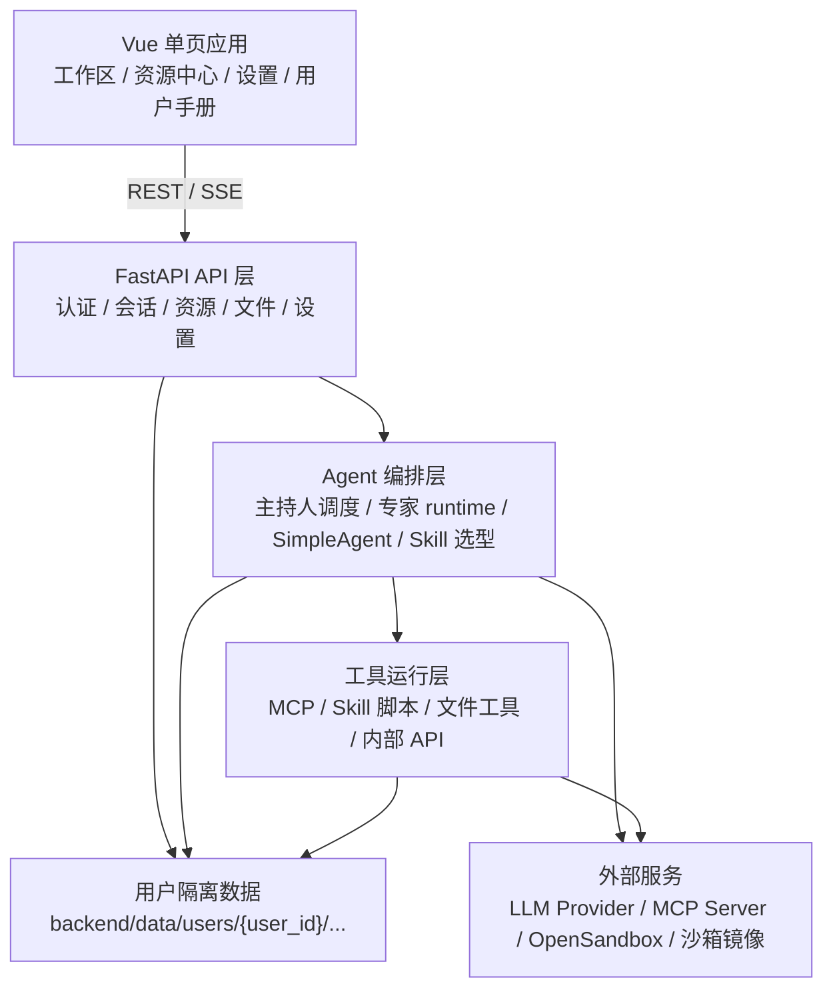

# 架构概述

## 项目定位

书童四九是一个可私有化部署的多用户 AI Agent 对话与工具平台。它以统一会话为入口，用主持人调度专家，用 Skill 描述可复用工作方法，用 MCP 和脚本提供执行能力，并把会话、资源、文件、密钥和沙箱配置按用户隔离保存。

核心能力：

- 多用户账号与资源隔离。
- 单人会话和多人专家协作共用 `/api/sessions/*`。
- 专家可以绑定 Skill、MCP、模型、提示词和工作区文件权限。
- Skill 脚本通过用户沙箱执行，MCP 通过后端按用户和专家权限组装。
- 场景、专家、Skill、MCP 支持 ZIP 资源包导入导出。

## 分层结构



## 前端层

前端使用 Vue 3、Vite 和 TypeScript。页面按业务域组织：

- `features/auth`：登录、注册。
- `features/workspace`：工作区、会话、消息、工作区文件。
- `features/resources`：场景、专家、Skill、MCP、LLM 等资源配置。
- `features/settings`：主持人、密钥、安全、沙箱和主题设置。
- `api/`：前端统一 API 调用封装。

前端通过 REST API 获取配置和资源，通过 SSE 接收会话流式事件。

## 后端层

后端使用 FastAPI，所有业务 API 挂载在 `/api` 下。主要模块：

- `api/sessions.py`：统一会话 API，包含流式和非流式会话入口。
- `api/group_chat.py`：会话编排主实现，包含主持人调度、专家回合、SSE 事件和会话持久化。
- `api/dha.py`：专家 CRUD 与专家资源包导入导出。
- `api/settings*.py`：Skill、MCP、场景、密钥、主持人、应用设置。
- `api/files.py`：工作区文件管理。
- `agent/`：SimpleAgent、专家 runtime、Skill 选型、主持人调度。
- `mcp/`：MCP 连接、工具列表、参数归一化。
- `tools/`：Skill 脚本执行、文件工具、内部 API 工具。
- `core/`：用户上下文、安全、资源路径、启动生命周期和 bundle 处理。

## 会话与 Agent

当前主入口是 `/api/sessions/{session_id}/chat/stream`。一次会话大致经过：

1. 前端发送用户消息。
2. 后端读取当前用户、会话、成员、场景和资源配置。
3. 主持人或强制 `@专家` 路由确定本轮发言专家。
4. 后端为专家组装 Skill、MCP、文件工具和脚本工具。
5. `SimpleAgent` 调用模型，按 `tool_calls` 执行工具，再生成最终回复。
6. 后端通过 SSE 推送 route、content、message、tool 和 end 事件。
7. 会话历史、meta、工作区文件和记忆写回当前用户数据目录。

非流式 `/api/sessions/{session_id}/chat` 只作为兜底，内部聚合同一条 SSE 流。

## Skill 与 MCP

Skill 和 MCP 是互补关系：

- Skill 是策略层，描述“什么时候触发、按什么步骤做、脚本如何调用、输出如何判断”。
- MCP 是执行层，提供外部工具、搜索、转写、抓取、生成或内部服务调用能力。
- 专家 runtime 会根据专家配置、当前 Skill 和用户权限组装工具集合。
- 脚本型 Skill 通过 `run_skill_script` 在当前用户沙箱中执行。

详细规范见 [Skill 规范](../skills/skill-standard.md) 和 [Skill 脚本路径手册](../skills/skill-script-paths.md)。

## 数据层

用户运行数据统一在：

```text
backend/data/users/{user_id}/
```

典型子目录：

- `resources/`：场景、专家、Skill、MCP、模型等资源。
- `sessions/`：会话历史、meta 和工作区。
- `config/`：用户级设置、密钥引用、沙箱 requirements。

账号凭据和用户运行数据分离。详见 [用户资源存储](user-resource-store/README.md)。

## 部署边界

- 本地开发可以分别启动 FastAPI 和 Vite。
- 生产/交付推荐 Docker 或 1Panel 编排。
- OpenSandbox 独立运行，Skill 脚本通过挂载当前用户工作区和 Skill 资源执行。
- 前端静态构建可由后端同源挂载，避免跨域复杂度。

## 相关文档

- [系统架构图](system-architecture.md)
- [API 设计文档](api-design.md)
- [运行架构说明](runtime-architecture.md)
- [运行流程概览](runtime-flow-overview.md)
- [项目结构文档](project-structure.md)
