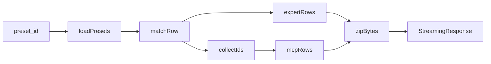

# 导出场景压缩包：实现方式与 ID 说明

## 实现入口与调用链

1. **HTTP 接口**（[`backend/app/api/settings.py`](../../backend/app/api/settings.py)）
   - `GET /settings/session-presets/{preset_id}/export-bundle`：流式返回 ZIP，下载文件名 `scenario-bundle-{safe_name}.zip`。
   - `POST .../publish-share`：先复用同一套逻辑生成 ZIP，再写入公开分享目录（见下文「分享 ID」）。

2. **组装 ZIP 的核心函数**
   - [`_session_preset_bundle_zip_for_preset(preset_id)`](../../backend/app/api/settings.py)：按 `preset_id` 从当前用户的 `session_presets.json` 里找场景行；拉全量 `dha_instances`，按场景里的 `agent_ids` 挑出专家行；用 [`collect_skill_and_mcp_ids_for_preset`](../../backend/app/core/scenario_bundle.py) 收集技能/MCP 引用；从 `load_mcp_config()` 里按 id 取出 MCP 行；最后调用 [`build_scenario_bundle_zip_bytes`](../../backend/app/core/scenario_bundle.py)。

## ZIP 里有什么

由 [`build_scenario_bundle_zip_bytes`](../../backend/app/core/scenario_bundle.py) 写入：

| 路径 | 内容 |
|------|------|
| `scenario_bundle.json` | `bundle_version`、`exported_at`（UTC ISO）、`preset`（**整份场景行原样**，含 `id`、`agent_ids`、`host_config` 等） |
| `dha_instances.json` | 场景中每个 `agent_id` 对应专家的一条记录（经 `strip_dha_row_for_disk` 处理） |
| `mcp_servers.json` | **仅当**收集到的 `mcp_ids` 非空时写入；为当前用户配置里这些 id 的 MCP 条目 |
| `skills/<skill_id>/...` | 每个技能目录下含 `SKILL.md` 才会打包；路径为 `skills/{skill_id}/相对文件` |

**注意**：场景预设行、专家、MCP 在包内 **不做 id 重映射**；导出的是当前账号配置里的真实 id 与内容。

## 各类「ID」怎么来、怎么用

### 1. 场景预设 id（`preset.id`）

- 导出时 URL 参数 `preset_id` 必须与 `session_presets.json` 里某行的 `id` 一致。
- 下载文件名里的 `safe_name`：对该 id 去掉 `..`、`/`、`\`，为空则 `"scenario"` —— **只做安全化，不改 id 本身**。

### 2. 专家 id（`agent_id`）

- 包内 `dha_instances.json` 只包含场景 `agent_ids` 里、且在本地 `dha_instances` 里能找到的专家。
- [`strip_dha_row_for_disk`](../../backend/app/core/scenario_bundle.py) 会去掉 `expert_id`、`file_capability_labels`，**保留 `agent_id` 等其余字段**。
- 导入时用 [`merge_dha_instances_for_bundle`](../../backend/app/core/scenario_bundle.py)：**以 `agent_id` 为键**合并；冲突时是否覆盖由 `overwrite_experts` 决定。

### 3. 技能 id（目录名 = skill_id）

- [`collect_skill_and_mcp_ids_for_preset`](../../backend/app/core/scenario_bundle.py) 汇总：
  - 场景 `host_config` 里规范化后的 `skill_ids`、`mcp_server_ids`；
  - 每个关联专家的 `skill_ids`、`mcp_server_ids`。
- ZIP 里每个技能对应 `skills_root / {skill_id}`，且必须有 `SKILL.md` 才会打进包。
- 导入时 [`copy_bundle_skills_to_user`](../../backend/app/core/scenario_bundle.py)：**目录名即 skill_id**，复制到用户技能目录。

### 4. MCP id

- 收集的是一串 **字符串 id**，再从 [`load_mcp_config()`](../../backend/app/api/settings.py) 里按 id 取完整条目写入 `mcp_servers.json`（本地没有的 id 不会出现）。
- 导入时 [`merge_mcp_servers_for_bundle`](../../backend/app/core/scenario_bundle.py) 按 MCP 的 `id` 合并，`mcp_skip_existing` 控制同名是跳过还是覆盖。

### 5. 公开发布时的「分享 ID」（`share_id`）— 与场景 id 不同

- 逻辑在 [`backend/app/core/scenario_share_store.py`](../../backend/app/core/scenario_share_store.py)。
- **新建**：`secrets.token_hex(6)` → **12 位十六进制**；文件名 `{share_id}.zip`；写入 `registry.json` 的 `entries`。
- **复用**：同一 `created_by`（用户名）+ 同一 `source_preset_id`（场景预设的 `id`）再次发布时，**沿用已有 `share_id`**，只覆盖 ZIP 与元数据，保证链接不变（[`upsert_public_share`](../../backend/app/core/scenario_share_store.py)）。

### 6. 导入场景包时预设 id 冲突

- [`_merge_session_presets_into_file`](../../backend/app/api/settings.py)：若本地已有同 id 且 `preset_id_conflict == "new_id"`，会把导入的场景 id 改成 `scenario-{uuid 前 10 位}`；`overwrite` 则覆盖同 id 条目（具体以该函数与 `normalize_preset_dict_for_validation` 为准）。

---

**一句话**：导出包是「按场景 id 取行 + 按引用收集专家/技能/MCP 快照」打成 ZIP；包内 id 保持原样；公开链接用的是另一套 **12 位 hex 分享 id**，并在同一用户、同一场景预设 id 下保持稳定复用。
