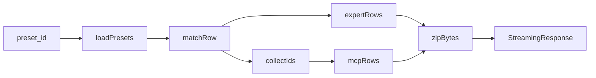

# 导出场景压缩包：实现方式与名称引用说明

## 实现入口与调用链

1. **HTTP 接口**（[`backend/app/api/settings_presets.py`](../../backend/app/api/settings_presets.py)）
   - `GET /settings/session-presets/{preset_id}/export-bundle`：流式返回 ZIP，下载文件名 `scenario-bundle-{safe_name}.zip`。
   - `POST /settings/session-presets/import-bundle`：上传 ZIP 场景包，支持 dry run 预览和确认导入。

2. **组装 ZIP 的核心函数**
   - [`_session_preset_bundle_zip_for_preset(preset_id)`](../../backend/app/api/settings_presets.py)：按 `preset_id` 从当前用户的 `resources/scenarios/*/scenario.json` 里找场景行；拉全量 `resources/agents/*/agent.json`，按场景里的 `agent_names` 挑出专家行；用 [`collect_skill_and_mcp_ids_for_preset`](../../backend/app/core/scenario_bundle.py) 收集技能/MCP 引用；从 `load_mcp_config()` 里按工具配置名取出 `resources/tools/*/tool.json` 对应的 MCP 行；最后调用 [`build_scenario_bundle_zip_bytes`](../../backend/app/core/scenario_bundle.py)。

## ZIP 里有什么

由 [`build_scenario_bundle_zip_bytes`](../../backend/app/core/scenario_bundle.py) 写入：

| 路径 | 内容 |
|------|------|
| `scenario_bundle.json` | `bundle_version`、`exported_at`（UTC ISO）、`preset`（**整份场景行原样**，含 `id`、`agent_names`、顶层 `system_prompt`、`host_config` 等） |
| `dha_instances.json` | 场景中每个专家名称对应专家的一条记录（经 `strip_agent_row_for_disk` 处理） |
| `mcp_servers.json` | **仅当**收集到的 `mcp_ids` 非空时写入；为当前用户配置里这些 id 的 MCP 条目 |
| `skills/<directory_name>/...` | 每个技能目录下含 `SKILL.md` 才会打包；路径为 `skills/{directory_name}/相对文件` |

**注意**：场景预设行、专家、Skill、MCP 在包内按名称和目录名维持引用关系；导入到目标账号时，名称用于判断冲突，目录名仅作为 Skill 文件路径。

## 各类引用怎么来、怎么用

导入时统一采用「名称即版本」规则：

- 名称相同：认为目标账号已有同名资源，覆盖本地资源内容并保留目标账号的本地目录。
- 名称不同：认为是新版本或新资源，生成新的本地目录后导入。
- 包内目录名只用于解开 ZIP 内部的 Skill 文件路径，落盘前会按目标账号重新映射。

### 1. 场景预设 id（`preset.id`）

- 导出时 URL 参数 `preset_id` 必须与 `resources/scenarios/*/scenario.json` 里某行的 `id` 一致。
- 下载文件名里的 `safe_name`：对该 id 去掉 `..`、`/`、`\`，为空则 `"scenario"` —— **只做安全化，不改 id 本身**。

### 2. 专家名称

- 包内 `dha_instances.json` 只包含场景 `agent_names` 里、且在本地专家资源里能找到的专家。
- [`strip_agent_row_for_disk`](../../backend/app/core/scenario_bundle.py) 会去掉兼容字段和运行期派生字段，只保留 name-based 配置。
- 导入时专家按 `name` 判断冲突；同名覆盖本地专家内容，不同名生成新的本地专家目录，并重写场景中的专家引用。

### 3. 技能目录名

- [`collect_skill_and_mcp_ids_for_preset`](../../backend/app/core/scenario_bundle.py) 汇总：
  - 场景 `host_config` 里规范化后的 `skill_directory`、`mcp_server_ids`；
  - 每个关联专家的 `skills[].directory_name`、`mcp_server_ids`。
- ZIP 里每个技能对应 `skills_root / {directory_name}`，且必须有 `SKILL.md` 才会打进包。
- 导入时 Skill 按 `SKILL.md` frontmatter 里的 `name` 判断冲突；同名覆盖本地 Skill 内容并保留本地目录名，不同名生成新的本地目录名，并重写专家、场景主持人和 Skill frontmatter 中的相关引用。

### 4. MCP id

- 收集的是一串 **字符串 id**，再从 [`load_mcp_config()`](../../backend/app/api/settings_mcp.py) 里按 id 取完整条目写入导出包内的 `mcp_servers.json`（本地没有的 id 不会出现）。本地 MCP 配置来自 `resources/tools/*/tool.json`。
- 导入时 MCP 按 `name` 判断冲突；同名覆盖本地 MCP 配置并保留本地 id，不同名生成新的 `mcp-*` 本地 id，并重写专家、场景主持人和 Skill frontmatter 中的 MCP 引用。

### 5. 导入场景包时预设 id 冲突

- 场景按 `name` 判断冲突；同名覆盖本地场景内容并保留本地 `scenario-*` id，不同名生成新的 `scenario-*` 本地 id。包内 `preset.id` 不决定覆盖关系。

---

**一句话**：导出包是「按场景 id 取行 + 按引用收集专家/技能/MCP 快照」打成 ZIP；包内 id 保持原样用于内部引用；导入时只按名称判断版本，同名覆盖目标账号内容并保留本地 id，不同名生成目标账号的新 id 后落盘。
