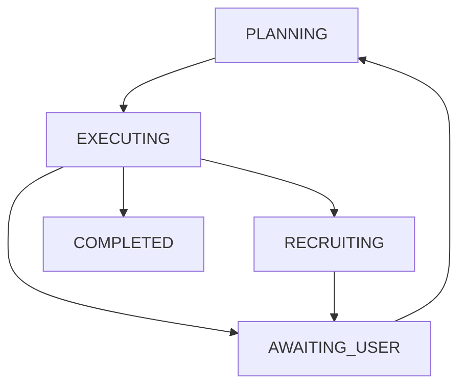
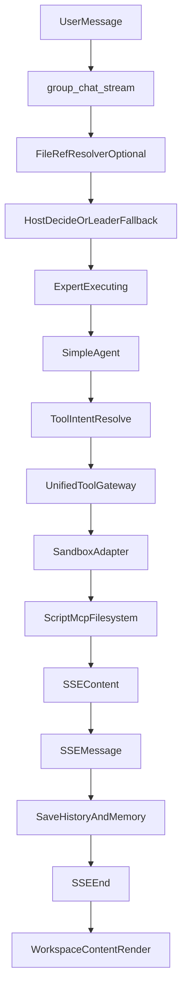

# 会话逻辑梳理（当前实现版）

本文按当前代码真实行为梳理一次群聊会话运行链路，覆盖：自动机、sandbox、scripts、skill、专家、主持人、mcp、文件、记忆、上下文、主持人推荐逻辑。

---

## 1. 角色与核心对象

- **用户**：通过 `POST /api/sessions/{id}/chat/stream` 触发一轮会话。
- **主持人（Host）**：负责决定下一位发言专家、是否建议增援专家、是否暂停等待用户。
- **专家（Agent）**：绑定 `skill_ids`，执行具体任务，可调用工具（scripts / MCP / 文件系统等）。
- **SimpleAgent**：当前实际执行器，识别工具意图并驱动工具调用。
- **工具网关**：`UnifiedToolGateway` + `SandboxAdapter`，统一承载 script 与 MCP 调用。
- **会话存储**：
  - 会话消息：`backend/data/users/<user>/sessions/group_history_<session>.json`
  - 会话元信息：`group_sessions_meta.json`
  - 专家记忆：工作区 `memory/facts.md`
  - 工作区产物索引：工作区 `memory/index.md`

关键文件：
- `backend/app/api/group_chat.py`
- `backend/app/agent/simple_agent.py`
- `backend/app/agent/skill_agent_runtime.py`
- `backend/app/agent/tools_for_skill.py`
- `backend/app/agent/tool_gateway.py`
- `backend/app/agent/sandbox_adapter.py`
- `backend/app/tools/run_skill_script.py`
- `backend/app/mcp/manager.py`
- `backend/app/agent/file_ref_resolver.py`
- `backend/app/agent/group_memory_store.py`
- `frontend/src/views/WorkspaceContent.vue`

---

## 2. 端到端主流程（从请求到落库）

### 2.1 入口与预处理

入口在 `group_chat_stream()`（`backend/app/api/group_chat.py`）。

1. 读取群聊历史、会话元信息、专家列表。
2. 解析请求参数（`message`、`host_takeover_requested`）。
3. 若开启 `FILE_REF_SERVER_RESOLVE_ENABLED`，对输入中的 `【文件引用：...】` 执行服务端展开（`resolve_file_refs_in_text()`）。

### 2.2 调度（主持人/回退）

在每轮执行前，系统会确定 `next_speaker`（见 `group_orchestration_fsm.resolve_group_entry_route` 与 `group_chat_stream` 内 `if/elif`）：

1. **0 个专家**：仅主持人推荐可邀请 id，结束本轮流。
2. **`@` 点名**、**Skill 会话锁短路**（`skip_host_dispatch`）：按分支直接定人，可能不调主持人 LLM。
3. 否则：**`_host_decide_by_agent`**（虚拟主持 + `host_config` 优先）→ 失败则 **`leader_decide`**；结果经 **`finalize_host_scheduler_decision(..., orchestration_profile=...)`** 与 `normalize_scheduler_decision` 归一化。`scene` 档会抑制招募相关字段。

### 2.3 专家执行与流式事件

选定专家后：

1. `build_tools_for_group_chat(...)` 构建本轮可用工具集：
   - 文件工具（filesystem / file-reader）
   - MCP 工具（含 server alias 兼容，例如 `fetch -> linkup`）
   - 每个 skill 自动注入 `run_skill_script_<skill_id>`
2. `SimpleAgent.astream(...)` 开始执行：
   - 输出 `agent_step`（文本增量）
   - 输出 `tool_step`（工具消息、原始返回）
   - 输出 `final_step`（最终响应）
3. 后端把流转换为 SSE：
   - `event: content`（文本块、工具中间输出）
   - `event: message`（完整消息对象）
   - `event: end`（编排终态）

### 2.4 持久化与收尾

1. `_save_group_history(...)` 持久化当前消息数组。
2. 专家回合后写 memory：
   - `upsert_facts(...)`
3. LLM 调用排障信息写入当前会话工作区：
   - `append_llm_roundtrip(...)`
4. 构造 `build_end_payload(...)`，写回 pending 状态与下一步建议，发送 `event: end`。

---

## 3. 自动机（Orchestration State Machine）

状态定义在 `backend/app/agent/orchestrator_state.py`：

- `PLANNING`
- `EXECUTING`
- `AWAITING_USER`
- `RECRUITING`
- `COMPLETED`

中断原因 `InterruptReason` 包括（示意）：`NONE`、`NEED_USER_INPUT`、`NEED_RECRUIT_EXPERT`、`TOOL_UNAVAILABLE` 等。

说明：
- 运行时通常在一次 stream 请求内从 `EXECUTING` 推进到 `AWAITING_USER` 或 `COMPLETED`。
- 若建议拉新专家，终态会体现 `RECRUITING` 语义并附建议列表。

---

## 4. 主持人推荐逻辑（如何选下一位）

主流程在 `group_chat.py`，与 **`orchestration_profile`（recruitment / scene）** 及 **Skill 锁** 联动：

1. **硬路由优先**：`@` 点名、Skill 锁导致的 **`skip_host_dispatch`**。
2. **主持人**：`_host_decide_by_agent()` → **`leader_decide()`**；`recruitment` 时可含建议增援，`scene` 时 `available_to_add` 与招募输出被压掉。
3. **归一化**：`finalize_host_scheduler_decision` + `normalize_scheduler_decision`。
4. **可中断**：`AWAITING_USER` / `RECRUITING`（招募语义主要在 recruitment 或显式拉新时）经 `event: end` 给前端。

---

## 5. 工具调用统一链路（tool -> gateway -> sandbox）

### 5.1 tool intent 识别

`SimpleAgent` 两种识别路径：

1. 结构化 `AIMessage.tool_calls`（优先）
2. 文本中 JSON `tool_call` 块（兼容）

并记录 `tool_attempt_debug`，用于排查“为什么没识别到工具”。

### 5.2 skill 脚本工具

`tools_for_skill.py` 为每个 skill 注入：

- `run_skill_script_<skill_id>`

执行落在 `run_skill_script.py`：

1. 构造脚本路径（限制在 skill `scripts/`）
2. 执行 `_execute_script_subprocess(...)`
3. 补全 `PYTHONPATH` 确保 `app.*` import 可用
4. 当 `UNIFIED_TOOL_GATEWAY_ENABLED=true` 时走统一网关

### 5.3 MCP 工具

`mcp/manager.py` 中：

1. `execute_mcp_call(...)` 作为统一入口。
2. 先做参数归一化 `normalize_mcp_kwargs_for_call(...)`。
3. 同样受 `UNIFIED_TOOL_GATEWAY_ENABLED` 控制，接入 `UnifiedToolGateway`。

### 5.4 sandbox 执行

`UnifiedToolGateway.execute(...)`：

1. 基于 `ToolExecutionContext` 生成 `SandboxPolicy`（allowlist/timeout）。
2. 进入 `SandboxAdapter.run_tool_in_sandbox(...)`。
3. 返回标准结构并附 `_sandbox_trace`，供观测与前端展示。

---

## 6. 文件、上下文、记忆

### 6.1 文件引用（用户输入里的 `【文件引用】`）

`file_ref_resolver.py`：

- 正则识别：`【文件引用：...】`
- 路径安全：阻止越界到工作区外
- 限额控制：
  - `max_files=8`
  - `max_chars_per_file=6000`
  - `max_total_chars=18000`

### 6.2 上下文拼装

群聊提示词主线在 `group_chat.py`，通常包含：

- 当前讨论目标
- 最近对话上下文
- 必要的主持人补充指令

工具调用与结果会回灌到本轮 accumulated 内容，并写入最终消息 / debug 字段。

### 6.3 记忆写入与读取

`group_memory_store.py`：

- `upsert_facts(...)`：更新 `memory/facts.md`
- `upsert_index_entries(...)`：更新 `memory/index.md`，记录专家工作简述与工作区相对文件路径
- `build_dispatch_context(...)`：读取 `memory/facts.md` 与 `memory/index.md`，构建下一轮专家提示词里的 **【关键事实】** 与 **【工作区索引】**

---

## 7. 前端流式渲染（content/message/end）与 sandbox 标签

核心在 `frontend/src/views/WorkspaceContent.vue`。

### 7.1 SSE 消费

前端用 `fetch + reader` 手动解析 SSE 分帧：

- `event: content` -> `appendStreamingContent(...)`（追加占位内容）
- `event: message` -> `replaceOrPushAssistantMessage(...)`（替换为完整消息）
- `event: end` -> 更新等待用户、下一位建议等状态

### 7.2 占位与最终替换

- 流式中会新建 `_streaming` assistant 占位消息。
- 收到完整 `message` 后，用最终对象替换占位。
- 会话刷新时，`groupDetail.messages` 会整体覆盖 `groupDisplayMessages`。

### 7.3 sandbox 标签展示

- `getToolRawResults(...)` 提取 `tool_raw_results`
- `parseToolRawResult(...)` 解析 `_sandbox_trace`，标签显示为 `sandbox` 或 `sandbox:<tool>`
- 点击标签展开原始返回值（popover）

---

## 8. 关键开关与可观测性

### 8.1 关键 feature flags

- `UNIFIED_TOOL_GATEWAY_ENABLED`：script/mcp 是否统一走网关 + sandbox
- `FILE_REF_SERVER_RESOLVE_ENABLED`：服务端是否展开文件引用标签

### 8.2 关键排查字段

优先看单轮日志中的：

- `tool_calls`
- `tool_raw_outputs`
- `tool_attempt_debug`
- `sandbox_entry_trace`

这四组字段能快速区分：模型没发工具意图、工具名没匹配、工具执行失败、未进入 sandbox。

---

## 9. 已知历史边界与易错点

1. **执行器命名**：主执行链以 `SimpleAgent` 为准，技能执行入口位于 `skill_agent_runtime.py`。
2. **工具意图双轨**：结构化 `tool_calls` 与文本 JSON `tool_call` 并存，提示词与模型输出风格不一致时易出偏差。
3. **前端覆盖机制**：流式展示与服务端刷新并行时，若最终 `message` 不完整或刷新时机过早，会出现“看见后消失”观感。
4. **文档历史差异**：部分旧文档 API 路径/认证描述可能与现实现不完全一致，应以 `group_chat.py` 与相关路由代码为准。

---

## 10. 排障顺序清单（推荐实战）

1. **先看 `tool_attempt_debug`**  
   - 若是 `no_tool_detected`，优先修模型输出/工具识别。
2. **再看 `tool_calls` 与工具名**  
   - 确认是否命中 `run_skill_script_<skill_id>` 或正确 MCP 工具名。
3. **看 `tool_raw_outputs`**  
   - 有调用但失败时，这里会有异常文本/错误码。
4. **看 `sandbox_entry_trace`**  
   - 确认是否真的进入 sandbox（runtime、tool_name、allowlist_hit、timeout）。
5. **看前端 SSE 三段**  
   - `content` 有无、`message` 有无、`end` 是否过早触发状态切换。
6. **核对落库消息**  
   - 检查 `group_history_*.json` 中该条 assistant 的 `content/tool_raw_results/tool_debug` 是否完整。

---

## 11. 一图总览

