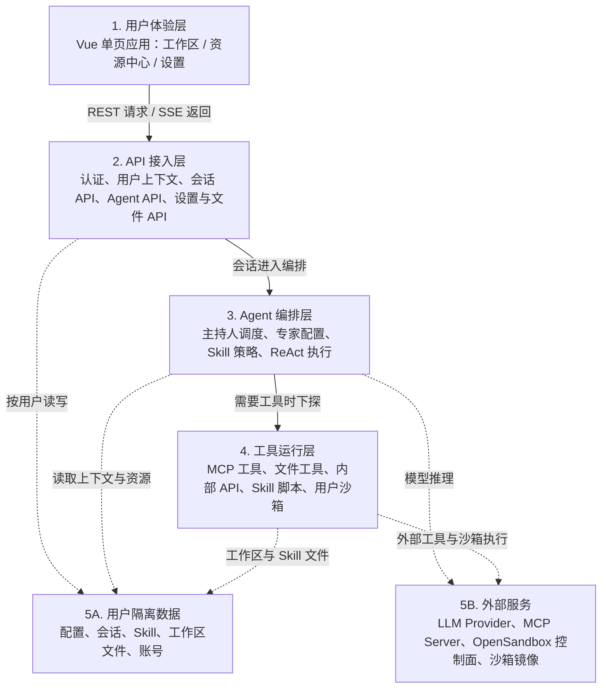

# 书童四九系统架构图

本文用一张总览图描述书童四九当前主链路：浏览器端 Vue 单页应用通过 `/api` 访问 FastAPI，后端按当前用户隔离加载会话、专家、Skill、MCP、工作区文件，并在专家回合中通过 ReAct 循环调用大模型和工具。

图片版见 [system-architecture.svg](system-architecture.svg)。

## 用户需求到架构层映射

| 用户需求 | 主要架构层 | 设计关注点 |
|----------|------------|------------|
| UR-01 账号与用户隔离 | UI、API、用户隔离数据 | 登录态、受保护路由、Token 校验、用户资源根隔离 |
| UR-02 工作区与统一会话 | UI、API、Agent 编排、用户隔离数据 | 会话生命周期、SSE 事件、消息历史、成员和工作区状态恢复 |
| UR-03 主持人与专家协作 | UI、API、Agent 编排 | 主持人调度、专家选择、`@专家` 路由、等待用户状态 |
| UR-04 资源中心 | UI、API、用户隔离数据 | 场景、专家、Skill、MCP、LLM、文件配置的 CRUD 和引用关系 |
| UR-05 Skill 与脚本执行 | Agent 编排、工具运行层、用户隔离数据 | Skill 选择、脚本契约、工作区挂载、执行结果回传 |
| UR-06 MCP 工具能力 | Agent 编排、工具运行层、外部服务 | 工具授权、MCP 生命周期、断连重试、鉴权错误诊断 |
| UR-07 沙箱运行环境 | 工具运行层、外部服务、用户隔离数据 | OpenSandbox、镜像选择、requirements、超时和网络策略 |
| UR-08 工作区文件管理 | UI、API、工具运行层、用户隔离数据 | 文件预览、编辑、下载、路径白名单、工具读写边界 |
| UR-09 导出与导入 | UI、API、用户隔离数据 | ZIP 资源包、依赖预览、冲突处理、跨账号迁移 |
| UR-10 模型、密钥与个人设置 | UI、API、Agent 编排、用户隔离数据、外部服务 | LLM Provider、密钥脱敏、默认主持人、主题和账号安全 |
| UR-11 部署与运维 | API、工具运行层、外部服务 | 健康检查、Docker/1Panel、数据卷、OpenSandbox 和日志诊断 |

## 图例说明

- 当前会话主入口是 `/api/sessions/*`；单人和多人会话共用同一套带主持人的会话模型。
- 当前 Agent 主入口是 `/api/agents/*`；`/api/dha/instances/*` 与 `/api/experts/*` 只作为兼容别名存在。
- Expert 是配置实体，声明人设、Skill、MCP 和可选 LLM；真正执行时由 `SimpleAgent` 在同一个 ReAct 循环里调用模型与工具。
- Skill 提供任务策略与可选脚本；MCP 和内置工具提供执行能力；脚本通过 OpenSandbox 在当前用户沙箱内运行。
- 用户业务数据落在 `backend/data/users/{user_id}/...` 下，按用户隔离保存配置、会话、资源、Skill 和工作区文件。
