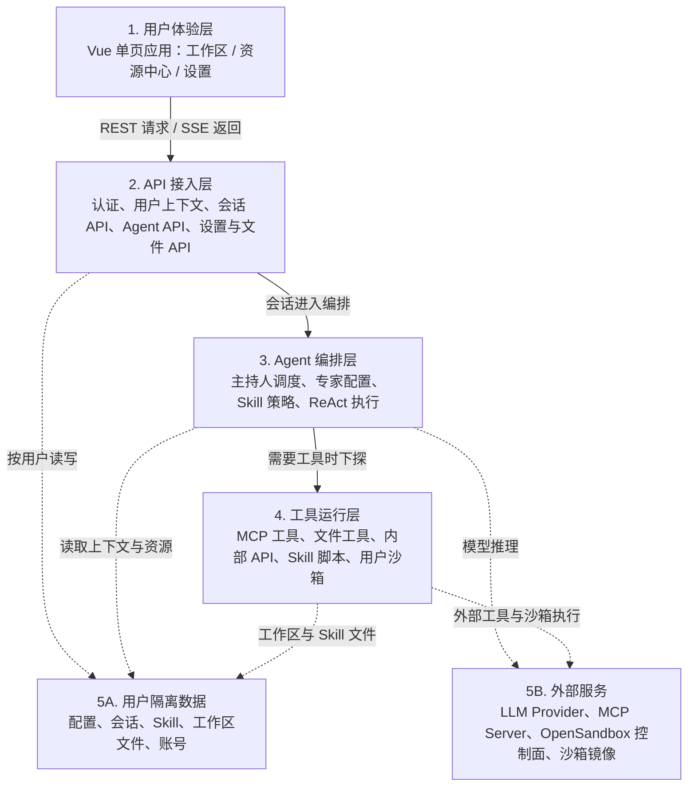

# 书童四九系统架构图

本文用一张总览图描述书童四九当前主链路：浏览器端 Vue 单页应用通过 `/api` 访问 FastAPI，后端按当前用户隔离加载会话、专家、Skill、MCP、工作区文件，并在专家回合中通过 ReAct 循环调用大模型和工具。

图片版见 [system-architecture.svg](system-architecture.svg)。

## 图例说明

- 当前会话主入口是 `/api/sessions/*`；单人和多人会话共用同一套带主持人的会话模型。
- 当前 Agent 主入口是 `/api/agents/*`；`/api/dha/instances/*` 与 `/api/experts/*` 只作为兼容别名存在。
- Expert 是配置实体，声明人设、Skill、MCP 和可选 LLM；真正执行时由 `SimpleAgent` 在同一个 ReAct 循环里调用模型与工具。
- Skill 提供任务策略与可选脚本；MCP 和内置工具提供执行能力；脚本通过 OpenSandbox 在当前用户沙箱内运行。
- 用户业务数据落在 `backend/data/users/{user_id}/...` 下，按用户隔离保存配置、会话、资源、Skill 和工作区文件。
