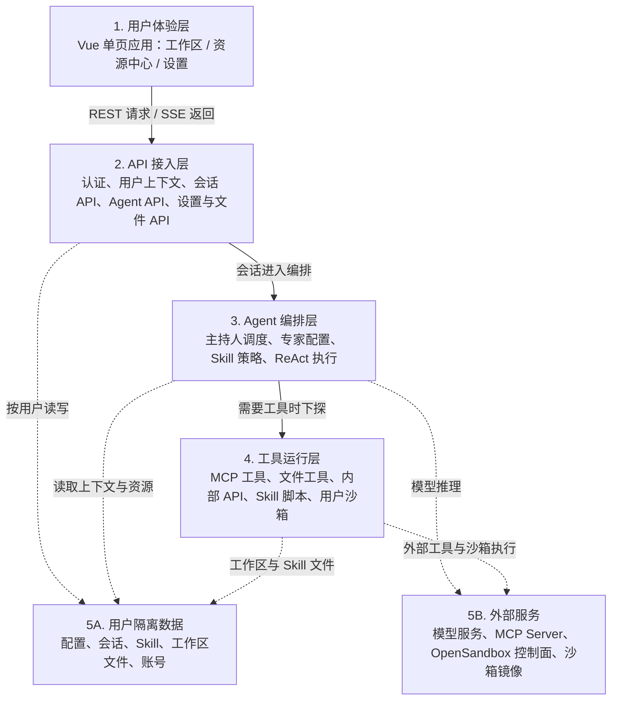
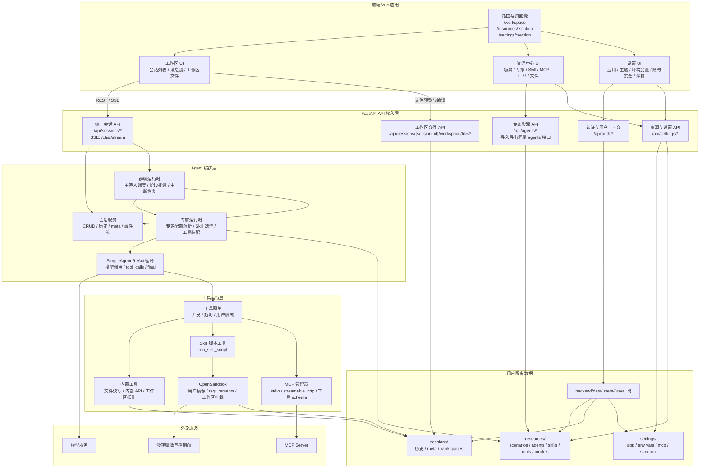

# 书童四九系统架构图

本文用一张总览图描述书童四九当前主链路：浏览器端 Vue 单页应用通过 `/api` 访问 FastAPI，后端按当前用户隔离加载会话、专家、Skill、MCP、工作区文件，并在专家回合中通过 ReAct 循环调用大模型和工具。

图片版见 [system-architecture.svg](system-architecture.svg)。

## 用户需求到架构层映射

| 用户需求 | 主要架构层 | 设计关注点 |
|----------|------------|------------|
| UR-01 账号与用户隔离 | UI、API、用户隔离数据 | 登录态、受保护路由、Token 校验、用户资源根隔离 |
| UR-02 工作区与统一会话 | UI、API、Agent 编排、用户隔离数据 | 会话生命周期、SSE 事件、消息历史、成员和工作区状态恢复 |
| UR-03 主持人与专家协作 | UI、API、Agent 编排 | 主持人调度、专家选择、`target_agent_name` 路由、等待用户状态 |
| UR-04 资源中心 | UI、API、用户隔离数据 | 场景、专家、Skill、MCP、LLM、文件配置的 CRUD 和引用关系 |
| UR-05 Skill 与脚本执行 | Agent 编排、工具运行层、用户隔离数据 | Skill 选择、脚本契约、工作区挂载、执行结果回传 |
| UR-06 MCP 工具能力 | Agent 编排、工具运行层、外部服务 | 工具授权、MCP 生命周期、断连重试、鉴权错误诊断 |
| UR-07 沙箱运行环境 | 工具运行层、外部服务、用户隔离数据 | OpenSandbox、镜像选择、requirements、超时和网络策略 |
| UR-08 工作区文件管理 | UI、API、工具运行层、用户隔离数据 | 文件预览、编辑、下载、路径白名单、工具读写边界 |
| UR-09 导出与导入 | UI、API、用户隔离数据 | ZIP 资源包、依赖预览、冲突处理、跨账号迁移 |
| UR-10 模型、环境变量与个人设置 | UI、API、Agent 编排、用户隔离数据、外部服务 | 模型调用配置、环境变量脱敏、默认主持人、主题和账号安全 |
| UR-11 部署与运维 | API、工具运行层、外部服务 | 健康检查、Docker/1Panel、数据卷、OpenSandbox 和日志诊断 |

## 图例说明

- 当前会话主入口是 `/api/sessions/*`；单人和多人会话共用同一套带主持人的会话模型。
- 当前 Agent 主入口是 `/api/agents/*`；专家资源包导入导出也归入 `/api/agents/*`。
- Expert 是配置实体，声明人设、Skill、MCP 和可选 LLM；真正执行时由 `SimpleAgent` 在同一个 ReAct 循环里调用模型与工具。
- Skill 提供任务策略与可选脚本；MCP 和内置工具提供执行能力；脚本通过 OpenSandbox 在当前用户沙箱内运行。
- 用户业务数据落在 `backend/data/users/{user_id}/...` 下，按用户隔离保存配置、会话、资源、Skill 和工作区文件。

## 模块、接口与扩展点

下面这张图把“谁负责什么”和“边界从哪里接入”放在一起。新增能力时优先先判断它属于 UI 能力、资源配置、会话编排、工具能力、运行环境还是数据存储，再进入对应模块。

| 模块 | 负责什么 | 主要接口或契约 | 新东西从哪里接入 |
|------|----------|----------------|------------------|
| 前端路由与页面壳 | 控制主导航、鉴权跳转、资源与设置分区 | `/workspace`、`/resources/:section`、`/settings/:section` | 新增一级页面先改 `frontend/src/router/index.ts`；新增资源或设置分区先扩展对应 section 集合和 `MainView` 内容提供器。 |
| 工作区 UI | 展示会话、消息流、输入框、文件面板和专家协作状态 | 调 `/api/sessions/*`、`/api/sessions/{session_id}/workspace/files*`，消费 SSE 事件 | 新增会话交互、消息状态、工具可视化，优先接在工作区组件和 SSE 事件解析处。 |
| 资源中心 UI | 管理场景、专家、Skill、MCP、LLM 和文件资源 | 调 `/api/agents/*`、`/api/settings/*`、`/api/sessions/{session_id}/workspace/files*` | 新增一种用户可配置资源，先定义资源模型和后端 API，再在资源中心增加 section。 |
| 设置 UI | 管理应用设置、环境变量、账号安全、沙箱策略和主题 | 调 `/api/settings/app`、`/api/settings/env-vars`、`/api/settings/sandbox`、`/api/auth/*` | 新增个人级配置放到设置层；如果会影响运行时，还要在后端 runtime 读取该配置。 |
| API 路由注册 | 把业务 API 统一挂到 `/api` 下，提供后端入口 | `backend/app/api/routes.py` 的 `register_api_routes()` | 新增后端业务入口时新建或扩展 `backend/app/api/*.py`，再在 `routes.py` 注册。 |
| 认证与用户上下文 | 登录、注册、改密、Token 校验、解析稳定 `user_id` | `/api/auth/*`，`user_context_dependency` | 任何读写用户数据的新 API 都必须依赖用户上下文，不直接拼全局路径。 |
| 统一会话 API | 会话 CRUD、流式对话、停止、导出、事件流 | `/api/sessions/*`，主入口 `/api/sessions/{session_id}/chat/stream` | 新增会话级动作接在 `sessions.py`；若动作会触发专家执行，再进入群聊运行时。 |
| 群聊运行时 | 主持人调度、专家发言顺序、阶段推进、中断恢复、SSE 输出 | `route`、`progress`、`message`、`end`、`error` 事件 | 新增编排规则、发言模式、结束条件，接在 `backend/app/agent/group_chat_*` 运行时模块。 |
| 专家运行时 | 读取专家配置，选择 Skill，组装模型、MCP 和工具 | 专家配置、Skill 正文、工具列表、模型参数 | 新增专家能力配置字段时，同步改专家资源模型、运行时解析和资源中心表单。 |
| SimpleAgent 执行器 | 执行 ReAct 循环，处理模型输出、工具调用和最终回复 | LLM message、`tool_calls`、`ToolSpec`、最终 assistant message | 新增模型调用行为或工具调用语义，接在 Agent 执行器和 LLM client 边界。 |
| Skill 管理 | Skill CRUD、ZIP 导入导出、`SKILL.md` 与文件分区管理 | `/api/settings/skills/*`，脚本契约见 `run_skill_script` | 新增可复用工作方法时优先做 Skill；需要代码执行时放到 Skill 脚本并通过 `run_skill_script` 调用。 |
| MCP 管理 | 管理外部 MCP Server 配置、连接、工具 schema 和直接调用 | `/api/settings/mcp/*`，stdio / streamable HTTP | 新增外部工具服务优先做 MCP Server；后端只保存配置、测试连接并把工具转成 `ToolSpec`。 |
| 工具与沙箱运行层 | 统一执行内置工具、MCP、Skill 脚本，处理并发、超时、工作区挂载 | `ToolSpec`、OpenSandbox、用户 requirements | 新增系统内置能力可做 `backend/app/tools/*`；需要隔离执行的能力走沙箱策略和 `run_skill_script`。 |
| 用户隔离数据 | 按 `user_id` 保存资源、会话、工作区、设置和环境变量引用 | `backend/data/users/{user_id}/resources`、`sessions`、`settings` | 新增持久化数据时先归入 `resources`、`sessions` 或 `settings`，用现有用户上下文和原子写入工具。 |
| 外部服务 | 提供模型、MCP 远端能力、沙箱镜像和控制面 | 模型服务 API、MCP 协议、OpenSandbox API | 新增第三方能力时先判断是模型、MCP 还是沙箱镜像；不要绕过运行时直接从 UI 调外部服务。 |

## 新增能力接入规则

| 想新增的东西 | 首选接入点 | 需要同步检查 |
|--------------|------------|--------------|
| 新页面或新导航分区 | 前端路由与 `MainView` 内容分发 | 受保护路由、默认跳转、移动端布局 |
| 新资源类型 | `/api/settings/*` 或独立资源 API + 资源中心 section | 用户数据目录、导入导出、搜索和删除语义 |
| 新专家配置字段 | `agents` API + 专家运行时 + 资源中心表单 | 资源包导入导出、旧配置默认值、运行时兼容 |
| 新会话行为 | `sessions.py` API 壳 + `group_chat_*` 运行时 | SSE 事件、历史落盘、停止和中断恢复 |
| 新 Skill 工作流 | 用户 Skill 目录与 `/api/settings/skills/*` | `SKILL.md` 说明、脚本路径、沙箱 requirements |
| 新外部工具 | MCP Server 配置与 `MCPToolManager` | 鉴权、超时、参数 schema、错误诊断 |
| 新内置工具 | `backend/app/tools/*` + 工具装配逻辑 | 用户权限、工作区路径、工具结果展示 |
| 新沙箱能力 | 沙箱设置 API + sandbox runtime | 镜像策略、requirements、网络与挂载边界 |
| 新持久化数据 | `backend/data/users/{user_id}` 下的标准目录 | 用户隔离、原子写入、导入导出和测试 fixture |
