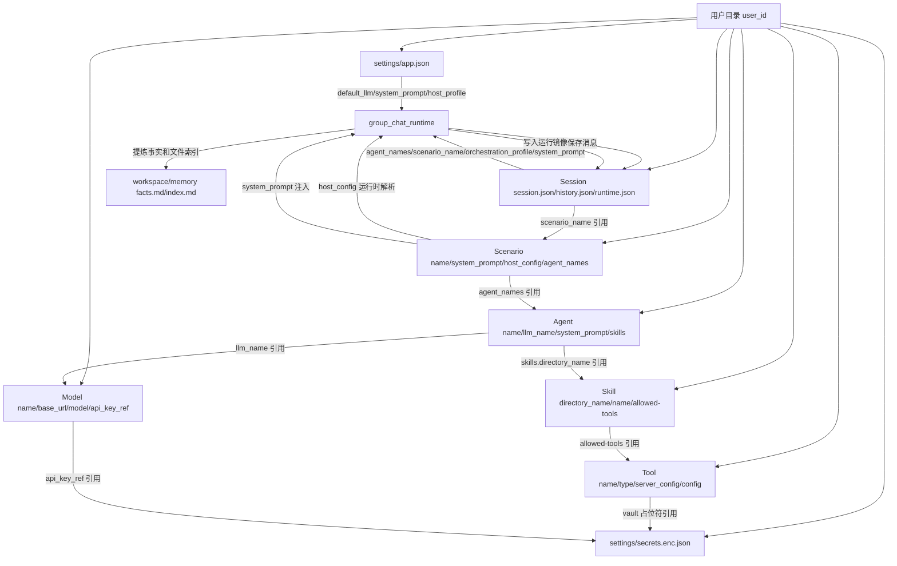

# 数据结构与字段逻辑

本文说明书童四九当前程序的数据结构、字段含义和运行时字段如何生效。它面向想快速理解代码的人，重点回答三件事：

- 数据存在哪里。
- 每类资源有哪些字段。
- 字段在运行时如何影响主持人、专家、Skill、工具和会话状态。

当前事实以源码为准。主要入口：

- 用户目录：[`backend/app/core/user_context.py`](../../backend/app/core/user_context.py)
- 用户路径：[`backend/app/core/user_settings_paths.py`](../../backend/app/core/user_settings_paths.py)
- 字段归一化：[`backend/app/core/name_based_resources.py`](../../backend/app/core/name_based_resources.py)
- 会话入口：[`backend/app/api/sessions.py`](../../backend/app/api/sessions.py)
- 群聊运行时：[`backend/app/agent/group_chat_runtime.py`](../../backend/app/agent/group_chat_runtime.py)
- 工具组装：[`backend/app/agent/tools_for_skill.py`](../../backend/app/agent/tools_for_skill.py)

## 1. 总体目录结构

所有用户数据按 `user_id` 隔离，默认位于：

```text
backend/data/users/{user_id}/
  profile.json

  resources/
    scenarios/{scenario_name}/scenario.json
    agents/{agent_name}/agent.json
    skills/{skill_directory}/SKILL.md
    tools/{tool_name}/tool.json
    models/{model_name}/model.json

  settings/
    app.json
    secrets.enc.json
    sandbox/requirements.txt

  sessions/
    index.json
    {session_id}/
      session.json
      history.json
      runtime.json
      workspace/
        memory/facts.md
        memory/index.md
      checkpoints/
```

边界：

- `resources/` 是资源中心，存可管理、可导入导出的资源。
- `settings/` 是账号级设置，存全局模型、全局提示词、主持人默认配置、密钥和沙箱依赖。
- `sessions/` 是真实运行态，存会话元信息、消息历史、工作区产物和快照。
- 密钥当前存放在 `settings/secrets.enc.json`。资源文件只能保存密钥引用，例如 `${vault:exa}` 或 `api_key_ref`，不应保存明文 key。

## 2. 字段身份规则

当前资源契约是名称优先，不再以数据库式 id 作为主身份。

| 资源 | 身份字段 | 磁盘位置 | 说明 |
|------|----------|----------|------|
| 场景 | `name` | `resources/scenarios/{name}/scenario.json` | 场景导入、保存、列表都按名称归一化。 |
| 专家 | `name` | `resources/agents/{name}/agent.json` | 会话和场景通过专家名称引用专家。 |
| Skill | `directory_name` + frontmatter `name` | `resources/skills/{directory_name}/SKILL.md` | 专家引用目录名，用户界面展示 frontmatter 名称。 |
| 工具 | `name` | `resources/tools/{name}/tool.json` | Skill 的 `allowed-tools` 通过工具名称引用。 |
| 模型 | `name` | `resources/models/{name}/model.json` | `llm_name` / `default_llm` 引用模型名称。 |
| 会话 | `session_id` | `sessions/{session_id}/` | 格式通常为 `group-...`，由后端生成。 |

字段归一化集中在 `normalize_scenario_row()`、`normalize_agent_row()`、`normalize_tool_row()` 和 `normalize_skill_refs()`。

## 3. 场景字段

场景落盘格式：

```json
{
  "name": "场景名称",
  "description": "场景说明",
  "system_prompt": "场景级系统提示词",
  "host_config": {
    "leader_agent_name": "主持人显示名",
    "llm_name": "主持人模型",
    "system_prompt": "主持人专属提示词",
    "skill_name": "主持人 Skill 名称",
    "skill_directory": "主持人 Skill 目录"
  },
  "agent_names": ["专家名称"]
}
```

字段逻辑：

| 字段 | 类型 | 谁写 | 谁读 | 运行时影响 |
|------|------|------|------|------------|
| `name` | string | 场景编辑器、导入接口 | 场景列表、会话创建 | 资源身份，同名场景按名称处理。 |
| `description` | string | 场景编辑器 | 列表、导出 | 展示和搜索，不直接参与运行时核心路由。 |
| `system_prompt` | string | 场景编辑器 | `build_context_system_prompt()` | 合入运行时额外系统提示，影响主持人和专家上下文。 |
| `host_config.leader_agent_name` | string | 场景编辑器 | `SceneRuntime.from_group_session()` | 决定虚拟主持人显示名。 |
| `host_config.llm_name` | string | 场景编辑器 | 主持人 LLM 解析逻辑 | 覆盖主持人使用的模型。 |
| `host_config.system_prompt` | string | 场景编辑器 | 主持人调度提示构建 | 只影响主持人行为。 |
| `host_config.skill_name` | string | 场景编辑器 | 展示、导入导出 | 用户可读名称；真正加载靠 `skill_directory`。 |
| `host_config.skill_directory` | string | 场景编辑器 | 主持人 Skill 加载 | 决定主持人是否注入专属 Skill。 |
| `agent_names` | string[] | 场景编辑器 | 会话创建、主持人调度 | 决定场景固定包含哪些专家。 |

前端编辑入口是 [`frontend/src/features/resources/useScenarioEditor.ts`](../../frontend/src/features/resources/useScenarioEditor.ts)，后端 API 是 [`backend/app/api/settings_presets.py`](../../backend/app/api/settings_presets.py)。

## 4. 专家字段

专家落盘格式：

```json
{
  "name": "专家名称",
  "llm_name": "模型名称，可为空",
  "description": "专家职责描述",
  "system_prompt": "专家系统提示词",
  "skills": [
    {
      "name": "Skill 展示名",
      "directory_name": "skill-directory"
    }
  ]
}
```

字段逻辑：

| 字段 | 类型 | 谁写 | 谁读 | 运行时影响 |
|------|------|------|------|------------|
| `name` | string | 专家编辑器、导入接口 | 场景、会话、主持人调度 | 专家身份字段；场景和会话都按名称引用。 |
| `llm_name` | string | 专家编辑器 | `_get_llm_for_agent()` | 非空时覆盖应用默认模型。 |
| `description` | string | 专家编辑器 | `build_expert_turn_runtime()` | 会拼入专家 Skill 执行提示中的职责说明。 |
| `system_prompt` | string | 专家编辑器 | `build_expert_turn_runtime()` | 会拼在 Skill 正文前，作为专家自有规则。 |
| `skills[].name` | string | 专家编辑器 | 展示、缺失引用提示 | 用户可读名称，不作为加载主键。 |
| `skills[].directory_name` | string | 专家编辑器 | `resolve_expert_skill()` | 决定专家可选择和加载哪些 Skill。 |

专家不再直接保存 `mcp_server_ids` 作为工具权限。当前工具权限由本轮选中的 Skill frontmatter `allowed-tools` 决定。

前端编辑入口是 [`frontend/src/features/resources/AgentView.vue`](../../frontend/src/features/resources/AgentView.vue)，后端 API 是 [`backend/app/api/agents.py`](../../backend/app/api/agents.py)。

## 5. Skill 字段

Skill 是目录资源，主体文件是 `SKILL.md`。有效 Skill 至少包含 frontmatter：

```yaml
---
name: 技能名称
description: 技能描述
allowed-tools:
  mcp:
    - 工具名称
  http_api:
    - HTTP API 工具名称
  python:
    - requests>=2.31
---
正文说明...
```

字段逻辑：

| 字段 | 类型 | 谁写 | 谁读 | 运行时影响 |
|------|------|------|------|------------|
| `directory_name` | 目录名 | 创建/导入逻辑 | 专家配置、Skill loader | Skill 的稳定加载键。 |
| `name` | string | Skill 编辑器 | 列表、专家配置、导入冲突 | 展示名，也用于同名导入判断。 |
| `description` | string | Skill 编辑器 | Skill 选择逻辑 | 多 Skill 时参与专家 Skill 选型。 |
| `allowed-tools.mcp` | string[] | Skill 编辑器 | `get_mcp_servers_for_skill()` | 决定本轮允许加载哪些 MCP Server。 |
| `allowed-tools.http_api` | string[] | Skill 编辑器 | `build_tools_for_group_chat()` | 决定本轮注入哪些 HTTP API 工具。 |
| `allowed-tools.python` | string[] | Skill 编辑器、导入逻辑 | 沙箱依赖状态与导入预热 | 决定用户沙箱 requirements 合并与校验。 |
| 正文 | Markdown | Skill 编辑器 | `SkillsLoader.get_skill_full_content()` | 注入专家系统提示，约束任务执行流程。 |

读取和写入逻辑在 [`backend/app/api/settings_skill_store.py`](../../backend/app/api/settings_skill_store.py) 与 [`backend/app/api/settings_skill_frontmatter.py`](../../backend/app/api/settings_skill_frontmatter.py)。列表会合并用户 Skill 与内置 Skill，用户同目录名优先。

## 6. 工具字段

工具统一保存在 `resources/tools/{tool_name}/tool.json`，当前支持 `mcp` 和 `http_api`。

MCP 工具：

```json
{
  "name": "工具名称",
  "type": "mcp",
  "description": "说明",
  "server_config": "{\"mcpServers\":{\"工具名称\":{...}}}"
}
```

HTTP API 工具：

```json
{
  "name": "工具名称",
  "type": "http_api",
  "description": "说明",
  "config": {
    "type": "GET",
    "base_url": "https://example.com",
    "path": "/api",
    "header": {},
    "query": {},
    "body": "",
    "timeout_seconds": 60
  }
}
```

字段逻辑：

| 字段 | 类型 | 运行时影响 |
|------|------|------------|
| `name` | string | 工具身份；Skill `allowed-tools` 通过名称引用。 |
| `type` | `mcp` / `http_api` | 决定走 MCP manager 还是后端 HTTP API wrapper。 |
| `description` | string | 展示和导出说明。 |
| `server_config` | JSON string | MCP Server 连接配置；支持 `${vault:id}` 密钥引用。 |
| `config.type` | HTTP method | HTTP API 请求方法。 |
| `config.base_url` / `path` | string | HTTP API 请求目标。 |
| `config.header` / `query` / `body` | object/string | HTTP API 请求参数。 |
| `config.timeout_seconds` | number | HTTP API 请求超时。 |

MCP 管理在 [`backend/app/mcp/manager.py`](../../backend/app/mcp/manager.py)。HTTP API 工具创建在 [`backend/app/tools/http_api_tool.py`](../../backend/app/tools/http_api_tool.py)。

## 7. 模型、全局设置和密钥字段

应用设置在 `settings/app.json`：

```json
{
  "default_llm": "qwen3-max",
  "system_prompt": "平台全局提示词",
  "host_profile": {
    "leader_agent_name": "四九",
    "system_prompt": "",
    "llm_name": "",
    "skill_name": "",
    "skill_directory": ""
  }
}
```

模型资源在 `resources/models/{model_name}/model.json`：

```json
{
  "name": "qwen3-max",
  "base_url": "https://...",
  "model": "qwen3-max",
  "api_key_env": "QWEN_API_KEY",
  "api_key_ref": "qwen",
  "label": "通义千问"
}
```

密钥库在 `settings/secrets.enc.json`：

```json
{
  "items": {
    "qwen": {
      "label": "Qwen",
      "api_key": "明文只在服务端保存和读取"
    }
  }
}
```

字段逻辑：

| 字段 | 运行时影响 |
|------|------------|
| `default_llm` | 专家和主持人没有指定 `llm_name` 时使用。 |
| `system_prompt` | 平台级全局提示词，参与 `build_context_system_prompt()` 合并。 |
| `host_profile` | 账号级默认主持人配置；场景 `host_config` 可覆盖。 |
| `base_url` / `model` | LLM 客户端实际请求目标和模型名。 |
| `api_key_env` | 优先从环境变量取 key。 |
| `api_key_ref` | 从 `settings/secrets.enc.json` 取 key。 |
| `${vault:id}` | MCP / HTTP API 等配置中的密钥占位符。 |

相关 API 在 [`backend/app/api/settings_app.py`](../../backend/app/api/settings_app.py) 和 [`backend/app/api/settings_secrets.py`](../../backend/app/api/settings_secrets.py)。

## 8. 会话文件与字段

会话目录拆成三个文件：

```text
sessions/{session_id}/
  session.json
  history.json
  runtime.json
  workspace/
  checkpoints/
```

边界：

- `session.json` 保存会话定义和资源引用。
- `history.json` 保存消息事实、工具结果和 Skill 流程控制结果。
- `runtime.json` 保存当前运行镜像，只用于刷新恢复和运行中 UI。
- 新协议不再使用 `meta.json` 作为会话定义文件名。

`session.json` 典型字段：

```json
{
  "title": "会话标题",
  "title_auto_generated": true,
  "created_at": "2026062908104800",
  "updated_at": "2026062908104800",
  "orchestration_profile": "scene",
  "scenario_name": "场景名称",
  "agent_names": ["专家名称"],
  "system_prompt": "会话级系统提示词"
}
```

字段逻辑：

| 字段 | 类型 | 运行时影响 |
|------|------|------------|
| `title` | string | 会话列表展示。 |
| `title_auto_generated` | boolean | 为 true 时可被后端自动主题标题覆盖。 |
| `created_at` | string | 创建时间，格式为 `YYYYMMDDHHmmssSS`。 |
| `updated_at` | string | 更新时间，格式为 `YYYYMMDDHHmmssSS`。 |
| `orchestration_profile` | `scene` / `recruitment` | `scene` 固定场景协作；`recruitment` 为空会话招募模式。 |
| `scenario_name` | string | 场景引用；`scene` 模式下用于从资源中心解析场景主持人配置。 |
| `agent_names` | string[] | 当前参与会话的专家名称列表；只保存引用，专家详情和 Skill 从资源中心实时解析。 |
| `system_prompt` | string | 会话级系统提示词，作为顶层字段注入上下文。 |

新写入明确不保存：

- `leader_agent_name`
- `host_config`
- `runtime_state`
- `pending_*`
- `skill_session_*`
- `context.system_prompt`

主持人解析规则：

- `orchestration_profile=scene` 且 `scenario_name` 非空时，从资源中心场景读取主持人 Skill、LLM 和提示词。
- `orchestration_profile=recruitment` 时，加载账号级通用主持人配置。
- 会话文件不复制主持人和专家的模型、提示词、Skill 或工具权限，避免形成两个真相源。

会话定义读写在 [`backend/app/api/group_chat_state.py`](../../backend/app/api/group_chat_state.py) 与 [`backend/app/agent/group_session_service.py`](../../backend/app/agent/group_session_service.py)。

## 9. 运行态字段

`runtime.json` 是运行镜像，不是任务队列。浏览器刷新后可以用它恢复“运行中”提示并重新订阅事件流；后端进程重启后，进程内 `asyncio.Task` 已丢失，不能续跑，只能识别 stale runtime 并清理。

典型结构：

```json
{
  "running": true,
  "run_id": "run-id",
  "phase": "tool_running",
  "agent_name": "专家名称",
  "skill": "skill-directory",
  "started_at": "2026062908104800",
  "updated_at": "2026062908104800"
}
```

字段逻辑：

| 字段 | 类型 | 运行时影响 |
|------|------|------------|
| `running` | boolean | 当前会话是否有运行中的后端任务。 |
| `run_id` | string | 当前运行编号，用于区分并发或过期运行。 |
| `phase` | string | 当前阶段，例如 `routing`、`agent_waiting`、`tool_running`、`finalizing`。 |
| `agent_name` | string | 当前正在执行的专家名称。 |
| `skill` | string | 当前正在执行的 Skill 目录名。 |
| `started_at` | string | 本轮运行开始时间。 |
| `updated_at` | string | 运行镜像更新时间。 |

编排决策不依赖 `runtime.json`。它只服务前端刷新恢复、会话列表运行态标记和停止运行接口。

## 10. 消息字段

会话消息保存在 `sessions/{session_id}/history.json`。用户消息、主持人消息和专家消息共用同一列表。

专家消息典型结构：

```json
{
  "message_id": "msg-xxxx",
  "speaker": {
    "type": "expert",
    "agent_name": "专家名称",
    "skill": "skill-directory"
  },
  "content": "最终展示内容",
  "created_at": "2026062908104800",
  "skill_result": {
    "execution_status": "succeeded",
    "next_action": {
      "agent_turn": "respond",
      "skill_session": "release"
    }
  },
  "tool_raw_results": [],
  "tool_debug": {}
}
```

用户消息典型结构：

```json
{
  "message_id": "msg-xxxx",
  "speaker": {
    "type": "user"
  },
  "content": "用户输入",
  "created_at": "2026062908104800"
}
```

主持人消息典型结构：

```json
{
  "message_id": "msg-xxxx",
  "speaker": {
    "type": "host"
  },
  "content": "主持人回复",
  "created_at": "2026062908104800"
}
```

字段逻辑：

| 字段 | 运行时影响 |
|------|------------|
| `message_id` | 删除消息、快照回滚和前端列表 key。 |
| `speaker.type` | 区分 `user`、`host`、`expert`。 |
| `speaker.agent_name` | 标记专家发言人，仅专家消息需要。 |
| `speaker.skill` | 本轮专家实际使用的 Skill，仅专家消息需要。 |
| `content` | 前端展示和后续上下文来源。 |
| `created_at` | 消息创建时间，格式为 `YYYYMMDDHHmmssSS`。 |
| `skill_result.execution_status` | Skill 本步结果，取值为 `succeeded`、`blocked`、`failed`。 |
| `skill_result.next_action.agent_turn` | 当前专家回合是否继续，取值为 `respond`、`continue`。 |
| `skill_result.next_action.skill_session` | 下一条用户消息是否回到同一专家和 Skill，取值为 `keep`、`release`。 |
| `tool_raw_results` | 工具原始结果，供落盘、调试和记忆索引提取。 |
| `tool_debug` | 工具调用轨迹，不作为用户可编辑配置。 |

新协议不再把 `role: assistant`、`required_user_fields`、`handoff_reason`、`result_code`、`source` 作为核心字段。若需要排查，可统一放入 `debug`，不参与核心编排判断。

## 11. 运行时主链路

用户发送消息后的真实后端链路：

```text
POST /api/sessions/{session_id}/chat/stream
  -> sessions.py::session_chat_stream()
  -> group_chat_runtime.py::group_chat_stream()
  -> 读取 session.json
     - scene 模式按 scenario_name 解析场景主持人和专家引用
     - recruitment 模式加载通用主持人配置
  -> 读取 history.json
     - 从最后有效专家消息的 skill_result.next_action.skill_session 推导 Skill keep/release
  -> 写入 runtime.json 运行镜像
  -> 记录用户消息和刷新标题
  -> 合并全局/场景/会话/主持人上下文
  -> 路由决策
     - @ 点名专家
     - 显式请求某专家
     - 历史 Skill keep 续跑
     - 主持人调度
  -> expert_runtime.py::build_expert_turn_runtime()
     - 解析专家绑定 Skill
     - 多 Skill 时由专家模型选一个
     - 拼接专家 system_prompt、description、Skill 正文
  -> tools_for_skill.py::build_tools_for_group_chat()
     - 读取本轮 Skill allowed-tools
     - 按需加载 MCP
     - 注入 HTTP API、工作区工具、run_skill_script 工具
  -> skill_agent_runtime.py / simple_agent.py
     - LLM agent_step
     - tool_step
     - final_step
  -> 保存 history.json
  -> 清理或刷新 runtime.json
  -> 更新 memory/facts.md 和 memory/index.md
  -> SSE 返回 start/route/content/message/end/error
```

前端 SSE 事件在 [`frontend/src/api/chat.ts`](../../frontend/src/api/chat.ts) 解析：

| 事件 | 含义 |
|------|------|
| `start` | 本轮流开始。 |
| `route` | 后端决定的专家和 Skill。 |
| `content` | 流式内容片段，也承载工具运行阶段提示。 |
| `message` | 已落盘的完整消息。 |
| `end` | 本轮结束状态。 |
| `error` | 后端异常。 |

## 12. 工具执行边界

工具按当前生效 Skill 声明组装，不是专家直接拥有全部工具。

| 工具类别 | 字段来源 | 执行路径 | 边界 |
|----------|----------|----------|------|
| MCP | `Skill.allowed-tools.mcp` -> `resources/tools/*` | `tools_for_skill.py` -> `mcp/manager.py` -> MCP SDK `call_tool()` | 不是全局预连接；只按本轮 Skill 声明加载。 |
| HTTP API | `Skill.allowed-tools.http_api` -> `resources/tools/*` | `tools_for_skill.py` -> `http_api_tool.py` | 后端直接 HTTP 请求，使用密钥占位符替换和安全检查。 |
| Skill 脚本 | 专家绑定的 `skills[].directory_name` | `run_skill_script.py` -> 工具网关 -> sandbox service | 通过沙箱执行，工作区挂载到当前 session。 |
| 工作区文件工具 | 运行时内置 | `tools_for_skill.py` -> workspace wrappers | 限制在当前会话 workspace。 |
| `call_api` | 运行时内置兜底 | `tools_for_skill.py` 注入 | 没有 MCP 配置问题时注入。 |

## 13. 记忆和工作区字段

工作区位于 `sessions/{session_id}/workspace/`。文件 API 在 [`backend/app/api/files.py`](../../backend/app/api/files.py)。

自动记忆位于 `workspace/memory/`：

| 文件 | 作用 |
|------|------|
| `facts.md` | 从专家/主持人回合提炼关键事实，后续派发时可作为上下文。 |
| `index.md` | 从工具结果和产物路径中提取工作区索引，记录 `agent_name`、`skill`、`summary`、`files`。 |

记忆读写在 [`backend/app/agent/group_memory_store.py`](../../backend/app/agent/group_memory_store.py) 和 [`backend/app/agent/group_chat_memory_prompt.py`](../../backend/app/agent/group_chat_memory_prompt.py)。

## 14. 关键字段耦合图



## 15. 修改字段时的检查顺序

改字段时不要只改一个表单或一个 JSON。建议按下面顺序检查：

1. 资源归一化：`backend/app/core/name_based_resources.py`
2. 后端 API 请求/响应：`backend/app/api/*.py`
3. 前端表单和类型：`frontend/src/features/resources/*`、`frontend/src/features/workspace/*`
4. 运行时读取点：`backend/app/agent/group_chat_runtime.py`、`expert_runtime.py`、`tools_for_skill.py`
5. 导入导出：`backend/app/core/scenario_bundle.py`、`settings_bundle_import.py`
6. 测试和文档：`backend/tests/*`、`docs/contracts/*`、`docs/design/*`、`docs/architecture/*`

高风险字段：

| 字段 | 风险 |
|------|------|
| `name` | 资源身份字段，改名会影响引用和导入冲突。 |
| `directory_name` | Skill 加载主键，错误会导致专家找不到 Skill。 |
| `allowed-tools` | 工具权限边界，错误会导致工具不加载或加载过多。 |
| `system_prompt` | 分全局、场景、主持人、专家四层，容易混淆注入位置。 |
| `scenario_name` | 场景模式下用于解析主持人和场景规则，错误会导致主持人配置错位。 |
| `orchestration_profile` | 影响固定场景与招募模式。 |
| `runtime.json` | 运行镜像，不是任务队列；不能作为编排真相源。 |
| `skill_result.next_action.skill_session` | 跨轮 Skill 路由事实源，回滚和删除消息会影响下一轮路由。 |
