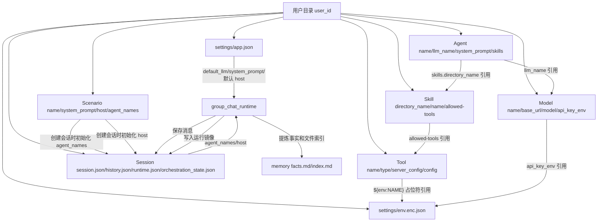

# 数据结构与字段逻辑

本文说明书童四九当前程序的数据结构、字段含义和运行时字段如何生效。它面向想快速理解代码的人，重点回答三件事：

- 数据存在哪里。
- 每类资源有哪些字段。
- 字段在运行时如何影响主持人、专家、Skill、工具和会话状态。

本文是字段与存储结构的目标契约；实现代码应按本文收敛。主要入口：

- 用户目录：[`backend/app/core/user_context.py`](../../backend/app/core/user_context.py)
- 用户路径：[`backend/app/core/user_settings_paths.py`](../../backend/app/core/user_settings_paths.py)
- 字段归一化：[`backend/app/core/name_based_resources.py`](../../backend/app/core/name_based_resources.py)
- 会话入口：[`backend/app/api/sessions.py`](../../backend/app/api/sessions.py)
- 群聊运行时：[`backend/app/agent/group_chat_runtime.py`](../../backend/app/agent/group_chat_runtime.py)
- 工具组装：[`backend/app/agent/tools_for_skill.py`](../../backend/app/agent/tools_for_skill.py)

## 1. 总体目录结构

所有用户数据按 `user_id` 隔离，默认位于：

```text
backend/data/users/{user_id}/
  profile.json

  resources/
    scenarios/{name}/scenario.json
    agents/{agent_name}/agent.json
    skills/{skill_directory}/SKILL.md
    tools/{tool_name}/tool.json
    models/{model_name}/model.json

  settings/
    app.json
    env.enc.json
    sandbox/requirements.txt

  sessions/
    {session_id}/
      session.json
      history.json
      runtime.json
      orchestration_state.json
      workspace/
      memory/
        facts.md
        index.md
      execution_logs/
        tool-execution.jsonl
      checkpoints/
```

边界：

- `resources/` 是资源中心，存可管理、可导入导出的资源。
- `settings/` 是账号级设置，存全局模型、全局提示词、主持人默认配置、平台内用户级环境变量和沙箱依赖。
- `sessions/` 是真实运行态，存会话元信息、消息历史、工作区产物和快照。
- 平台内用户级环境变量当前目标存放在 `settings/env.enc.json`。资源文件只能保存环境变量名或 `${env:NAME}` 引用，不应保存明文 key。

## 2. 字段身份规则

当前资源契约是名称优先，不再以数据库式 id 作为主身份。本文中的“身份字段”指程序查找和引用资源时使用的字段；前端展示字段可以不同，但不能反向参与运行时查找。

| 资源 | 身份字段 | 磁盘位置 | 说明 |
|------|----------|----------|------|
| 场景 | `name` | `resources/scenarios/{name}/scenario.json` | 场景导入、保存、列表都按名称归一化；创建会话时仅作为初始化模板。 |
| 专家 | `name` | `resources/agents/{name}/agent.json` | 会话和场景通过专家名称引用专家。 |
| Skill | `directory_name` | `resources/skills/{directory_name}/SKILL.md` | 专家和主持人引用目录名，用户界面展示 frontmatter `name`。 |
| 工具 | `name` | `resources/tools/{name}/tool.json` | Skill 的 `allowed-tools` 通过工具名称引用。 |
| 模型 | `name` | `resources/models/{name}/model.json` | `llm_name` / `default_llm` 引用模型名称。 |
| 会话 | `session_id` | `sessions/{session_id}/` | 由后端生成；目录名就是会话身份。 |

字段归一化集中在 `normalize_scenario_row()`、`normalize_agent_row()`、`normalize_tool_row()` 和 `normalize_skill_refs()`。

资源查找、引用和展示的边界如下：

| 资源 | 查找字段 | 引用字段 | 前端显示 |
|------|----------|----------|----------|
| 场景 | `name` | 创建会话时一次性读取 | `name` |
| 专家 | `name` | `agent_names[]` / `agent_name` | `name` |
| Skill | `directory_name` | `skills[].directory_name` / `host.skill_directory` | SKILL.md frontmatter `name` |
| 工具 | `name` | `allowed-tools.mcp[]` / `allowed-tools.http_api[]` | `name` |
| 模型 | `name` | `llm_name` / `default_llm` / `host.llm_name` | `name` |

引用缺失不是旧字段兼容逻辑，而是资源完整性状态。删除专家、Skill、工具或模型时，不自动级联删除引用；前端应保留原引用值并提示缺失，直到用户手动修复或删除。保存资源时也不能静默清理缺失引用。

## 3. 场景字段

场景落盘格式：

```json
{
  "name": "场景名称",
  "description": "场景说明",
  "system_prompt": "场景级系统提示词",
  "host": {
    "name": "主持人显示名",
    "llm_name": "主持人模型",
    "system_prompt": "主持人专属提示词",
    "skill_name": "主持人 Skill 名称",
    "skill_directory": "主持人 Skill 目录"
  },
  "agent_names": ["专家名称"]
}
```

字段逻辑：

| 字段 | 类型 | 谁写 | 谁读 | 运行时影响 |
|------|------|------|------|------------|
| `name` | string | 场景编辑器、导入接口 | 场景列表、会话创建 | 资源身份，同名场景按名称处理。 |
| `description` | string | 场景编辑器 | 列表、导出 | 展示和搜索，不直接参与运行时核心路由。 |
| `system_prompt` | string | 场景编辑器 | 创建会话 | 场景初始化材料；是否进入会话由创建逻辑决定，不作为会话定义字段。 |
| `host.name` | string | 场景编辑器 | 创建会话、主持人显示 | 主持人显示名；旧 `leader_agent_name` 删除。 |
| `host.llm_name` | string | 场景编辑器 | 创建会话、主持人 LLM 解析 | 主持人使用的模型名称。 |
| `host.system_prompt` | string | 场景编辑器 | 创建会话、主持人调度提示构建 | 只影响主持人行为。 |
| `host.skill_name` | string | 场景编辑器 | 展示、导入导出、缺失引用提示 | 用户可读名称快照；真正加载只靠 `skill_directory`。 |
| `host.skill_directory` | string | 场景编辑器 | 创建会话、主持人 Skill 加载 | 决定主持人是否注入专属 Skill。 |
| `agent_names` | string[] | 场景编辑器 | 会话创建、缺失引用提示 | 创建会话时初始化会话专家列表；会话创建后不再关联场景。 |

前端编辑入口是 [`frontend/src/features/resources/useScenarioEditor.ts`](../../frontend/src/features/resources/useScenarioEditor.ts)，后端 API 是 [`backend/app/api/settings_presets.py`](../../backend/app/api/settings_presets.py)。

## 4. 专家字段

专家落盘格式：

```json
{
  "name": "专家名称",
  "llm_name": "模型名称，可为空",
  "description": "专家职责描述",
  "system_prompt": "专家系统提示词",
  "skills": [
    {
      "name": "Skill 展示名",
      "directory_name": "skill-directory"
    }
  ]
}
```

字段逻辑：

| 字段 | 类型 | 谁写 | 谁读 | 运行时影响 |
|------|------|------|------|------------|
| `name` | string | 专家编辑器、导入接口 | 场景、会话、主持人调度 | 专家身份字段；场景和会话都按名称引用。 |
| `llm_name` | string | 专家编辑器 | `_get_llm_for_agent()` | 非空时覆盖应用默认模型。 |
| `description` | string | 专家编辑器 | `build_expert_turn_runtime()` | 会拼入专家 Skill 执行提示中的职责说明。 |
| `system_prompt` | string | 专家编辑器 | `build_expert_turn_runtime()` | 会拼在 Skill 正文前，作为专家自有规则。 |
| `skills[].name` | string | 专家编辑器 | 展示、缺失引用提示 | Skill frontmatter `name` 的展示快照；不作为加载主键。 |
| `skills[].directory_name` | string | 专家编辑器 | `resolve_expert_skill()`、Skill loader | 决定专家可选择和加载哪些 Skill；Skill 被删除时保留原目录名并提示缺失。 |

专家不再直接保存 `mcp_server_ids` 作为工具权限。当前工具权限由本轮选中的 Skill frontmatter `allowed-tools` 决定。

专家 `skills[].name` 与当前 Skill frontmatter `name` 不一致时，以当前 Skill frontmatter `name` 作为前端显示；如果 `directory_name` 已找不到 Skill，则保留并展示 `skills[].name`，同时标记缺失。保存专家配置时，已存在的 Skill 可刷新展示名；缺失 Skill 不能被静默删除。

前端编辑入口是 [`frontend/src/features/resources/AgentView.vue`](../../frontend/src/features/resources/AgentView.vue)，后端 API 是 [`backend/app/api/agents.py`](../../backend/app/api/agents.py)。

## 5. Skill 字段

Skill 是目录资源，主体文件是 `SKILL.md`。有效 Skill 至少包含 frontmatter：

```yaml
---
name: 技能名称
description: 技能描述
allowed-tools:
  mcp:
    - 工具名称
  http_api:
    - HTTP API 工具名称
  python:
    - requests>=2.31
---
正文说明...
```

字段逻辑：

| 字段 | 类型 | 谁写 | 谁读 | 运行时影响 |
|------|------|------|------|------------|
| `directory_name` | 目录名 | 创建/导入逻辑 | 专家配置、主持人配置、Skill loader | Skill 的唯一加载键和磁盘目录名。 |
| `name` | string | Skill 编辑器 | 列表、专家配置、导入冲突 | 展示名，也用于同名导入判断；不参与运行时加载。 |
| `description` | string | Skill 编辑器 | Skill 选择逻辑 | 多 Skill 时参与专家 Skill 选型。 |
| `allowed-tools.mcp` | string[] | Skill 编辑器 | `get_mcp_servers_for_skill()` | 决定本轮允许加载哪些 MCP Server。 |
| `allowed-tools.http_api` | string[] | Skill 编辑器 | `build_tools_for_group_chat()` | 决定本轮注入哪些 HTTP API 工具。 |
| `allowed-tools.python` | string[] | Skill 编辑器、导入逻辑 | 沙箱依赖状态与导入预热 | 决定用户沙箱 requirements 合并与校验。 |
| 正文 | Markdown | Skill 编辑器 | `SkillsLoader.get_skill_full_content()` | 注入专家系统提示，约束任务执行流程。 |

读取和写入逻辑在 [`backend/app/api/settings_skill_store.py`](../../backend/app/api/settings_skill_store.py) 与 [`backend/app/api/settings_skill_frontmatter.py`](../../backend/app/api/settings_skill_frontmatter.py)。列表会合并用户 Skill 与内置 Skill，用户同目录名优先。

修改 Skill frontmatter `name` 只改变展示名，不应自动修改 `directory_name` 或移动 Skill 目录。运行时禁止通过 `name` 反查 Skill；旧的 `skill_id`、`skill_names`、`folder_name` 不属于当前契约。

## 6. 工具字段

工具统一保存在 `resources/tools/{tool_name}/tool.json`，当前支持 `mcp` 和 `http_api`。

MCP 工具：

```json
{
  "name": "工具名称",
  "type": "mcp",
  "description": "说明",
  "server_config": "{\"mcpServers\":{\"工具名称\":{...}}}"
}
```

HTTP API 工具：

```json
{
  "name": "工具名称",
  "type": "http_api",
  "description": "说明",
  "config": {
    "type": "GET",
    "base_url": "https://example.com",
    "path": "/api",
    "header": {},
    "query": {},
    "body": "",
    "timeout_seconds": 60
  }
}
```

字段逻辑：

| 字段 | 类型 | 运行时影响 |
|------|------|------------|
| `name` | string | 工具身份；Skill `allowed-tools` 通过名称引用。 |
| `type` | `mcp` / `http_api` | 决定走 MCP manager 还是后端 HTTP API wrapper。 |
| `description` | string | 展示和导出说明。 |
| `server_config` | JSON string | MCP Server 连接配置；支持 `${env:NAME}` 用户级环境变量引用。 |
| `config.type` | HTTP method | HTTP API 请求方法。 |
| `config.base_url` / `path` | string | HTTP API 请求目标。 |
| `config.header` / `query` / `body` | object/string | HTTP API 请求参数。 |
| `config.timeout_seconds` | number | HTTP API 请求超时。 |

MCP 管理在 [`backend/app/mcp/manager.py`](../../backend/app/mcp/manager.py)。HTTP API 工具创建在 [`backend/app/tools/http_api_tool.py`](../../backend/app/tools/http_api_tool.py)。

## 7. 模型、全局设置和环境变量字段

应用设置在 `settings/app.json`：

```json
{
  "default_llm": "qwen3-max",
  "system_prompt": "平台全局提示词",
  "host": {
    "name": "四九",
    "system_prompt": "",
    "llm_name": "",
    "skill_name": "",
    "skill_directory": ""
  }
}
```

模型资源在 `resources/models/{model_name}/model.json`：

```json
{
  "name": "qwen3-max",
  "base_url": "https://...",
  "model": "qwen3-max",
  "api_key_env": "QWEN_API_KEY",
  "params": {}
}
```

平台内用户级环境变量保存在 `settings/env.enc.json`：

```json
{
  "items": {
    "QWEN_API_KEY": {
      "label": "Qwen API Key",
      "value": "明文只在服务端保存和读取",
      "sensitive": true
    }
  }
}
```

字段逻辑：

| 字段 | 运行时影响 |
|------|------------|
| `default_llm` | 专家和主持人没有指定 `llm_name` 时使用。 |
| `system_prompt` | 平台级全局提示词，参与 `build_context_system_prompt()` 合并。 |
| `host` | 账号级默认主持人配置；创建会话时可由场景 `host` 覆盖并写入会话 `host` 快照。 |
| `base_url` / `model` | LLM 客户端实际请求目标和供应商真实模型号，不作为资源身份或 UI 主标题。 |
| `api_key_env` | 模型使用的环境变量名；运行时先从当前用户 `settings/env.enc.json` 取值，再查宿主机环境变量。 |
| `params` | 模型调用参数。 |
| `${env:NAME}` | MCP / HTTP API 等配置中的用户级环境变量占位符。 |

相关目标 API 在 [`backend/app/api/settings_app.py`](../../backend/app/api/settings_app.py) 和环境变量设置接口。详细口径见 [`user-env-vars-contract.md`](user-env-vars-contract.md)。

模型资源的查找、引用和前端显示都使用 `name`。`label` 不属于当前模型资源契约；如果历史配置中存在，只能作为待清理旧字段，不能作为 UI 展示名或运行时引用依据。`llm_providers` 字典 key 若仍存在，语义必须等同于模型资源 `name`。

## 8. 会话文件与字段

会话目录以 `session_id` 为身份，不再依赖 `sessions/index.json` 汇总。会话列表通过扫描各会话目录中的 `session.json` 得到。

```text
sessions/{session_id}/
  session.json
  history.json
  runtime.json
  orchestration_state.json
  workspace/
  memory/
  checkpoints/
```

边界：

- `session.json` 保存会话主信息。
- `history.json` 保存消息事实和 Skill 流程控制结果；工具 stdout、stderr、退出码和调用耗时属于执行 trace 或运行日志。
- `runtime.json` 保存当前运行镜像，只用于刷新恢复和运行中 UI。
- `orchestration_state.json` 保存短期编排状态，供下一轮路由和后续上下文组装使用。
- 新协议不再使用 `meta.json` 作为会话定义文件名。
- 新协议不再使用 `chat.md` 或 `history.md` 保存第二套消息快照；`history.json` 是唯一消息事实源。

`checkpoints/` 保存会话文件化状态快照。检查点不是独立业务资源，也不是 Git commit 对外模型；对外统一使用 `checkpoint_id`：

```text
checkpoints/
  HEAD.json
  chain.json
  snapshots/{checkpoint_id}.json
  objects/
    blobs/{sha256}
    trees/{sha256}.json
```

检查点对象字段：

| 字段 | 类型 | 含义 |
|------|------|------|
| `checkpoint_id` | string | 对外检查点身份。 |
| `parent_checkpoint_id` | string / null | 上一个检查点身份。 |
| `created_at` | string | 检查点创建时间。 |
| `trigger` | string | 检查点触发来源，如 `turn_started`、`turn_completed`、`workspace_changed`、`manual_snapshot`、`rollback`、`clone`；只用于审计和展示，不参与恢复逻辑。 |
| `session_blob` | sha256 | `session.json` 当时内容的不可变快照。 |
| `history_blob` | sha256 | `history.json` 当时内容的不可变快照。 |
| `orchestration_state_blob` | sha256 / null | `orchestration_state.json` 当时内容的不可变快照。 |
| `workspace_tree` | sha256 | `workspace/` 用户可见文件树。 |
| `memory_tree` | sha256 | `memory/` 内部记忆文件树。 |
| `state_hash` | sha256 | 由 `session_blob`、`history_blob`、`orchestration_state_blob`、`workspace_tree`、`memory_tree` 计算出的整体状态 hash。 |
| `last_message_id` | string / null | 快照对应的最后一条消息 ID。 |

旧字段 `commit_id`、`parent`、`reason`、`session_definition`、`chat_blob`、`message_count` 不属于新的检查点契约。`trigger` 不进入 `state_hash`，不得被运行时用作恢复分支判断。

检查点触发和恢复规则：

- 接收用户消息并写入 `history.json` 后、专家或工具执行前，必须创建 `turn_started` 检查点，作为本轮开始边界。
- 一轮用户消息完整结束后，必须创建 `turn_completed` 检查点，作为本轮结束边界。
- 工作区文件上传、新建、保存、删除、重命名完成后，必须创建 `workspace_changed` 检查点；显式文件操作每次生成检查点，自动保存或连续编辑可在短窗口内合并。
- 手动 snapshot 创建 `manual_snapshot` 检查点。
- rollback 完成后，在目标状态上生成新的 `rollback` 检查点；clone 创建新会话时生成新的 `clone` 初始检查点。
- 每次检查点必须是同一时刻的完整状态：`session.json`、`history.json`、`orchestration_state.json`、`workspace/` 和 `memory/`。写入失败时不得更新 `HEAD.json`，不得暴露半成品检查点。
- `runtime.json` 不进入检查点；运行日志、trace 和中间缓存不进入 `workspace_tree` 或 `memory_tree`。
- 检查点默认逻辑永久保留，不自动压缩、清理或设置数量上限；对象清理和保留策略另行设计。

运行中边界：

- 会话正在生成回复时，允许用户通过文件 API 修改 `workspace/`；这些文件操作按上面的 `workspace_changed` 规则形成稳定检查点。
- 本轮专家、模型和工具读取用户附件或工作区输入时，以本轮 `turn_started` 检查点中的 `workspace_tree` 为准；运行中用户对 `workspace/` 的修改只影响后续回合，不改变当前正在生成回合的输入。
- 本轮工具或专家产物写入当前 `workspace/`，按完成顺序落盘并生成 `workspace_changed` 检查点。
- 如果运行中用户操作和本轮工具写入同一路径，按完成顺序串行落盘，后完成的写入覆盖前一个；每次写入都必须形成可回滚检查点。
- 会话正在生成回复时，clone、rollback 和删除消息不可用；这些操作会分叉或改写会话主状态，必须等待当前回复结束或先停止当前运行后才能操作。
- 当前稳定 `HEAD` 只来自已经完成的检查点，不包含未完成的流式回复片段。

回滚和分叉语义：

- rollback 到 `checkpoint_id` 时，恢复该检查点对应状态。
- rollback 或 clone 到 `message_id` 时，使用该消息完成后的状态；若该消息没有精确检查点，则使用不晚于该消息的最近检查点。找不到可用检查点时严格失败。
- rollback 不删除旧检查点链，而是在目标状态上生成新的检查点并更新当前会话 `HEAD`。旧检查点仍可查看、克隆和再次回滚。
- 删除消息只修改当前 `history.json`，并生成新的检查点；已有检查点不可变，不因当前删除操作而改写。
- `message_id` 不存在、对象缺失、对象 hash 校验失败或树对象损坏时严格失败，不进行猜测恢复。

`session.json` 典型字段：

```json
{
  "title": "会话标题",
  "title_auto_generated": true,
  "agent_names": ["专家名称"],
  "host": {
    "name": "四九",
    "llm_name": "模型名称",
    "system_prompt": "主持人提示词",
    "skill_directory": "group-host"
  },
  "created_at": "2026062908104800",
  "updated_at": "2026062908104800"
}
```

字段逻辑：

| 字段 | 类型 | 运行时影响 |
|------|------|------------|
| `title` | string | 会话列表展示。 |
| `title_auto_generated` | boolean | 创建时默认为 `true`；用户手动修改标题后置为 `false`，之后不得自动置回 `true`。 |
| `agent_names` | string[] | 当前参与会话的专家名称列表；只保存专家 `name`。 |
| `host.name` | string | 主持人显示名。 |
| `host.llm_name` | string | 主持人使用的模型名称。 |
| `host.system_prompt` | string | 主持人调度提示词，只影响主持人。 |
| `host.skill_directory` | string | 主持人 Skill 目录名。 |
| `created_at` | string | 创建时间，格式为 `YYYYMMDDHHmmssSS`。 |
| `updated_at` | string | 更新时间，格式为 `YYYYMMDDHHmmssSS`。 |

新写入明确不保存：

- `leader_agent_name`
- `host_config`
- `scenario_name`
- `orchestration_profile`
- `system_prompt`
- `runtime_state`
- `pending_*`
- `skill_session_*`
- `next_prompt`
- `context.system_prompt`

主持人解析规则：

- 创建会话时，如果入口来自场景，则用场景 `host` 初始化会话 `host`，用场景 `agent_names` 初始化会话 `agent_names`。
- 创建会话时，如果入口不是场景，则用账号级默认 `host` 初始化会话 `host`，`agent_names` 为空。
- 会话创建后不再依赖场景资源；会话运行只读取 `session.json` 中的 `host` 和 `agent_names`。
- 会话文件不复制专家的模型、提示词、Skill 或工具权限；专家详情仍从资源中心按 `agent_names` 实时解析。

会话定义读写在 [`backend/app/api/group_chat_state.py`](../../backend/app/api/group_chat_state.py) 与 [`backend/app/agent/group_session_service.py`](../../backend/app/agent/group_session_service.py)。

## 9. 运行态字段

`runtime.json` 是运行镜像，不是任务队列。浏览器刷新后可以用它恢复“运行中”提示并重新订阅事件流；后端进程重启后，进程内 `asyncio.Task` 已丢失，不能续跑，只能识别 stale runtime 并清理。

典型结构：

```json
{
  "running": true,
  "run_id": "run-id",
  "phase": "tool_running",
  "agent_name": "专家名称",
  "skill": "skill-directory",
  "started_at": "2026062908104800"
}
```

字段逻辑：

| 字段 | 类型 | 运行时影响 |
|------|------|------------|
| `running` | boolean | 当前会话是否有运行中的后端任务。 |
| `run_id` | string | 当前运行编号，用于区分并发或过期运行。 |
| `phase` | string | 后端生成的当前阶段；`progress.phase` 必须原样同步该值。 |
| `agent_name` | string | 当前正在执行的专家名称。 |
| `skill` | string | 当前正在执行的 Skill 目录名。 |
| `started_at` | string | 本轮运行开始时间。 |

编排决策不依赖 `runtime.json`。它只服务前端刷新恢复、会话列表运行态标记和停止运行接口。`runtime.json` 不保存 `updated_at`、`user_id` 或任何前端不展示、不恢复 UI、不用于停止运行的字段。

`runtime.json.phase` 由后端综合 `OrchestrationPhase`、文件解析、Skill 选择、工具执行和生成阶段写入，前端不维护第二套 `status` 枚举。目标取值为：

| phase | 含义 |
|------|------|
| `routing` | 主持人或目标专家路由中。 |
| `planning` | 编排规划中。 |
| `executing` | 专家或 Skill 主执行中。 |
| `file_resolving` | 解析本轮附件和工作区文件引用。 |
| `file_resolved` | 文件引用解析完成。 |
| `skill_selecting` | 为专家选择 Skill。 |
| `agent_routed` | 已确定执行专家和 Skill。 |
| `tool_running` | 工具调用中。 |
| `assistant_generating` | 模型生成最终回复中。 |
| `finalizing` | 收尾、落盘历史和产物登记中。 |
| `awaiting_user` | 当前回合结束，等待用户补充或确认。 |
| `recruiting` | 当前回合结束，建议补充专家。 |
| `reviewing` | 主持人或审查步骤处理中。 |
| `completed` | 当前回合正常完成。 |
| `stopped` | 用户主动停止当前运行。 |
| `failed` | 当前运行失败或 stale runtime 被清理。 |

`orchestration_state.json` 是刷新不能丢的短期编排状态，不是 UI 运行镜像：

```json
{
  "continuation": {
    "owner_agent_name": "专家名称",
    "skill_policy": "keep",
    "skill": "skill-directory",
    "next_action": "面向上下文组装的下一步动作说明"
  },
  "host_scheduler": {
    "current_phase": "主持人当前阶段",
    "next_speaker": "专家名称 | user | end",
    "next_action": "主持人给下一位的动作说明"
  }
}
```

字段逻辑：

| 字段 | 类型 | 运行时影响 |
|------|------|------------|
| `continuation.owner_agent_name` | string | 下一轮用户消息优先接回的专家名称。 |
| `continuation.skill_policy` | `keep` / `release` | `keep` 表示继续同一 Skill；`release` 表示接回同一专家但重新选择 Skill。 |
| `continuation.skill` | string | 仅 `skill_policy=keep` 时填写。 |
| `continuation.next_action` | string | 下一轮接回专家时要执行的动作说明。 |
| `host_scheduler.current_phase` | string | 主持人的跨轮阶段记忆。 |
| `host_scheduler.next_speaker` | string | 主持人已经确定的下一位，只能是场内专家名称、`user` 或 `end`；为场内专家时优先于 `continuation`。 |
| `host_scheduler.next_action` | string | 主持人给下一位的动作说明。 |

旧字段 `pending_owner_agent_name`、`pending_skill`、`pending_phase`、`pending_required_user_fields`、`pending_handoff_reason`、`skill_session_owner_name`、`skill_session_skill`、`speaker_task`、`instruction`、`next_prompt` 不属于当前运行态契约。主持人调度 JSON 中的 `reason`、`invite`、`task_done`、`announcement`、`suggested_order` 和 id 类字段也不属于当前契约。`host_scheduler.next_speaker` 与 `continuation.owner_agent_name` 冲突时，`host_scheduler` 优先，并应清理 `continuation`。

专家路由决策的内部结果使用统一字段：

```json
{
  "next_speaker": "专家名称 | user | end | invite",
  "next_action": "下一步动作说明",
  "route_source": "empty_group | target_agent | host_scheduler_state | continuation | host_scheduler",
  "skill_policy": "none | keep | release",
  "skill": "skill-directory 或 null"
}
```

`route_source` 只用于后端内部日志和测试断言，不进入前端 API、SSE payload 或持久化业务数据。`next_action` 是唯一动作说明字段：进入专家时作为专家任务，交回用户、结束或邀请时转换为主持人消息或前端提示。

## 10. 消息字段

会话消息保存在 `sessions/{session_id}/history.json`。用户消息、主持人消息和专家消息共用同一列表。

专家消息典型结构：

```json
{
  "message_id": "msg-xxxx",
  "speaker": {
    "type": "expert",
    "agent_name": "专家名称",
    "skill": "skill-directory"
  },
  "message": {
    "content": "专家最终展示消息"
  },
  "created_at": "2026062908104800",
  "skill_result": {
    "execution_status": "succeeded",
    "content": "脚本文本而非总结",
    "artifacts": [
      {
        "type": "directory",
        "name": "Skill 模板目录",
        "path": "skills/demo"
      }
    ],
    "next_action": {
      "agent_turn": "respond",
      "skill_session": "release"
    }
  }
}
```

用户消息典型结构：

```json
{
  "message_id": "msg-xxxx",
  "speaker": {
    "type": "user"
  },
  "message": {
    "content": "用户输入",
    "attachments": [
      {
        "type": "workspace_file",
        "name": "附件1.pdf",
        "path": "附件1.pdf"
      }
    ],
    "target_agent_name": "写作专家"
  },
  "created_at": "2026062908104800",
  "client_message_id": "client-msg-xxxx"
}
```

主持人消息典型结构：

```json
{
  "message_id": "msg-xxxx",
  "speaker": {
    "type": "host",
    "agent_name": "四九",
    "skill": "host-skill-directory"
  },
  "message": {
    "content": "主持人回复"
  },
  "created_at": "2026062908104800"
}
```

字段逻辑：

| 字段 | 运行时影响 |
|------|------------|
| `message_id` | 删除消息、快照回滚和前端列表 key。 |
| `speaker.type` | 区分 `user`、`host`、`expert`。 |
| `speaker.agent_name` | 标记主持人或专家发言人；`host`、`expert` 填写，`user` 不填写。 |
| `speaker.skill` | 本轮主持人或专家实际使用的 Skill；`host`、`expert` 可填写，`user` 不填写。 |
| `message.content` | 前端展示和后续上下文来源。 |
| `message.attachments` | 用户消息附带的工作区文件引用，只允许当前会话 `workspace/` 相对路径。 |
| `message.attachments[].type` | 附件引用类型；当前只允许 `workspace_file`。 |
| `message.attachments[].path` | 工作区相对路径，是后端读取和工具访问的依据。 |
| `message.attachments[].name` | 展示名，不参与路径解析。 |
| `message.target_agent_name` | 用户明确指定本轮专家；必须是当前会话 `agent_names` 中的专家名称。 |
| `created_at` | 消息创建时间，格式为 `YYYYMMDDHHmmssSS`。 |
| `client_message_id` | 用户消息幂等 id，用于避免同一前端发送重复落盘。 |
| `skill_result.execution_status` | Skill 本步结果，取值为 `succeeded`、`blocked`、`failed`。 |
| `skill_result.content` | Skill 脚本或专家产出的正文结果；平台不做 LLM 总结或改写。 |
| `skill_result.artifacts` | Skill 产物索引数组，每项固定为 `type`、`name`、`path`；真实内容通过 workspace 路径读取。 |
| `skill_result.next_action.agent_turn` | 当前专家回合是否继续，取值为 `respond`、`continue`。 |
| `skill_result.next_action.skill_session` | 下一条用户消息是否回到同一专家和 Skill，取值为 `keep`、`release`。 |

脚本型 Skill 消息中，`message.content` 是消息列表展示字段，内容应与 `skill_result.content` 保持一致；Skill 执行结果、产物索引和会话控制的事实源仍是 `skill_result`。

`skill_result.next_action.agent_turn` 和 `skill_result.next_action.skill_session` 是两个维度。`agent_turn` 只控制当前专家本轮是否继续行动，`skill_session` 只控制下一条用户消息是否继续回到同一专家和同一 Skill；`continue+keep`、`continue+release`、`respond+keep`、`respond+release` 四种组合都合法，平台不把某个组合硬判为非法。

脚本型 Skill 的 `next_action` 来自脚本 stdout。非脚本 Skill、MCP / HTTP / workspace 工具后的流程判断来自专家最终回复末尾的隐藏状态块。脚本 stdout 缺少 `next_action`、字段缺失、枚举非法或 JSON 结构不合法时，按协议失败处理为 `execution_status=failed`、`agent_turn=respond`、`skill_session=release`。

`execution_status=blocked` 表示 Skill 或工具已经执行到一个明确等待点，需要用户补充材料、文件、链接、确认或参数后才能继续；它不是失败，也不是兜底状态。`failed` 表示本步执行失败，`message.content` 和 `skill_result.content` 必须给出面向用户的失败原因。

新协议不再把 `role: assistant`、顶层 `content`、顶层 `agent_name`、顶层 `skill`、`timestamp`、`turn_id`、`debug`、`required_user_fields`、`handoff_reason`、`result_code`、`source`、`tool_raw_results`、`tool_debug`、`tool_results` 作为消息核心字段。若需要排查工具执行细节，应写入执行 trace 或运行日志，不进入 `history.json` 的业务消息结构，也不进入提示词字段。

用户消息请求不再通过 `message.content` 文本承载文件和路由控制。`【文件引用：...】`、`@专家`、自然语言点名只可作为历史文本展示，不是当前协议入口；新请求必须使用 `message.attachments` 和 `message.target_agent_name`。

执行日志不属于 `history.json`。MCP、Skill 脚本、HTTP API 和工作区操作的调用参数、stdout、stderr、结构化返回和中间产物应写入会话级运行日志，并通过 `message_id` 单向关联到某条历史消息。`history.json` 不反向保存 `log_ids`，避免形成双向引用。

会话级工具执行日志固定写入 `sessions/{session_id}/execution_logs/tool-execution.jsonl`。该目录不进入检查点，也不参与 `workspace_tree` 或 `memory_tree`。

会话运行日志典型结构：

```json
{
  "log_id": "log-xxxx",
  "message_id": "msg-xxxx",
  "created_at": "2026062908104800",
  "source": "mcp",
  "agent_name": "信息检索专家",
  "skill": "web-search",
  "tool_call": {
    "id": "call-xxxx",
    "name": "linkup-search",
    "provider": "linkup",
    "provider_tool": "search",
    "arguments": {}
  },
  "output": {
    "text": "",
    "json": {},
    "stdout": "",
    "stderr": ""
  },
  "artifacts": []
}
```

运行日志 `source` 只允许 `mcp`、`script`、`workspace`、`api`，不设置 `unknown`。`provider` 表示工具所属容器：MCP 为 server 名，script 为 Skill `directory_name`，api 为保存的 API 工具名；`provider_tool` 表示容器内真实工具：MCP 原始 tool name、script 的 `script_path` 相对路径或 API 动作名。无值时省略字段，不写 `null`。

## 11. 运行时主链路

用户发送消息后的真实后端链路：

```text
POST /api/sessions/{session_id}/chat/stream
  -> sessions.py::session_chat_stream()
  -> group_chat_runtime.py::group_chat_stream()
  -> 读取 session.json
     - 读取 agent_names 作为本会话专家列表
     - 读取 host 作为本会话主持人快照
  -> 读取 history.json
     - 从最后有效专家消息的 skill_result.next_action.skill_session 推导 Skill keep/release
  -> 写入 runtime.json 运行镜像
  -> 读取 orchestration_state.json 短期编排状态
  -> 校验 attachments 和 target_agent_name
  -> 记录用户消息和刷新标题
  -> 合并全局/主持人/专家/Skill/历史上下文
  -> 路由决策
     - target_agent_name 指定专家
     - orchestration_state continuation 续跑
     - orchestration_state host_scheduler 换专家或延续主持人阶段
     - 主持人调度
  -> expert_runtime.py::build_expert_turn_runtime()
     - 解析专家绑定 Skill
     - 多 Skill 时由专家模型选一个
     - 拼接专家 system_prompt、description、Skill 正文
  -> tools_for_skill.py::build_tools_for_group_chat()
     - 读取本轮 Skill allowed-tools
     - 按需加载 MCP
     - 注入 HTTP API、工作区工具、run_skill_script 工具
  -> skill_agent_runtime.py / simple_agent.py
     - LLM agent_step
     - tool_step
     - final_step
  -> 保存 history.json
  -> 清理或刷新 runtime.json
  -> 更新 memory/facts.md 和 memory/index.md
  -> SSE 返回 start/route/progress/message/end/error
```

前端 SSE 事件在 [`frontend/src/api/chat.ts`](../../frontend/src/api/chat.ts) 解析：

| 事件 | 含义 |
|------|------|
| `start` | 本轮流开始。 |
| `route` | 后端决定的专家和 Skill。 |
| `progress` | 运行阶段提示，`phase` 必须等于当前 `runtime.json.phase`。 |
| `message` | 已落盘的完整消息。 |
| `end` | 本轮结束状态。 |
| `error` | 后端异常。 |

`discussion_ended` 不属于平台字段。`end` 只表示当前回复回合结束，不表示整个会话结束。`tool_start`、`tool_result` 不作为顶层 SSE 事件；工具细节写入执行 trace、运行日志或 `skill_result.artifacts`。

前端状态与 mock 规则：

| 范围 | 规则 |
|------|------|
| 消息事实 | 只使用 `history.json` 同构消息：`message_id`、`speaker`、`message`、`created_at`、`client_message_id`、`skill_result`。前端不得保存第二套顶层 `role` / `content` / `agent_name` 消息结构。 |
| 运行状态 | 只来自 `runtime.json`、`progress` 和 `/events/stream runtime`。前端可以把 `phase` 映射成中文文案，但不能生成第二套业务枚举。 |
| 本地暂态 | `_streaming`、`_streamingStatus`、滚动位置、本地网络错误提示只属于页面展示，不进入 API、mock、历史或运行态文件。 |
| 招募与下一步 | 只读取 `suggested_add_agent_names`、`suggested_next_speaker`、`waiting_for_user` 等结构化字段，不从 `message.content` 正则猜测。 |
| 附件清理 | 本地 composer 附件在用户消息被当前回合接收或收到 `end` 后清理，不依赖 `discussion_ended`。 |
| 非流式聚合 | `/chat` 聚合 SSE 时保留 `route`、`progress`、`message`、`end`、`error` 结构，不返回旧 `contents`。 |
| E2E mock | `frontend/e2e/fixtures/mockApi.ts` 和单测内手写 SSE 必须与真实 API 同字段；不得使用旧事件或旧消息结构。 |

## 12. 工具执行边界

工具按当前生效 Skill 声明组装，不是专家直接拥有全部工具。

| 工具类别 | 字段来源 | 执行路径 | 边界 |
|----------|----------|----------|------|
| MCP | `Skill.allowed-tools.mcp` -> `resources/tools/*` | `tools_for_skill.py` -> `mcp/manager.py` -> MCP SDK `call_tool()` | 不是全局预连接；只按本轮 Skill 声明加载。 |
| HTTP API | `Skill.allowed-tools.http_api` -> `resources/tools/*` | `tools_for_skill.py` -> `http_api_tool.py` | 后端直接 HTTP 请求，使用 `${env:NAME}` 占位符替换和安全检查。 |
| Skill 脚本 | 专家绑定的 `skills[].directory_name` | `run_skill_script.py` -> 工具网关 -> sandbox service | 通过沙箱执行，工作区挂载到当前 session。 |
| 工作区文件工具 | 运行时内置 | `tools_for_skill.py` -> workspace wrappers | 限制在当前会话 workspace。 |

## 13. 记忆和工作区字段

用户可见工作区位于 `sessions/{session_id}/workspace/`。文件 API 只访问该目录，不访问内部记忆目录。

自动记忆位于 `sessions/{session_id}/memory/`：

| 文件 | 作用 |
|------|------|
| `facts.md` | 从专家/主持人回合提炼关键事实，后续派发时可作为上下文。 |
| `index.md` | 从 `skill_result.artifacts` 和工作区产物路径中提取索引，记录 `agent_name`、`skill`、`summary`、`files`。 |

边界：

- `workspace/` 只保存用户可见文件、专家产物和可下载/可编辑内容。
- `memory/` 是运行时内部记忆状态，不进入工作区文件列表、资源中心文件页、用户下载或用户编辑入口。
- `sessions/with-workspace-files` 只统计 `workspace/` 中的用户可见文件，不统计 `memory/`。
- `memory/` 的单次写入不单独触发用户可见 checkpoint；会话轮次形成 checkpoint 时，必须把 `memory_tree` 纳入快照。
- `workspace/` 内允许普通点文件，例如 `.gitignore` 和 `.env.example`。
- 文件 API 永远禁止访问路径穿越、绝对路径、`memory/`、`checkpoints/`、运行日志目录和任何会话内部系统目录。
- 用户主动导出的 Markdown、ZIP、报告等成果文件属于用户可见产物，可以写入 `workspace/`。
- 运行日志、trace、中间缓存和内部对象不得写入 `workspace/`，也不得通过文件 API 暴露。

记忆读写在 [`backend/app/agent/group_memory_store.py`](../../backend/app/agent/group_memory_store.py) 和 [`backend/app/agent/group_chat_memory_prompt.py`](../../backend/app/agent/group_chat_memory_prompt.py)。

## 14. 关键字段耦合图



## 15. 修改字段时的检查顺序

改字段时不要只改一个表单或一个 JSON。建议按下面顺序检查：

1. 资源归一化：`backend/app/core/name_based_resources.py`
2. 后端 API 请求/响应：`backend/app/api/*.py`
3. 前端表单和类型：`frontend/src/features/resources/*`、`frontend/src/features/workspace/*`
4. 运行时读取点：`backend/app/agent/group_chat_runtime.py`、`expert_runtime.py`、`tools_for_skill.py`
5. 导入导出：`backend/app/core/scenario_bundle.py`、`settings_bundle_import.py`
6. 测试和文档：`backend/tests/*`、`docs/contracts/*`、`docs/design/*`、`docs/architecture/*`

高风险字段：

| 字段 | 风险 |
|------|------|
| `name` | 资源身份字段，改名会影响引用和导入冲突。 |
| `directory_name` | Skill 加载主键，错误会导致专家找不到 Skill。 |
| `allowed-tools` | 工具权限边界，错误会导致工具不加载或加载过多。 |
| `system_prompt` | 分全局、场景、主持人、专家四层，容易混淆注入位置。 |
| `host` | 会话主持人快照，错误会导致主持人名称、模型、提示词或主持人 Skill 错位。 |
| `agent_names` | 会话专家列表，错误会导致 `target_agent_name` 校验、主持人调度和专家执行错位。 |
| `runtime.json` | 运行镜像，不是任务队列；不能作为编排真相源。 |
| `orchestration_state.json` | 短期编排状态，错误会导致续跑、换专家或主持人阶段恢复错位。 |
| `skill_result.next_action.skill_session` | 跨轮 Skill 路由事实源，回滚和删除消息会影响下一轮路由。 |
