# 书童四九上线验收操作手册

本文档面向上线验收人员，用于在本地或验收环境中按核心路径操作“书童四九”，并记录每条路径是否通过。

## 1. 验收前准备

### 适用对象

本手册适用于项目方测试人员、交付验收人员和临时验收环境操作人员。

### 验收范围

第一版覆盖上线验收核心路径：登录注册、工作空间会话、专家邀请与移除、文件引用与增删、场景新建、资源中心配置、设置中心配置、资源包导入导出。

### 环境要求

- 前端和后端服务已启动，浏览器可访问系统页面。
- 使用项目方提供的本地验收账号登录。
- 模型配置使用验收环境中的 `jeniya`。
- 密钥字段只用于本地验证，截图和文档不展示明文 API Key。
- 演示数据统一使用“验收”或“问答验收”前缀。

### 通用通过标准

- 页面可正常打开，无白屏、无 500/401 异常。
- 按钮点击后有明确反馈、跳转或数据变化。
- 保存后的配置刷新后仍存在。
- 删除、移除、导入等动作和页面提示一致。

### 通用不通过判定

- 页面无法进入或持续加载。
- 按钮无响应，或点击后没有可判断的结果。
- 保存成功提示出现后刷新丢失。
- 页面出现未处理异常、控制台错误导致核心流程中断。
- 验收数据混入真实密钥、真实客户数据或个人隐私。

## 2. 登录与注册

### 验收目标

确认验收人员可以进入系统，能识别登录、注册和账号切换入口。

### 页面截图

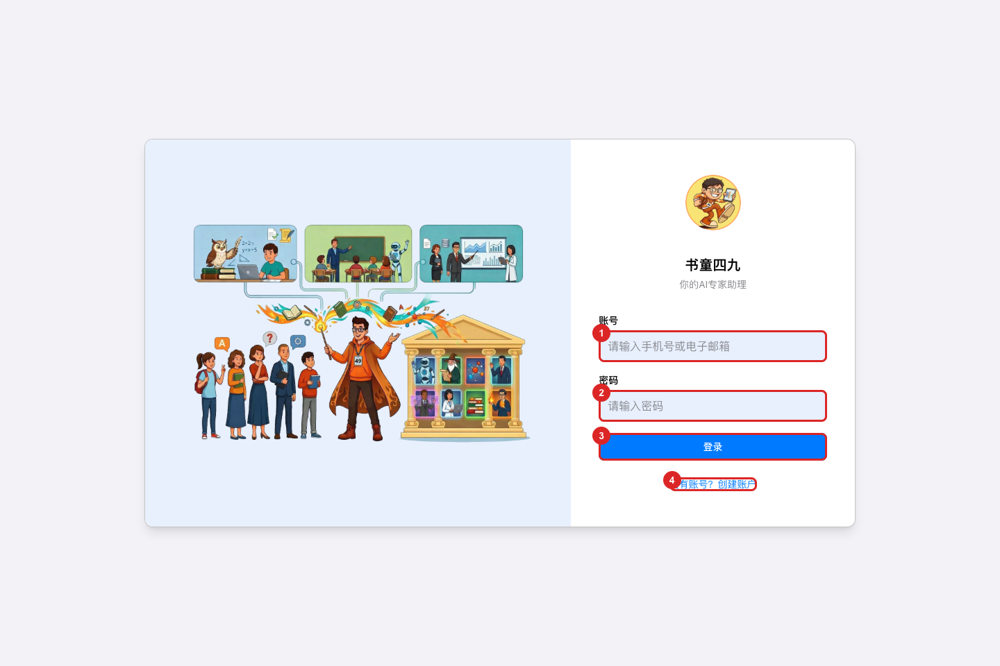

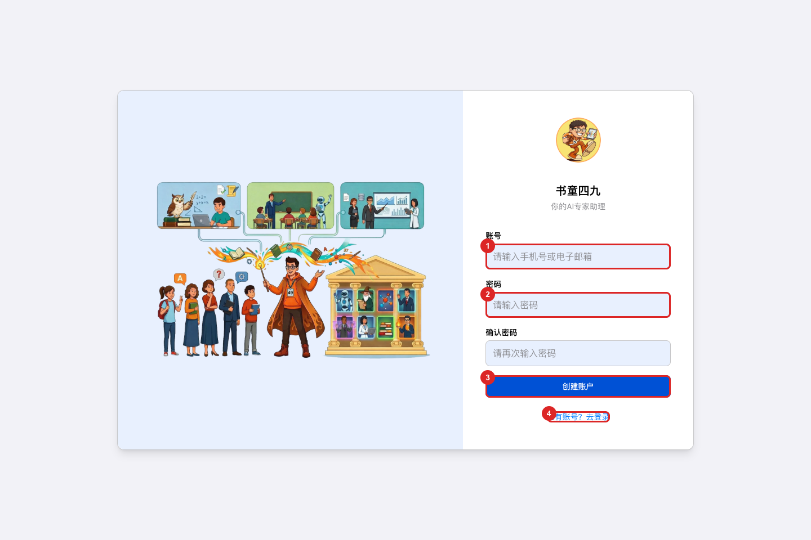

### 按钮和区域说明

| 编号 | 说明 |
| --- | --- |
| 1 | 账号输入框，填写项目方提供的验收账号。 |
| 2 | 密码输入框，本地输入，不记录到验收文档。 |
| 3 | 登录或创建账户按钮。 |
| 4 | 登录和注册页面切换入口。 |

### 操作步骤

1. 打开系统访问地址。
2. 在登录页填写验收账号和密码。
3. 点击“登录”。
4. 进入主界面后点击“登出”。
5. 再次进入登录页，确认可以重新登录。
6. 如需验证注册，点击“没有账号？创建账户”，填写测试账号和密码后提交。

### 预期结果

登录成功后进入“工作空间”；登出后回到登录页；注册页字段完整，账号格式错误或密码不一致时有明确提示。

### 不通过判定

登录后停留在登录页、页面无错误提示但无法进入、注册按钮无响应、登出后仍保留旧账号状态，均判定为不通过。

## 3. 工作空间

### 验收目标

确认验收人员可以创建和进入会话，能发送问题、查看回复、邀请或移除专家，并操作工作区文件。

### 页面截图

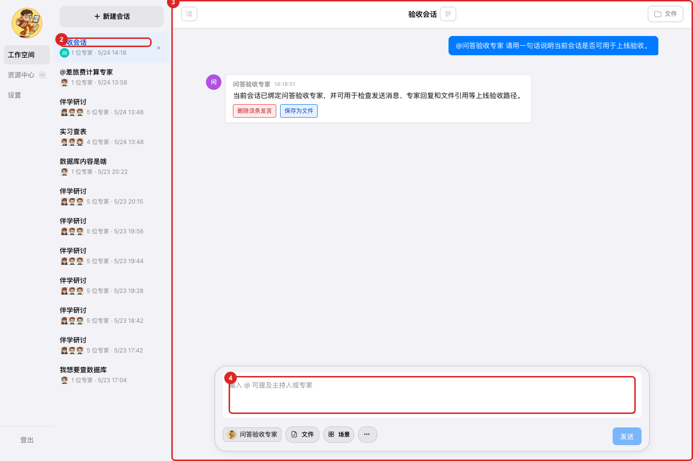

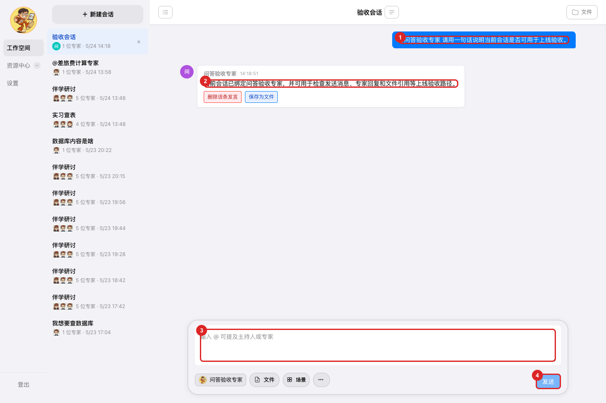

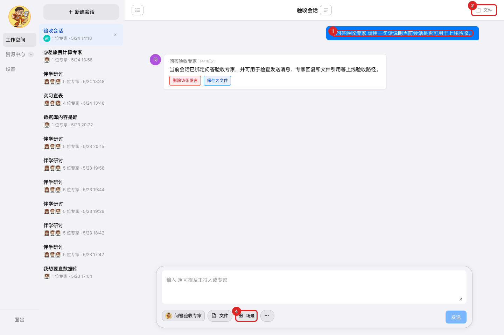

### 按钮和区域说明

| 编号 | 说明 |
| --- | --- |
| 1 | 新建会话或用户消息区域，用于创建会话或查看用户发问。 |
| 2 | 会话列表、专家回复或当前专家区域。 |
| 3 | 会话主区域或输入框，用于查看消息、输入问题和引用文件。 |
| 4 | 发送、文件、场景等核心操作按钮。 |

### 操作步骤

1. 点击左侧“工作空间”。
2. 点击“＋ 新建会话”，确认左侧出现新会话。
3. 进入“验收会话”。
4. 在输入框输入 `@问答验收专家 请用一句话说明当前会话是否可用于上线验收。`。
5. 点击“发送”，等待专家回复。
6. 点击当前专家或成员入口，打开成员管理。
7. 邀请“问答验收专家”；如页面支持移除，移除后再重新邀请。
8. 点击“文件”，查看工作区文件。
9. 新建或上传一个验收文件，确认列表出现。
10. 删除刚创建的验收文件，确认文件列表同步移除。
11. 点击“场景”，选择或新建“问答验收场景”。

### 预期结果

新会话可创建；消息发送后显示用户气泡和专家回复；`@` 能指定专家；邀请和移除专家后成员数量变化；文件新增、保存、删除后刷新仍一致；场景入口可用于创建或选择场景。

### 不通过判定

无法创建会话、发送后没有消息、专家回复不展示、成员变化不生效、文件增删刷新后状态错误、场景入口无法打开，均判定为不通过。

## 4. 资源中心：场景

### 验收目标

确认验收人员可以创建、编辑和保存场景，并能绑定协作专家。

### 页面截图

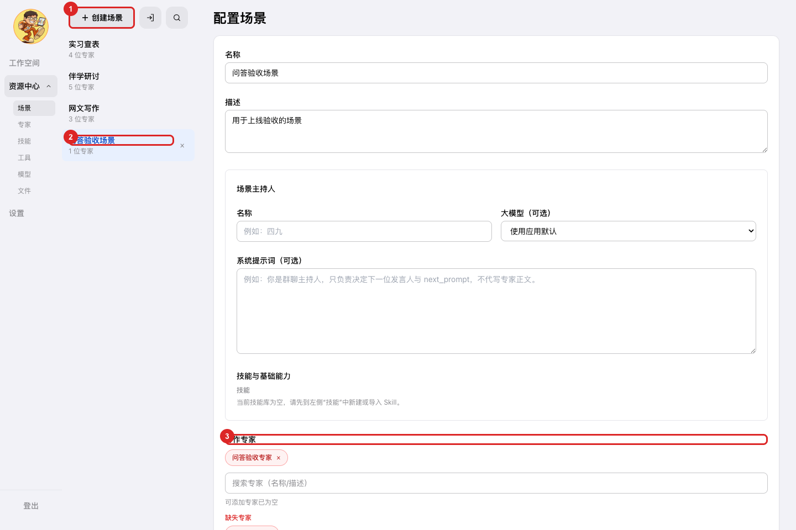

### 按钮和区域说明

| 编号 | 说明 |
| --- | --- |
| 1 | 创建场景按钮。 |
| 2 | 场景列表中的“问答验收场景”。 |
| 3 | 协作专家配置区域。 |
| 4 | 保存按钮。 |

### 操作步骤

1. 点击“资源中心 → 场景”。
2. 点击“创建场景”。
3. 填写场景名称、描述和验收目标。
4. 添加“问答验收专家”。
5. 点击“保存”。
6. 刷新页面后重新进入该场景。

### 预期结果

场景保存成功；刷新后场景仍存在；专家绑定关系保持；从工作空间场景入口可选到该场景。

### 不通过判定

场景不能保存、刷新后丢失、专家绑定为空、同名覆盖提示不清晰，均判定为不通过。

## 5. 资源中心：专家

### 验收目标

确认验收人员可以创建和编辑专家，能绑定模型和技能。

### 页面截图

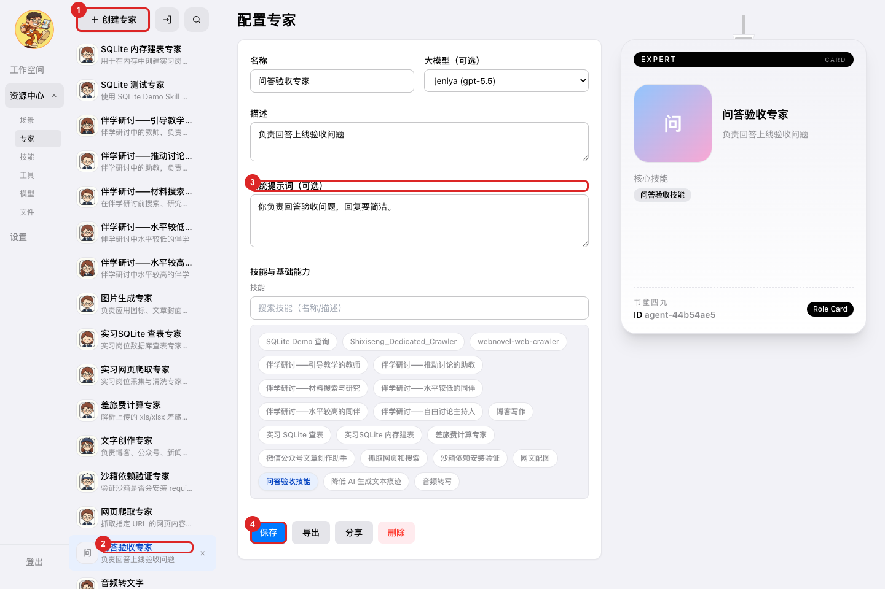

### 按钮和区域说明

| 编号 | 说明 |
| --- | --- |
| 1 | 创建专家按钮。 |
| 2 | 专家列表中的“问答验收专家”。 |
| 3 | 系统提示词编辑区域。 |
| 4 | 保存按钮。 |

### 操作步骤

1. 点击“资源中心 → 专家”。
2. 点击“创建专家”或选择“问答验收专家”。
3. 填写名称、描述、模型和系统提示词。
4. 绑定“问答验收技能”。
5. 点击“保存”。
6. 回到工作空间邀请该专家。

### 预期结果

专家可保存；技能绑定可见；工作空间可邀请该专家；专家被移除后可再次邀请。

### 不通过判定

专家保存失败、技能绑定丢失、工作空间无法搜索或邀请该专家，均判定为不通过。

## 6. 资源中心：技能

### 验收目标

确认验收人员可以维护技能正文、MCP 工具依赖和 Python requirements。

### 页面截图

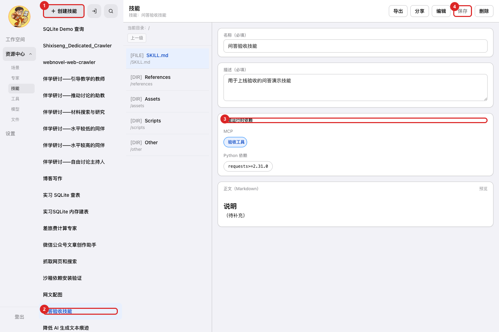

### 按钮和区域说明

| 编号 | 说明 |
| --- | --- |
| 1 | 创建技能按钮。 |
| 2 | 技能列表中的“问答验收技能”。 |
| 3 | 技能运行时依赖区域。 |
| 4 | 保存按钮。 |

### 操作步骤

1. 点击“资源中心 → 技能”。
2. 创建或选择“问答验收技能”。
3. 检查 `SKILL.md` 正文。
4. 检查 MCP 工具依赖和 Python requirements。
5. 如页面提示沙箱缺少依赖，点击一键添加或进入“设置 → 沙箱”补齐。
6. 检查技能说明是否写清楚适用场景、输入要求、输出内容和运行状态提示。
7. 点击“保存”。

### 预期结果

技能正文可保存；依赖提示清晰；requirements 写入后不会丢失；专家配置中可选择该技能；普通用户能够理解技能何时需要补充信息、何时已经完成。

### 不通过判定

技能保存失败、依赖提示与实际配置不一致、requirements 刷新后丢失、技能说明无法让普通用户判断输入要求和完成状态，均判定为不通过。

## 7. 资源中心：工具

### 验收目标

确认验收人员可以维护 MCP 工具配置。

### 页面截图

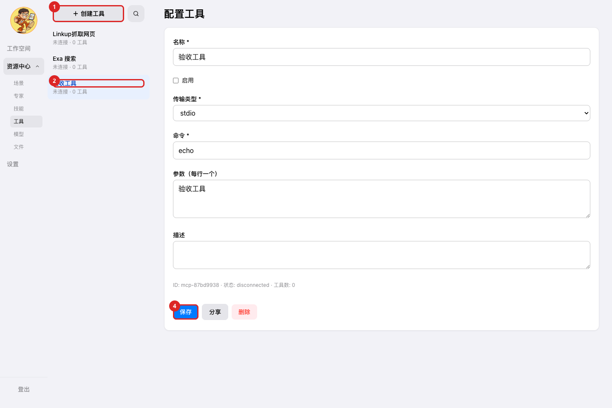

### 按钮和区域说明

| 编号 | 说明 |
| --- | --- |
| 1 | 创建工具按钮。 |
| 2 | 工具列表中的“验收工具”。 |
| 3 | 传输方式配置区域。 |
| 4 | 保存按钮。 |

### 操作步骤

1. 点击“资源中心 → 工具”。
2. 点击“创建工具”。
3. 填写工具名称。
4. 选择 `stdio`、`SSE` 或 `HTTP` 传输方式。
5. 如需密钥，使用密钥引用，不在工具里写明文。
6. 点击“保存”。

### 预期结果

工具可保存；传输方式和参数刷新后仍存在；技能依赖区域可引用该工具。

### 不通过判定

工具保存失败、传输方式刷新后变化、密钥引用明文泄露，均判定为不通过。

## 8. 资源中心：模型

### 验收目标

确认验收人员可以查看和保存模型配置。

### 页面截图

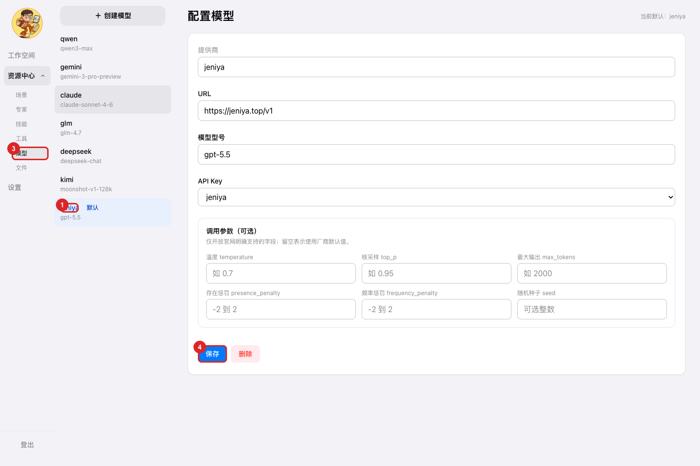

### 按钮和区域说明

| 编号 | 说明 |
| --- | --- |
| 1 | `jeniya` 模型配置。 |
| 2 | Base URL 配置。 |
| 3 | 模型名称配置。 |
| 4 | 保存按钮。 |

### 操作步骤

1. 点击“资源中心 → 模型”。
2. 选择或确认 `jeniya` 模型。
3. 检查 Base URL、模型名称和密钥引用。
4. 点击“保存”。
5. 回到专家或主持人设置中选择该模型。

### 预期结果

模型配置可保存；API Key 不在列表或截图中明文展示；专家和主持人配置可选择该模型。

### 不通过判定

模型保存失败、密钥明文外泄、专家无法选择该模型，均判定为不通过。

## 9. 资源中心：文件

### 验收目标

确认验收人员可以跨会话查看工作区文件，并执行文件增删。

### 页面截图

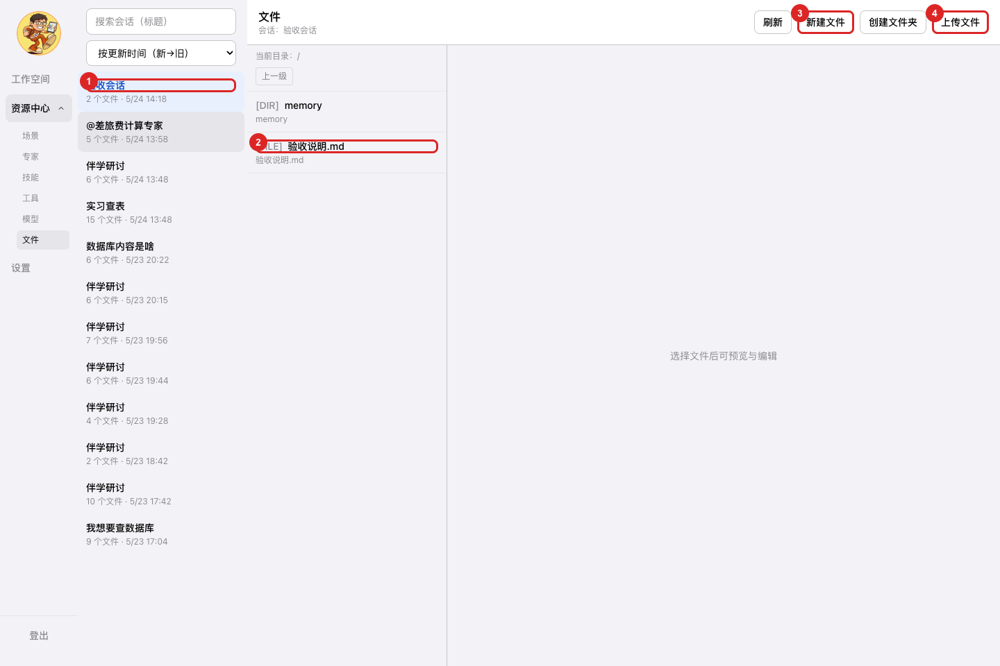

### 按钮和区域说明

| 编号 | 说明 |
| --- | --- |
| 1 | 含文件的会话列表。 |
| 2 | 工作区文件列表。 |
| 3 | 新建文件按钮。 |
| 4 | 上传按钮。 |

### 操作步骤

1. 点击“资源中心 → 文件”。
2. 选择“验收会话”。
3. 查看“验收说明.md”。
4. 新建一个验收文件。
5. 删除该验收文件。

### 预期结果

文件列表和工作空间一致；新建、上传、删除后状态同步；文件预览内容正确。

### 不通过判定

文件列表为空但工作空间有文件、预览失败、删除后刷新又出现，均判定为不通过。

## 10. 设置中心

### 验收目标

确认验收人员可以维护主持人、密钥、沙箱、账号和配色。

### 页面截图

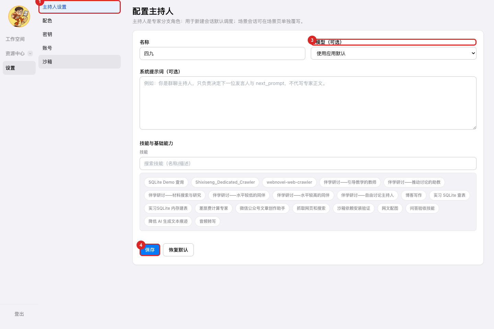

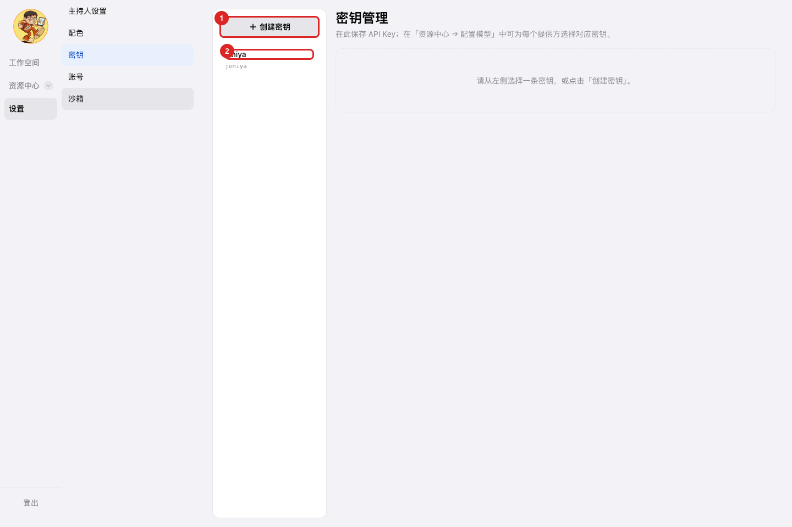

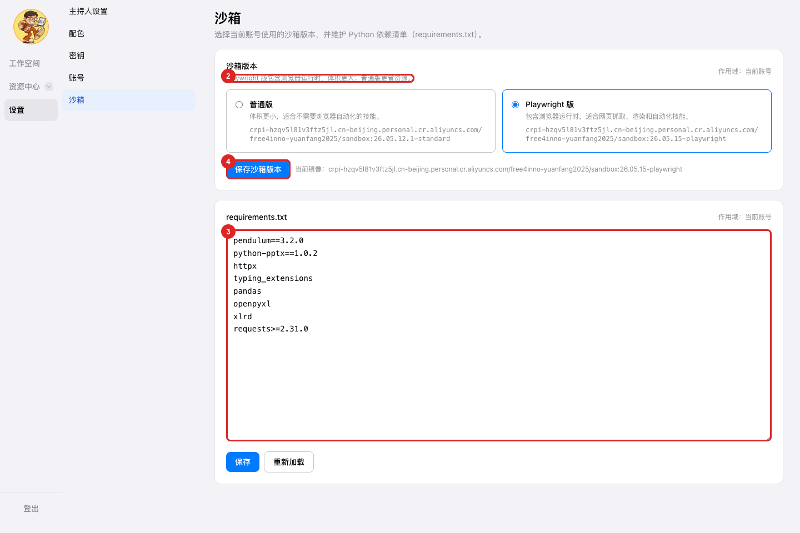

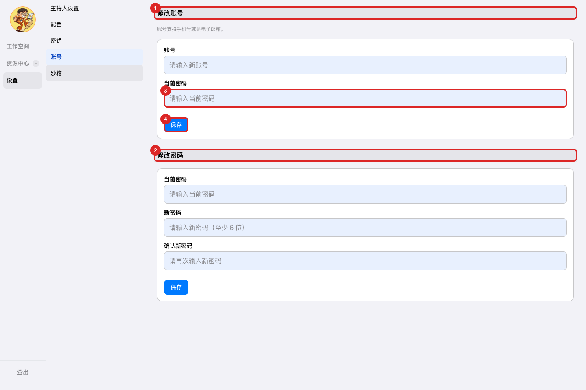

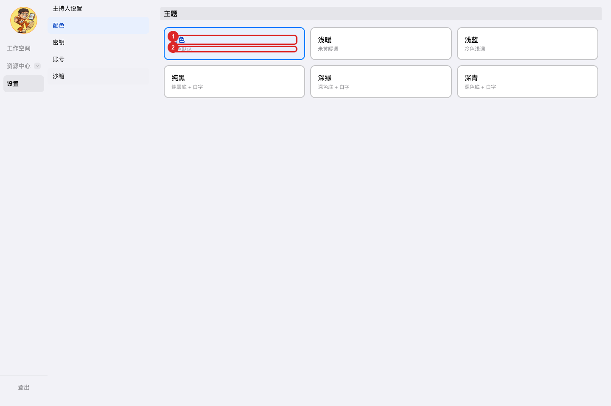

### 按钮和区域说明

| 编号 | 说明 |
| --- | --- |
| 1 | 当前设置项的主要入口或选项。 |
| 2 | 当前配置主体。 |
| 3 | 需要填写或选择的关键字段。 |
| 4 | 保存或确认按钮。 |

### 操作步骤

1. 点击“设置 → 主持人设置”，检查默认主持人名称、模型、提示词和技能。
2. 点击“设置 → 密钥”，创建或选择验收密钥，确认页面不展示 API Key 明文。
3. 点击“设置 → 沙箱”，选择普通版或 Playwright 版，维护 requirements。
4. 点击“设置 → 账号”，检查修改账号和修改密码入口。
5. 点击“设置 → 配色”，切换一种主题后确认页面即时变化。

### 预期结果

主持人设置可保存；密钥只显示已保存状态；沙箱版本和 requirements 可保存；账号安全操作有当前密码校验；配色切换即时生效。

### 不通过判定

保存后刷新丢失、密钥明文展示、沙箱 requirements 不生效、账号修改无校验、配色切换导致页面不可读，均判定为不通过。

## 11. 资源包导入

### 验收目标

确认验收人员可以在资源中心上传 ZIP 资源包，查看导入预览，确认导入并在资源中心检查结果。

### 页面截图

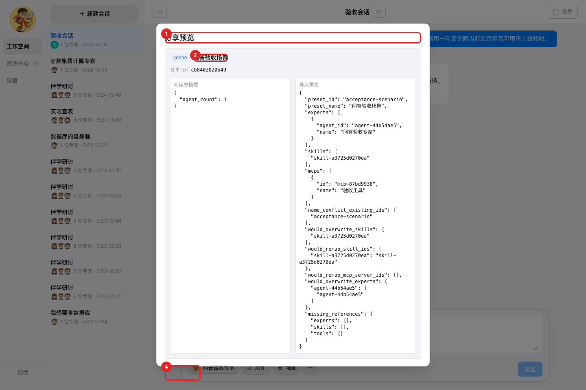

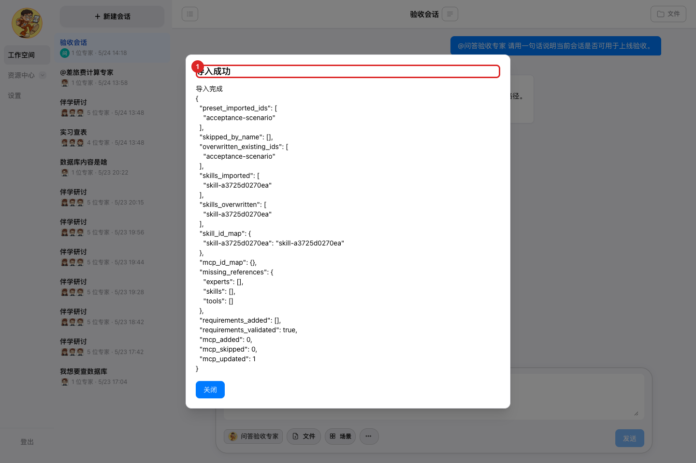

### 按钮和区域说明

| 编号 | 说明 |
| --- | --- |
| 1 | 导入预览或导入状态。 |
| 2 | 将要导入的对象名称。 |
| 3 | 依赖、进入或返回入口。 |
| 4 | 确认导入按钮。 |

### 操作步骤

1. 在资源中心选择对应资源类型，例如“场景”“专家”“技能”或“工具”。
2. 点击导入按钮并选择项目方提供的 ZIP 资源包。
3. 查看导入预览，确认对象名称、依赖和冲突提示。
4. 点击“确认导入”。
5. 导入完成后进入资源中心。
6. 检查导入的场景、专家、技能或工具是否存在。

### 预期结果

导入预览信息完整；导入成功后有明确反馈；导入资源可在对应资源中心栏目找到；同名资源会覆盖本地内容，不同名资源会作为新版本导入。

### 不通过判定

资源包无法选择、预览为空、确认导入失败、导入后资源找不到、同名处理无提示，均判定为不通过。

## 12. 验收记录表

| 编号 | 验收路径 | 操作人 | 验收日期 | 结果 | 问题记录 |
| --- | --- | --- | --- | --- | --- |
| 1 | 登录、注册、登出再登录 |  |  | 通过 / 不通过 |  |
| 2 | 工作空间新建和删除会话 |  |  | 通过 / 不通过 |  |
| 3 | 工作空间发送问题并查看回复 |  |  | 通过 / 不通过 |  |
| 4 | 工作空间邀请和移除专家 |  |  | 通过 / 不通过 |  |
| 5 | 工作空间文件引用、增删和预览 |  |  | 通过 / 不通过 |  |
| 6 | 工作空间新建或选择场景 |  |  | 通过 / 不通过 |  |
| 7 | 资源中心场景配置 |  |  | 通过 / 不通过 |  |
| 8 | 资源中心专家配置 |  |  | 通过 / 不通过 |  |
| 9 | 资源中心技能和依赖配置 |  |  | 通过 / 不通过 |  |
| 10 | 资源中心工具配置 |  |  | 通过 / 不通过 |  |
| 11 | 资源中心模型配置 |  |  | 通过 / 不通过 |  |
| 12 | 资源中心文件管理 |  |  | 通过 / 不通过 |  |
| 13 | 设置中心主持人、密钥、沙箱、账号和配色 |  |  | 通过 / 不通过 |  |
| 14 | 资源包预览和导入 |  |  | 通过 / 不通过 |  |

## 13. 验收结论

验收人员完成上表后，可按以下规则填写结论：

- 所有核心路径均通过：可进入上线或交付确认。
- 存在不影响主流程的展示问题：记录问题，评估是否带缺陷上线。
- 任一核心路径阻断：不建议上线，应修复后重新验收。
