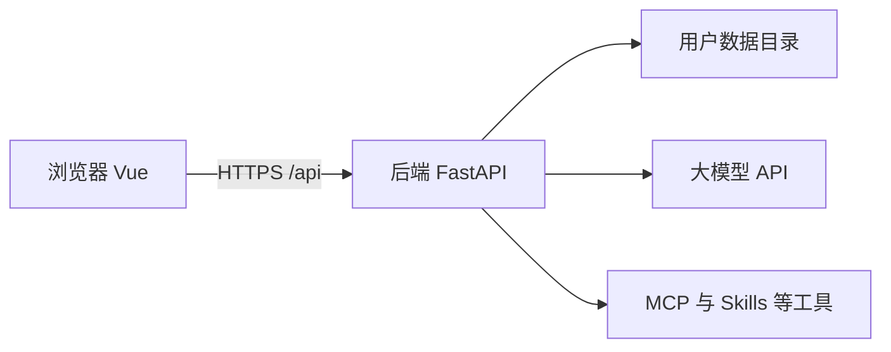
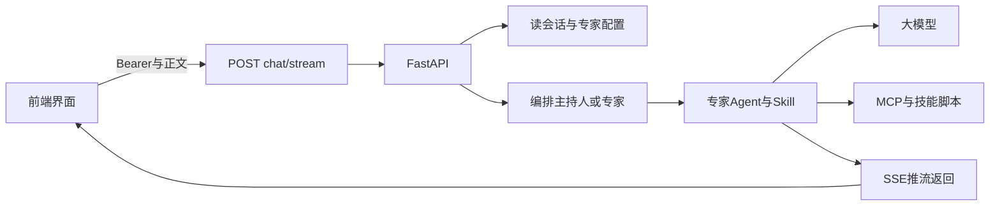
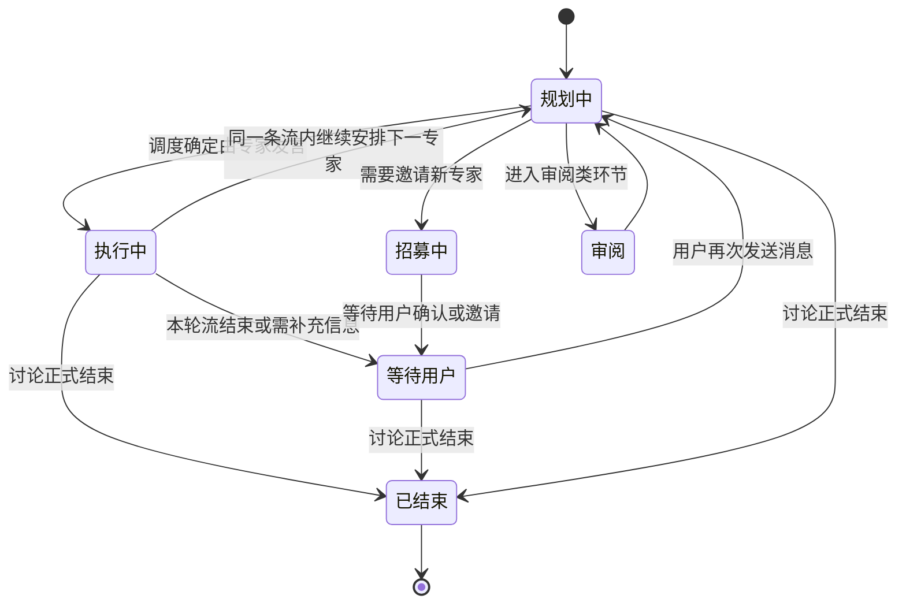
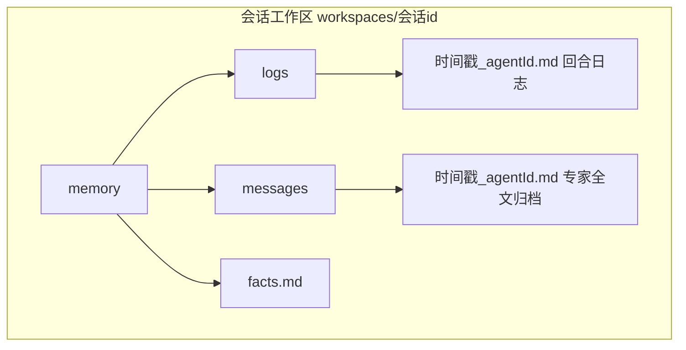

# 书童四九：程序怎么跑起来（框架说明）

本文用**尽量少术语**的方式说明：开发时前后端如何启动、登录后页面怎么工作、以及你在工作区和**专家（Agent）**对话时，请求从前端走到后端再流式回来，大致经过哪些环节。更短的概览见 [书童四九.md](./书童四九.md)。

---

## 1. 整体长什么样

可以把它想成两层：

- **浏览器里的网页（前端）**：Vue 做的单页应用，负责界面、会话列表、输入框、消息展示。
- **一台 Python 服务（后端）**：用 FastAPI 提供 `/api` 接口，负责登录校验、读写你的数据、调用大模型和工具，并把结果**流式**推回浏览器。

每个登录用户在服务器上有一块**自己的数据目录**（会话记录、专家配置、技能、工作区文件等），互不混用。

**系统组成（谁和谁相连）**

**一次对话时的数据流（从你在输入框发送到看到专家回复）**

上图表示：**同一条 HTTP 连接上**，后端可能先推增量字（`content`）、再推完整气泡（`message`）、最后推本轮结束（`end`）；细节见下文第 4、5 节。

**群聊编排阶段（状态机示意，与 `orchestrator_state.py` 中 `OrchestrationPhase` 一致）**

一次会话流里，后端用内存中的「编排上下文」记录**当前阶段**；推给前端的 `end` 事件里也会带 `phase` 字段（英文枚举值）。下图为直观中文说明，**箭头表示常见跳转**，不等同于源码里每一条分支。

阶段与枚举对应关系：**规划中** `planning`，**执行中** `executing`，**等待用户** `awaiting_user`，**招募中** `recruiting`，**审阅** `reviewing`，**已结束** `completed`。此外尚有多种**中断原因**（`InterruptReason`，如需用户输入、工具不可用、轮次上限等），会写在 `end` 的 `interrupt_reason` 里，用于前端判断是否展示表单或继续同一位专家，此处不逐条画在图上。

---

## 2. 开发时：程序是怎么启动的

1. **后端**（在项目 `backend` 目录）  
   安装依赖后执行 `python -m app.main`，默认在 `http://localhost:8000` 提供接口（含 `/api` 和文档页 `/docs`）。

2. **前端**（在项目 `frontend` 目录）  
   执行 `npm run dev`，一般由 Vite 在 `http://localhost:5173` 打开页面。

3. **为什么前端能调到后端**  
   开发配置里会把以 `/api` 开头的请求**转发**到本机的 8000 端口，所以在浏览器里访问的是 5173，但实际对话请求会进到 FastAPI。

4. **登录后请求怎么带上身份**  
   登录成功会把令牌存在浏览器本地；项目在 `main.ts` 里包装了全局 `fetch`，之后每次访问 `/api` 都会自动带上 `Authorization`，后端据此知道「当前是哪个用户」，再去读写**该用户**目录下的数据。

---

## 3. 打开主界面后，前端在干什么

- 路由进入 **`/`** 后，主界面是 **`MainView`**：左边是导航（例如工作区、资源中心、设置），右边是具体内容。
- **工作区**里和群聊相关的大块 UI 在 **`WorkspaceContent`**：展示当前会话、消息列表、输入框、工作区文件等。
- 选中一个会话时，前端会请求 **`GET /api/sessions/{会话id}`** 拉取标题、参与者、历史消息等，用于渲染界面。
- 你在输入框发送内容时，前端不会等「整段回答一次性返回」，而是请求 **`POST /api/sessions/{会话id}/chat/stream`**，然后**一边读流一边更新界面**（下面第 5 节细说）。

专家（Agent）不是在浏览器里跑的，浏览器只负责展示和发请求；**推理和工具调用都在后端**完成。

---

## 4. 后端：一次对话请求大致怎么走（稍细一点）

下面按**时间顺序**说明：从用户点「发送」到本轮流结束，后端在干什么。实现集中在 `group_chat.py` 的流式处理里，对外接口是 **`POST /api/sessions/{会话id}/chat/stream`**（与 `sessions` 路由绑定）。

### 4.1 接入与身份

1. **进入 FastAPI**  
   请求先到应用入口，再转到「会话 / 群聊」里处理流式对话的那一个处理函数。

2. **确认你是谁**  
   从 `Authorization: Bearer` 里解析令牌，得到用户名，并在**本次请求**范围内挂上「当前用户」。之后读写的会话文件、专家配置、技能目录，全部是 **`data/users/{用户名}/...`** 下的那一份，不会串到其他用户。

### 4.2 读出会话与恢复状态

3. **加载会话元数据与消息历史**  
   - 元数据里会有：标题、本会话邀请了哪些 **专家（agent_id 列表）**、主持人 id、发言模式（自动/手动等）、更新时间等。  
   - 历史消息列表来自同一会话对应的 JSON，包含用户、主持人、各专家已发出的气泡内容。  
   - 若上一轮里专家「卡在」需要用户补充信息（Skill 常见），元数据里可能还有 **pending** 信息（例如恢复时仍由同一专家继续），后端会按规则决定是否**自动续跑**该专家。

### 4.3 先发一条「流开始」

4. **向浏览器推 `start` 事件**  
   表示：本条 HTTP 连接上的流式会话已开始，前端可以进入「接收中」状态。

### 4.4 特殊情况：会话里还没有专家

5. **0 个专家时的分支**  
   若当前会话没有邀请任何专家，逻辑会走「仅主持人」路径：由主持人模型根据讨论目标、历史等**回复用户**，并可能**推荐若干可加入的专家 id**（前端可展示为「建议邀请」）。这类情况下会推一条主持人的 `message`，再推 `end`，本轮通常**等待用户继续操作**（例如邀请专家或再输入），然后返回。

### 4.5 编排：下一轮谁说话

6. **决定 `next_speaker`**  
   在已有专家的前提下，后端会结合：会话 **`orchestration_profile`（招募档 / 场景档）**、**Skill 会话锁**（可跳过主持人、直接续同一专家）、发言模式、主持人/回退调度器、用户是否手动指定下一轮、pending 等，算出 **下一个开口的 agent_id**（也可能是 `user`）。  
   场景档下不向模型提供「可邀请名单」，前端也不展示「建议邀请」条；招募档下主持人才可能产出 `suggested_add_agent_ids`。  
   常见体验：先插入一条**主持人气泡**（「下面由某某发言」），**不单独结束流**，紧接着进入专家回合（同一条流里连续发生）。

7. **防止无限循环**  
   在单次请求里，专家自动连续发言有**轮次上限**（如达到上限会强制停下，让用户确认是否继续），避免服务器长时间占满。

### 4.6 专家回合：组装大脑与工具，再流式推理

8. **按专家配置取工具与 Skill**  
   - 根据该专家在资源中心里的配置，组装 **MCP 工具、Skill 相关工具**（如跑技能脚本）等。  
   - 从该专家绑定的 **Skill** 中解析正文（多 Skill 时还会结合当前讨论内容做一次**选型**，得到实际用到的 `skill_id` 与正文）。  
   - 把专家自己的 **system_prompt、角色说明** 与 Skill 正文拼成**系统侧**提示，再挂上应用里配置的额外说明（若有）。

9. **构造本轮用户侧输入**  
   一般会带上：**讨论目标**、**最近讨论摘要/历史**，并避免重复拼接历史。若用户带了自定义输入（如覆盖本轮提示），会按规则只使用一次。

10. **创建「带工具的执行图」并流式跑**  
   使用为该专家选好的 **LLM** 和工具列表，进入 LangGraph 风格的执行器；对模型输出做 **流式迭代**（内部有 `agent_step` / `tool_step` / `final_step` 等阶段）。

11. **推给用户看的内容（与内部执行）**  
   - **模型边想边说的文字**：通过 **`content` 事件**一小段一小段推到前端（你看到的「打字」主要来自这里）。  
   - **即将调用工具**时：可能会先推一行**友好提示**（例如生图等要几十秒，避免你以为「卡住」）。  
   - **工具真正执行**的过程：内部会收集工具原始输出、调试信息；**一般不会把原始 JSON/stdout 直接当气泡正文**，避免刷屏或泄露无关细节；最终会合并成一条**完整的助手消息**。

12. **收尾与落盘**  
   - 把本轮专家最终可见正文拼好（若只有工具结果没有废话，也会有兜底文案）；可按规则把工具结果里的图片等转成 Markdown 预览。  
   - 打上 **skill_id**、可选工具调试信息、若 Skill 要求用户补充字段则带上 **required_user_fields**。  
   - **追加到消息历史 JSON 并保存**；更新会话 `updated_at`。  
   - 向浏览器推一条 **`message` 事件**（完整一条专家气泡）。  
   - 若开启了群聊记忆相关能力，还可能在后台写日志/摘要（失败不影响主对话）。

### 4.7 钩子与结束：何时停下来等你

13. **回合后钩子**  
   专家说完后可能经过一层「钩子」判断：例如是否允许继续自动下一位、是否要中断成「等你输入」等。

14. **推 `end` 事件**  
   告诉前端：**本轮流结束**。负载里常带有：是否**等你输入**、**建议下一轮谁发言**、是否中断、若中断则恢复时回到哪个专家等。若 Skill 要求用户补充信息，会在这里体现，前端可弹出表单。

**小结两个概念**  
- **MCP**：像给专家接上的**外部工具箱**（搜索、抓网页、浏览器自动化等），按用户配置连接。  
- **Skill**：像给专家准备的**说明书 + 可选脚本**；说明书进提示词，脚本通过工具执行。二者都在后端、按当前用户加载。

---

## 5. 流式回复：前端和后端怎么配合

（与上一节 **4.4～4.7** 中的 `start` / `content` / `message` / `end` 等事件一一对应。）

- 后端对 **`/chat/stream`** 返回的是**持续不断的文本流**（格式上类似 SSE：分成一段段 `event` + `data`）。
- 常见含义大致包括：流开始、**增量正文**（专家一边生一边出字）、**一条完整消息**（方便前端插入气泡）、**本轮结束**（例如是否等你继续输入、下一轮建议谁说话等），出错时也会有错误事件。
- 前端的 **`WorkspaceContent`** 里解析这段流：根据事件类型更新「正在生成」的片段或追加完整消息，所以你看到打字效果和多条气泡。

这样设计的好处是：**长回答不必等全部生成完才显示**，也更适合多轮工具调用耗时较长的场景。

---

## 6. 数据大致落在哪（有个印象即可）

在默认配置下，每个用户有自己的文件夹，例如会话列表、某次会话的消息 JSON、专家配置 JSON、技能目录、工作区文件等，都在该用户目录下由后端读写。账号密码另有单独库存储，不把「对话内容」和「账号表」混在一处。

### 6.1 群聊记忆（`memory` 目录结构）

群聊「记忆」不是单独的数据库表，而是落在**该会话对应工作区**下的一块 Markdown 文件树，由 [`group_memory_store.py`](../backend/app/agent/group_memory_store.py) 读写。会话 id 与前端里的会话一致时，工作区根路径为：

`data/users/{用户名}/agent-outputs/workspaces/{会话id}/`

其下 **`memory/`** 约定如下（不存在会在写入时自动创建）：

| 路径 | 作用 |
|------|------|
| **`memory/logs/*.md`** | **专家回合日志**：每轮专家结束后追加一条文件，文件名含时间戳与 `agent_id`。正文是结构化 Markdown，包含会话 id、讨论目标摘要、输入/回复摘要、工具调用与原始输出摘要、`full_message_ref`（指向下面 messages 里对应全文的路径）等；条数超过上限会删掉最旧的，默认由配置 `max_logs` 控制。 |
| **`memory/messages/*.md`** | **专家完整发言归档**：把该轮专家对用户可见的正文单独存一份，便于追溯与在派发上下文里引用。 |
| **`memory/facts.md`** | **事实清单**：从专家回复里抽取的短句事实，合并成 `- ` 开头的列表，去重并截断到 `max_facts` 条，供下一轮主持人/专家派发时拼进提示。 |

**何时写入**：在 [`group_chat.py`](../backend/app/api/group_chat.py) 里，当应用设置中 **`group_memory.enabled`** 为真（默认一般为开）时，专家回合成功结束后会调用 `append_expert_message_file`、`append_turn_log`，并从回复里抽取事实调用 `upsert_facts`。写入失败只打日志，不阻断主对话。

**何时读出**：构造下一轮给专家的提示时，若记忆开启，会调用 `build_dispatch_context`：读取 `facts.md` 与 `logs` 下若干文件，按**讨论目标关键词**与**目标专家 id** 给日志打分，取 top-k 条摘要，拼成一段 **【关键事实】**、**【相关历史摘录】**，必要时附上 **【文件引用：…】** 指向 `messages` 里的相对路径，让模型可以再去读全文。

**可调参数（在应用设置 JSON 的 `group_memory` 段）**：常见有 `enabled`、`max_logs`（日志文件数上限）、`max_facts`（事实条数上限）、`dispatch_top_k`（派发时选用几条日志摘要）。具体键名以当前 `app_settings` 与 `_get_group_memory_settings` 为准。

### 6.2 专家（Agent / DHA）是什么、存在哪

**产品里说的「专家」**，在后端就是一条 **Agent 实例配置**：有稳定 **`agent_id`**、展示名 **`name`**、可选 **`role`** 与 **`system_prompt`**，并声明本轮推理要用的 **Skill**、**MCP**、以及（可选）**专用模型**。

- **存哪里**：每个用户一份 JSON，路径为  
  `data/users/{用户名}/config/dha_instances.json`  
  内容是一个**列表**，每一项就是一位专家。API 主入口为 **`/api/agents/*`**（与 `/dha/instances`、`/experts` 等别名并存，见仓库 README）。

- **主要字段（理解用）**

| 字段 | 含义 |
|------|------|
| `agent_id` | 会话里引用专家时用，稳定主键。 |
| `name` / `role` | 界面展示与拼进提示的「人设」说明。 |
| `system_prompt` | 额外系统提示，会和 Skill 正文等拼接。 |
| `skill_ids` | 绑定哪些 Skill（目录 id 列表）；多 Skill 时群聊里还可按上下文选型实际注入的一个。 |
| `mcp_server_ids` | 绑定哪些 MCP 服务，工具会进该专家的 `build_tools_for_group_chat`。 |
| `is_leader` | 是否作为「主持人/领队」参与调度（与会话元数据里的 `leader_agent_id` 等配合）。 |
| `llm_provider_id` | **可选**；若为空，该专家使用应用**默认模型**（见下一小节）。 |
| `avatar_url` | 可选头像。 |

- **和会话的关系**：会话元数据里记录 **本会话邀请了哪些 `agent_id`**（`agent_ids`）。一轮流式对话里，编排层选中某位专家后，用 `agent_id` 在 `dha_instances` 里查出完整配置，再组工具、组 Skill、选 LLM。

- **和「模型」的边界**：**专家是配置实体**（人设 + Skill + MCP + 可选模型 id）；**模型**是具体 `base_url` + `model` + 密钥 的调用端。一位专家可以不指定模型，则全程跟应用默认走。

### 6.3 大模型（LLM）怎么配、怎么落到某位专家

- **全局配置在哪**：应用设置（如 `app_settings.json`）里通常有 **`default_llm`**（默认 provider  id，代码里常见回退为 `qwen`）和 **`llm_providers`**：一个**字典**，键是 provider id（字符串），值里一般有 `base_url`、`model`，以及 **`api_key`** 或 **`api_key_env`**（从环境变量读密钥）。

- **创建客户端**：[`llm_client.py`](../backend/app/agent/llm_client.py) 中 `get_llm_from_config(provider_id, llm_providers)` 根据 id 取出配置，密钥优先用设置里明文，否则读环境变量；最终构造 **`QwenLLM`**（内部用 LangChain `ChatOpenAI`，**兼容 OpenAI API** 的 HTTP 形态），并开启 **流式** 等参数。

- **何时用哪套模型**：群聊里通过 **`_get_llm_for_dha(dha, app_settings)`**（见 `group_chat.py`）统一决定：

  - 若当前专家配置里 **`llm_provider_id` 非空**，用该 id 去 `llm_providers` 里找；
  - **否则**用 **`default_llm`**。

  主持人、领队决策、标题生成等路径也会各自取「某位专家对应的 LLM」或「无专家时的默认 LLM」，因此**不同专家可以用不同模型**，未指定的都跟默认。

- **和 `.env` 的关系**：即使用户在界面里没填 key，仍可通过 **`api_key_env`** 指向的变量（如 `QWEN_API_KEY`）在部署环境注入，避免把密钥写进 JSON。

### 6.4 技能模块（Skills）

**技能**在本项目里主要是**用户目录下的一棵技能树**：每个技能一个子目录，**核心文件是 `SKILL.md`**（YAML frontmatter + Markdown 正文）。frontmatter 里常见字段包括 **`name`**、**`description`**、**`enabled`**、**`mcp_server_ids`**（声明该技能依赖哪些 MCP）、**`write_mode`** 等，用于展示、筛选和工具过滤。

- **存哪里**：`data/users/{用户名}/skills/{skill_id}/`  
  `skill_id` 一般与目录名一致；资源中心里创建/导入的技能会落在此路径。

- **加载与缓存**：[`loader.py`](../backend/app/skills/loader.py) 中的 **`SkillsLoader`** 扫描用户 `skills_dir`，解析 `SKILL.md`，在内存中维护 `skill_id → Skill`；**按用户隔离**，避免多租户下共用一个全局单例竞态。群聊里若一位专家绑了多个 Skill，还会结合上下文做**选型**（`pick_best_skill_id` 等），决定本轮实际注入哪份正文。

- **管理接口**：设置相关路由在 **`/api/settings/skills`**（列表、创建、导入 zip、读写内容、启用/禁用等），见 `settings.py`。变更后通常会**失效当前用户的技能缓存**，下次按磁盘重载。

- **和「专家」的关系**：专家配置里的 **`skill_ids`** 列出可用技能 id；本轮推理时把选中技能的**正文 + 描述**拼进系统提示，并挂上专家的 `system_prompt` / `role`（见第 4 节专家回合）。

- **脚本能力**：技能目录下可有 **`scripts/`**（`.py`、`.sh` 等），由 **`run_skill_script`** 工具在用户会话工作区内执行（见下一小节「工具模块」）。每个绑定到专家的技能若磁盘上存在有效 `SKILL.md`，会在工具列表里注册一个 **`run_skill_script_<…>`** 名称的工具，供模型调用。

### 6.5 工具模块（MCP、文件、HTTP、技能脚本）

这里的「工具」指 **模型在对话里可调用的 function**，统一在群聊路径里由 **`build_tools_for_group_chat`**（[`tools_for_skill.py`](../backend/app/agent/tools_for_skill.py)）组装，再交给执行图（如第 4 节中的专家 Agent）。

**组装顺序（理解即可）**

1. **MCP 工具**  
   - 配置来自当前用户的 **`mcp_servers.json`**；运行时由 [`mcp/manager.py`](../backend/app/mcp/manager.py) 按用户维护 **`MCPToolManager`**（连接、懒加载、进程退出时清理）。  
   - 专家若配置了 **`mcp_server_ids`**，则只加载这些 server 上的工具；若为空，则可根据各 Skill 的 MCP 依赖合并 server id；必要时对历史 id 做**别名**（如 `fetch` → `linkup`）。  
   - 工具名一般为 **`{server_id}_{工具名}`** 形式，便于区分来源。

2. **工作区文件类工具**  
   - 从同一 MCP 管理器提供的工具里筛出 **file-reader**、**filesystem** 等，按策略决定是否允许写文件（只读/可写）。  
   - 再经 **`wrap_filesystem_tools`** 把路径约束到**当前会话工作区**，避免越权访问其他会话目录。

3. **通用 HTTP 调用**  
   - **`call_api`** 作为内置工具叠加上去，供需要主动请求 URL 的场景使用（与具体 MCP 并存）。

4. **技能脚本**  
   - 对专家 **`skill_ids`** 里每一项，若磁盘上存在对应 `SKILL.md`，则 **`create_run_skill_script_tool`** 注册一个 **`run_skill_script_<skill_id>`**（名称会做安全化与哈希后缀，满足部分模型对 function 名的字符集要求）。  
   - 实际执行逻辑在 [`run_skill_script.py`](../backend/app/tools/run_skill_script.py)：在会话工作区与技能目录约束下起子进程/解释器，返回结构化 JSON 字符串给模型。

**执行与治理**：部分 MCP 调用与脚本会经过 **`UnifiedToolGateway`**、**`SandboxPolicy`** 等（见 `tool_gateway`、`sandbox_adapter`），用于超时、策略与调试信息聚合；细节以源码为准。

**小结**：**Skill** 解决「**说什么、遵循什么流程**」；**工具**解决「**能对外做什么**」——搜网页、读文件、跑脚本、调内部 API 等。二者在专家上通过配置 **`skill_ids` + `mcp_server_ids`** 与运行时 **`build_tools_for_group_chat`** 合在一起。

---

## 7. 上线时（极简）

- 前端一般会先 `npm run build` 得到静态文件；后端可设置环境变量，让 FastAPI **直接托管**这些静态页面，同一域名访问网页和 `/api`。
- 生产环境应使用强随机密钥、关闭仅用于调试的匿名接口、在 HTTPS 与反向代理后暴露服务。

---

## 8. 想深入时再读哪里

若需要对照代码或接口细节，可从这些入口下手：

| 方向 | 参考 |
|------|------|
| 后端入口与路由注册 | `backend/app/main.py` |
| 会话列表与流式对话 API | `backend/app/api/sessions.py`（内部与群聊实现共用） |
| 群聊编排与推流实现 | `backend/app/api/group_chat.py` |
| 群聊记忆落盘与派发上下文 | `backend/app/agent/group_memory_store.py` |
| 专家（Agent）配置 API | `backend/app/api/dha.py`（`/api/agents` 等） |
| LLM 构造与 OpenAI 兼容调用 | `backend/app/agent/llm_client.py` |
| Skill 加载（SKILL.md） | `backend/app/skills/loader.py` |
| 群聊工具组装（MCP/文件/脚本） | `backend/app/agent/tools_for_skill.py` |
| Skill 脚本执行 | `backend/app/tools/run_skill_script.py` |
| MCP 运行时（每用户） | `backend/app/mcp/manager.py` |
| 前端群聊与解析流 | `frontend/src/views/WorkspaceContent.vue` |
| 前端主壳与模块切换 | `frontend/src/views/MainView.vue` |

更细的模块表、环境变量表、SSE 事件名列表等，以源码与 [backend/README.md](../backend/README.md) 为准。

---

*若行为与本文不一致，以当前仓库代码为准。*
